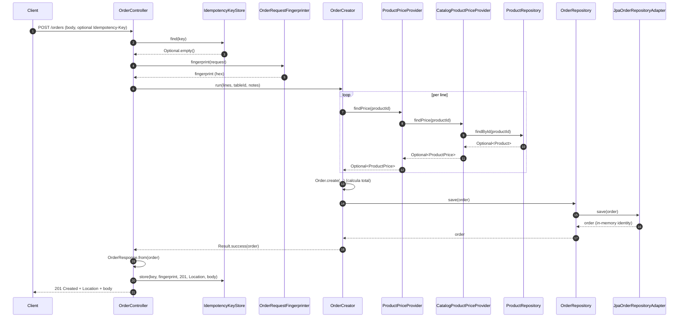
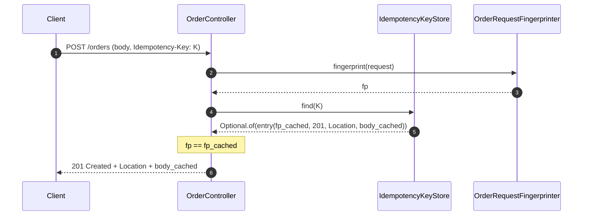
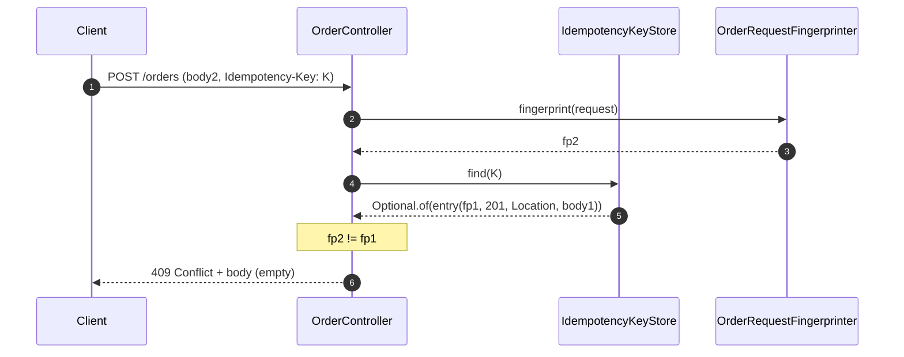
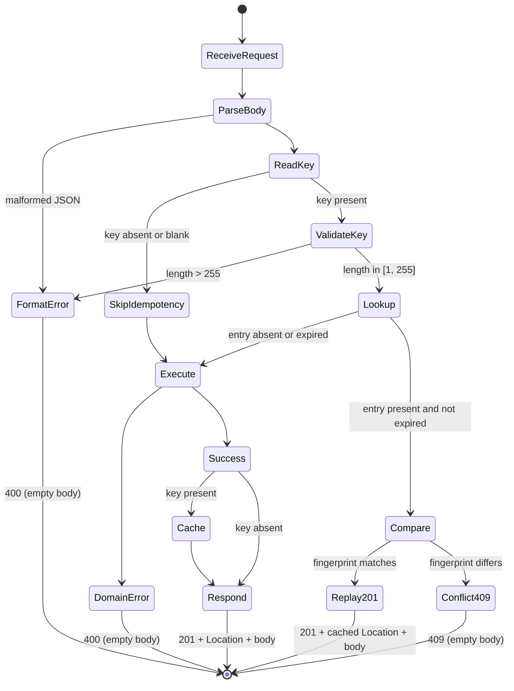

# Alta de pedido — arquitectura

## Overview

### Summary

Esta funcionalidad introduce el alta de pedidos en un nuevo bounded context `orders`, desacoplado de `catalog` y de `tables`. El objetivo es exponer el endpoint `POST /orders` para registrar pedidos compuestos por una o mas lineas de productos, opcionalmente vinculados a una mesa, con soporte opcional de idempotencia mediante la cabecera HTTP `Idempotency-Key`.

La arquitectura sigue DDD y hexagonal en los bordes (mismo patron que `catalog/product` y `tables`), replicando el modelo HTTP unificado del proyecto: cuerpo de error literalmente vacio para `400` y `409` (alineado con `catalog/product` y `table-deletion`), uso de `Result<T>` y `DomainError` como contrato de salida de los casos de uso, traduccion de `Result` a codigo HTTP en el adaptador de entrada, validacion de formato de `id` delegada en la factoría segura `Id.from(String)` del value object compartido `Id`, y agregado de errores de validacion con `CompositeValidationError`.

La integracion con `catalog` para resolver precios de productos se realiza unidireccionalmente a traves de un puerto de dominio `ProductPriceProvider` implementado por infraestructura con un adaptador `CatalogProductPriceProvider` que importa directamente el `ProductRepository` del contexto `catalog` (el proyecto es un unico modulo Gradle). El `unitPrice` resuelto en el servidor se persiste como snapshot historico en cada `OrderLine` y se usa para calcular el `total` del pedido, de modo que el precio del pedido permanece estable frente a cambios de precio en el catalogo.

El `ProductPrice(Id productId, BigDecimal unitPrice)` que el puerto expone y devuelve es un value object del nucleo `shared` (no del dominio `orders` ni del dominio `catalog`), reutilizado por ambos contextos. Esta migracion desde el actual `com.forkcore.api.catalog.product.domain.vo.ProductPrice(BigDecimal value)` a `com.forkcore.api.shared.domain.ProductPrice(Id productId, BigDecimal unitPrice)` forma parte de esta iteracion y se detalla en `## D-arch-10` y en la seccion de implementacion.

La politica de idempotencia vive en infraestructura (`IdempotencyKeyStore` en memoria por defecto) y se invoca desde el adaptador HTTP `OrderController`, manteniendo el caso de uso `OrderCreator` libre de detalles HTTP. La cache de idempotencia es de instancia unica (no distribuida) en esta iteracion.

### Related Feature Document

* `docs/design/orders/order-registration.md`

### Traceability Notes

* Reutiliza los tipos compartidos `Result`, `DomainError`, `ValidationError`, `CompositeValidationError`, `ConflictError`, `NotFoundError`, `Id`, `FieldUpdate` definidos en `src/main/java/com/forkcore/api/shared/domain/`.
* Introduce un nuevo value object compartido `ProductPrice(Id, BigDecimal)` en `shared/domain` (migracion del actual `catalog.product.domain.vo.ProductPrice`).
* Reutiliza el patron de mapeo uniforme de `Result` a HTTP ya presente en `ProductController` y `TableController` (cuerpo vacio para `400` y `409`).
* Reutiliza el patron de traduccion de errores por tipo de `DomainError` (`instanceof NotFoundError`, `instanceof ConflictError`, etc.) y el agregado de `ValidationError` en `CompositeValidationError` para devolver `400`.
* No introduce un puerto de entrada para el caso de uso `OrderCreator`, replicando la decision ya tomada para `ProductCreator`, `ProductUpdater`, `ProductDeleter` y `TableCreator` (el caso de uso es invocado directamente por el adaptador HTTP).
* El `IdempotencyKeyStore` es una abstraccion de infraestructura: la implementacion concreta por defecto es `InMemoryIdempotencyKeyStore` (en esta iteracion). El caso de uso no conoce la cache de idempotencia.

---

## Goals and Non-Goals

### Goals

- Permitir el alta sincrona de pedidos compuestos por lineas de productos con cantidad, opcionalmente vinculados a una mesa, opcionalmente anotados, con estado inicial `pending`.
- Resolver el `unitPrice` de cada linea en el servidor desde `catalog` mediante un puerto de dominio, sin que el cliente pueda aportar `unitPrice` ni `total` ni `status` inicial.
- Persistir el `unitPrice` resuelto y el `total` calculado como snapshot historico del pedido.
- Soportar idempotencia opcional mediante la cabecera HTTP `Idempotency-Key` con la politica estandar (mismo body -> 201 cacheado; body distinto -> 409; clave nueva o ausente -> ejecucion normal).
- Introducir el nuevo bounded context `orders` sin acoplarse a `tables` y con acoplamiento unidireccional a `catalog` mediado por un puerto.
- Migrar el value object `ProductPrice` al nucleo `shared` para que `catalog` y `orders` compartan el mismo tipo.

### Non-Goals

- Edicion, actualizacion, baja o consulta de pedidos (`GET /orders`, `GET /orders/{id}`, `PATCH /orders/{id}`, `DELETE /orders/{id}`). Estas operaciones pertenecen a features futuras.
- Transiciones de estado (`pending` -> `in_progress` -> `ready` -> `delivered`/`cancelled`). La maquina de estados vivira en la feature "Seguimiento del estado del pedido".
- Validacion de la existencia o el estado del `tableId` contra el contexto `tables`. La integridad referencial se difiere a una integracion futura.
- Desacoplamiento en linea entre `orders` y `catalog` (consumidor de eventos, lookup HTTP con cache, sincronizacion periodica). El MVP acopla los dos contextos a nivel de codigo mediante el puerto `ProductPriceProvider`.
- Multi-tenant (`restaurantId`), descuentos, impuestos, propinas, division de cuenta, clientes, codigos QR, reservas de mesa.
- Cache de idempotencia distribuida (Redis) o persistente (tabla `idempotency_key`). Solo in-memory en esta iteracion.
- Sincronizacion bajo carrera extrema entre instancias del servicio para la misma `Idempotency-Key`. La proteccion es por instancia unica.
- Autenticacion, autorizacion, rate limiting, TLS. Estas preocupaciones son transversales al proyecto y se abordaran en su propia iteracion.
- Modelado explicito de `Currency` en `ProductPrice` ni en `OrderLine`. Se mantiene `BigDecimal` con unidad implicita.

---

## Affected Contexts

| Context  | Type     | Impact                                                                                              |
| -------- | -------- | --------------------------------------------------------------------------------------------------- |
| Orders   | New      | Introduce el nuevo bounded context `orders` con su agregado `Order`, value objects, caso de uso, adaptador REST, adaptadores de persistencia y adaptador de resolucion de precios hacia `catalog` |
| Catalog  | Modified | El value object `ProductPrice` migra desde `catalog.product.domain.vo` a `shared.domain`. El campo `Product.price` pasa a tiparse con el `ProductPrice` compartido. No se introducen ni eliminan endpoints ni operaciones de dominio del contexto `catalog` |
| Tables   | Unchanged| Continua gobernando mesas; `orders` almacena `tableId` como referencia externa por `id` sin comprobacion de integridad |
| Shared   | Modified | Anade el value object `ProductPrice(Id, BigDecimal)` al nucleo `shared.domain`                       |

### Notes

El contexto `orders` es propietario del ciclo de vida del pedido. Su relacion con `catalog` es de sentido unico: `orders` consulta precios, `catalog` no conoce la existencia de `orders`. Su relacion con `tables` es de estricta autonomia: `orders` no inyecta ni consulta `TableRepository`; las referencias externas a `tableId` se almacenan como `Id` (UUID) y la integridad referencial se difiere.

`orders` introduce una dependencia unidireccional sobre `catalog` (a traves del puerto `ProductPriceProvider` y su adaptador `CatalogProductPriceProvider`) y ninguna dependencia sobre `tables`. La migracion de `ProductPrice` al nucleo `shared` reduce el acoplamiento entre `orders` y `catalog` a la llamada runtime del adaptador y a un solo tipo compartido: ambos contextos acuerdan la forma de `ProductPrice` una sola vez (en `shared`), y el resto de la interaccion pasa por el puerto.

`catalog` y `tables` no se modifican funcionalmente: la unica modificacion a `catalog` es el movimiento y la ampliacion del value object `ProductPrice` (de `ProductPrice(BigDecimal value)` a `ProductPrice(Id, BigDecimal)`); el esquema de la tabla `products` permanece inalterado.

---

## Domain Model Impact

### Aggregates

| Aggregate | Type | Purpose                                                                                          |
| --------- | ---- | ------------------------------------------------------------------------------------------------ |
| Order     | New  | Aggregate root del contexto `orders`. Modela un pedido compuesto por `OrderLine` con identidad, ciclo de vida y reglas propios |

### Entities

| Entity    | Type | Description                                                                                                                            |
| --------- | ---- | -------------------------------------------------------------------------------------------------------------------------------------- |
| Order     | New  | Aggregate root del contexto `orders`. Se identifica por un `Id` UUIDv7 time-ordered. Mantiene `lines: List<OrderLine>`, `status`, `total`, `tableId`, `notes` |
| OrderLine | New  | Entidad interna del agregado `Order`. Se identifica por su propio `Id` UUIDv7. Mantiene `productId: Id`, `quantity`, `unitPrice: BigDecimal` (snapshot historico) |

### Value Objects

| Value Object        | Type      | Description                                                                                                                |
| ------------------- | --------- | -------------------------------------------------------------------------------------------------------------------------- |
| OrderStatus         | New       | Enum cerrado del estado del pedido: `pending`, `in_progress`, `ready`, `delivered`, `cancelled`. En esta iteracion solo se persiste `pending` |
| OrderTotal          | New       | `BigDecimal` no negativo. Calculado por el dominio a partir de `sum(line.unitPrice * line.quantity)`                       |
| OrderNotes          | New       | String opcional. Sin regla de longitud maxima, formato o charset en esta iteracion                                          |
| OrderLineQuantity   | New       | Entero mayor o igual a 1. Validado en factoría `from(Integer)` que devuelve `Result<OrderLineQuantity>`                    |
| OrderLineUnitPrice  | New       | `BigDecimal` estrictamente positivo (en esta iteracion) o no negativo. Modela el snapshot historico del precio de la linea |
| Id                  | Unchanged | Value object compartido. Se reutiliza la factoría segura `Id.from(String): Result<Id>`                                     |
| ProductPrice        | Modified  | Value object compartido en `shared.domain`. Migra desde `catalog.product.domain.vo.ProductPrice(BigDecimal value)` a `shared.domain.ProductPrice(Id productId, BigDecimal unitPrice)` |

### Domain Notes

* El agregado `Order` se construye por la factoría estática `Order.create(...)` que devuelve `Result<Order>`. Un `Order` construido se considera valido por construccion.
* El calculo de `total` se realiza en el constructor del agregado `Order` a partir de las lineas ya enriquecidas con el `unitPrice` resuelto, garantizando la coherencia entre `lines` y `total` por construccion.
* La identidad propia de `OrderLine` (`OrderLine.id`) se introduce para permitir futuras operaciones de modificacion o eliminacion de lineas concretas. En esta iteracion no se expone por HTTP.
* El `OrderStatus` se define completo desde el inicio, aunque solo `pending` se persista en esta iteracion. Las transiciones entre valores quedan recogidas por la futura feature de seguimiento de estado.
* El `OrderTotal` se almacena como `BigDecimal` con precision 10 y escala 2 (mismo tipo que `Product.price` y que `OrderLine.unitPrice`).
* El `OrderNotes` y el `OrderLineUnitPrice` modelan tipos simples (`String` y `BigDecimal` respectivamente). Se envuelven en tipos nominales para mantener la consistencia con el resto del dominio (factoría `from(...)` que devuelve `Result<T>`), aunque su logica de validacion sea minima en esta iteracion.
* El `ProductPrice` migrado es el unico value object compartido entre `catalog` y `orders` (shared kernel). Su campo `productId` es redundante dentro de `Product` (donde el id del producto es implicito) pero aporta trazabilidad y uniformidad semantica con el contrato del puerto `ProductPriceProvider` del lado de `orders`. La forma del value object es `record ProductPrice(Id productId, BigDecimal unitPrice)`.
* El `OrderLine` no almacena el `ProductPrice` completo, solo el `unitPrice` (un `BigDecimal`). El `productId` se almacena por separado como `Id`. Esto evita acoplar la linea a la forma del `ProductPrice` y mantiene la granularidad del dato persistido.

---

## Application Services

### Use Cases

| Use Case     | Type | Description                                                                                                                                                                                                                                                                                                                  |
| ------------ | ---- | ---------------------------------------------------------------------------------------------------------------------------------------------------------------------------------------------------------------------------------------------------------------------------------------------------------------------------- |
| OrderCreator | New  | Crea un pedido valido, resuelve el `unitPrice` de cada linea mediante `ProductPriceProvider`, agrega los `OrderLine` ya enriquecidos en el agregado `Order` y lo persiste. Recibe parametros primitivos (`List<CreateOrderLineInput>`, `String tableId`, `String notes`) y devuelve `Result<Order>`. Nunca lanza excepciones |

`CreateOrderLineInput` es un record primitivo de aplicación (no DTO HTTP) con `(String productId, Integer quantity)`. Vive en `orders.application` o `orders.application.input` para no contaminar el dominio con tipos de entrada.

### Application Flow

1. El adaptador HTTP `OrderController` recibe `POST /orders` con el cuerpo de la request y, opcionalmente, la cabecera `Idempotency-Key`.
2. El adaptador HTTP consulta la cache de idempotencia. Si la clave esta presente y existe una entrada valida (no expirada), el adaptador HTTP reproduce la respuesta cacheada (`201 Created` con la misma `Location` y el mismo cuerpo) o responde `409 Conflict` (cuerpo vacio) segun el resultado de la comparacion del fingerprint.
3. Si la clave esta ausente, o presente pero sin entrada en cache, el adaptador HTTP deserializa el cuerpo a `CreateOrderRequest` y delega en `OrderCreator.run(lines, tableId, notes)`.
4. `OrderCreator` valida los formatos: para cada linea, `Id.from(productId)` y `OrderLineQuantity.from(quantity)`. Tambien valida que `lines` no sea nula ni vacia. Tambien valida `Id.from(tableId)` si `tableId` no es null. Los errores se acumulan en un `CompositeValidationError`.
5. Si los formatos son correctos, `OrderCreator` invoca `ProductPriceProvider.findPrice(productId)` para cada `productId` validado. Si alguna invocacion devuelve `Optional.empty()`, se genera un `ValidationError("productId", "product not found or has no resolvable price: <id>")` y se agrega al `CompositeValidationError` (sin abortar el bucle: todos los `productId` se comprueban para que el cliente reciba todos los errores en una sola respuesta).
6. Si hay errores de formato o de resolucion de precios, `OrderCreator` devuelve `Result.failure(CompositeValidationError)` y termina. El adaptador HTTP traduce el resultado a `400 Bad Request` con cuerpo vacio.
7. Si no hay errores, `OrderCreator` construye las `OrderLine` con el `unitPrice` resuelto (envolviendolo en `OrderLineUnitPrice.from(BigDecimal)`) y construye el agregado `Order` mediante `Order.create(...)`. El calculo de `total` se realiza en el constructor del agregado.
8. `OrderCreator` invoca `OrderRepository.save(order)` y devuelve `Result.success(order)`. El adaptador HTTP construye `OrderResponse.from(order)`, lo registra en `IdempotencyKeyStore` si la clave estaba presente y responde `201 Created` con cabecera `Location: /orders/{id}` y cuerpo `OrderResponse`.
9. El caso de uso nunca lanza excepciones de validacion. Cualquier excepcion tecnica no anticipada (por ejemplo, una excepcion de conexion a la base de datos) se propaga al adaptador HTTP, que la deja propagar al contenedor de Spring (politica del 500, ver `## Validation and Error Handling`).

---

## Domain Services

### Domain Services

Ninguno en esta iteracion.

La resolucion de precios de productos no es un servicio de dominio: es un puerto de salida (`ProductPriceProvider`) implementado por infraestructura, alineado con el patron de puertos de los modulos `catalog/product` y `tables`. El dominio `orders` no orquesta la consulta a `catalog`; la consulta se realiza dentro del caso de uso `OrderCreator` por la implementacion del puerto.

---

## Domain Events

### Events

Ninguno en esta iteracion.

No se introduce un evento de dominio `OrderCreated` en el MVP. Si en el futuro otros contextos (por ejemplo `billing` o `kitchen`) necesitan reaccionar al alta, el caso de uso podra emitirlo sin necesidad de modificar el contrato del puerto actual. Esta mejora esta registrada en `## Future Improvements` (heredado del documento de diseño).

---

## Ports

### Incoming Ports

Ninguno.

`OrderCreator` es invocado directamente por el adaptador HTTP `OrderController`, replicando la decision ya tomada para `ProductCreator`, `ProductUpdater`, `ProductDeleter` y `TableCreator` en los modulos `catalog/product` y `tables`. No se introduce una interfaz `CreateOrderUseCase` ni un `Command` en esta iteracion.

### Outgoing Ports

| Port                 | Purpose                                                                                                                                                |
| -------------------- | ------------------------------------------------------------------------------------------------------------------------------------------------------ |
| OrderRepository      | Persistir pedidos del contexto `orders`                                                                                                                |
| ProductPriceProvider | Resolver el `unitPrice` de un producto a partir de su `Id` consultando el contexto `catalog` a traves de su `ProductRepository` (import directo mismo modulo Gradle) |

### Port Contracts

`OrderRepository`:

* `Order save(Order order): Order`

Solo `save` en esta iteracion (decision YAGNI, ver `## D-arch-6`). `findById` se anade al puerto en la primera feature que lo necesite (seguimiento de estado o consulta).

`ProductPriceProvider`:

* `Optional<ProductPrice> findPrice(Id productId): Optional<ProductPrice>`

Devuelve `Optional<ProductPrice>` con un `ProductPrice(productId, unitPrice)` del nucleo `shared` si el producto existe y tiene un precio resoluble. Devuelve `Optional.empty()` en cualquier otro caso (producto inexistente en `catalog` o producto sin precio utilizable). Los dos casos se colapsan al mismo `Optional.empty()` porque la respuesta del cliente es la misma: `400 Bad Request` con cuerpo vacio (FR18).

### Port Notes

* El caso de uso `OrderCreator` no inyecta `ProductRepository` directamente: depende de `ProductPriceProvider`. Esto mantiene la autonomia del dominio `orders` frente a `catalog`.
* El `ProductRepository` de `catalog` no forma parte de la superficie de puertos de `orders`; vive en el contexto `catalog` y es invocado por el adaptador `CatalogProductPriceProvider` en `orders.infrastructure.out.catalog`.
* `OrderRepository.save(Order)` es el unico metodo del puerto en esta iteracion. La decision de no anadir `findById` en esta iteracion se justifica por YAGNI: la alta solo escribe; nada lee el pedido recien creado en la misma request. La response se construye a partir del agregado devuelto por el caso de uso (que es la misma instancia que `OrderRepository.save` persiste y devuelve), sin necesidad de un round-trip adicional a la base de datos.

---

## Repository Impact

### New Repositories

| Repository         | Purpose                                                                       |
| ------------------ | ----------------------------------------------------------------------------- |
| OrderRepository    | Almacena los pedidos del contexto `orders` (interfaz de dominio)              |
| SpringDataOrderJpaRepository | Spring Data JPA repository para `OrderJpaEntity`                       |

### Modified Repositories

| Repository           | Change                                                                                                                                                            |
| -------------------- | ----------------------------------------------------------------------------------------------------------------------------------------------------------------- |
| `JpaProductRepositoryAdapter` | Sin cambios en este PR. La firma `save(Product)`, `findById(Id)`, etc. no se tocan                                                              |
| `InMemoryProductRepository`   | Sin cambios en este PR. La firma no se toca; el cambio de tipo del campo `Product.price` se absorbe en el dominio                                  |
| `JpaOrderRepositoryAdapter`   | Nuevo: implementa `OrderRepository` delegando en `SpringDataOrderJpaRepository` y mapeando entre `Order` y `OrderJpaEntity` (mas `OrderLine` y `OrderLineJpaEntity`) |
| `InMemoryOrderRepository`     | Nuevo: implementa `OrderRepository` con un `Map<String, Order>` (o `List<Order>`) en memoria para el doble de pruebas                          |

### Notes

* El adaptador JPA `JpaOrderRepositoryAdapter` (`@Repository`) implementa `OrderRepository.save(Order)` mapeando el agregado a `OrderJpaEntity` (incluyendo las `OrderLine` como `OrderLineJpaEntity` embebidas o como `@OneToMany`, segun se decida en implementacion) y persistiendolo via `SpringDataOrderJpaRepository`. El adaptador `InMemoryOrderRepository` (no anotado, instanciado en tests) implementa el mismo puerto con almacenamiento en memoria.
* La eleccion entre `@OneToMany` embebido y `@ElementCollection` no es una decision arquitectonica: la entidad `OrderLine` tiene identidad propia (`OrderLine.id`), por lo que se modela con `@OneToMany(cascade = ALL, orphanRemoval = true)` o con una entidad intermedia `OrderLineJpaEntity` mapeada a una tabla `order_lines`. La decision concreta se delega a la fase de implementacion; la arquitectura admite ambas formas mientras se respete el contrato del puerto.
* `ProductRepository` (de `catalog`) sigue intacto en su contrato publico. La unica modificacion a `catalog` es el movimiento del value object `ProductPrice` al nucleo `shared`, que no cambia la firma de `ProductRepository`.

---

## External Integrations

### New Integrations

| Integration | Purpose                                                                                |
| ----------- | -------------------------------------------------------------------------------------- |
| PostgreSQL  | Persistencia de pedidos y lineas de pedido (nuevas tablas `orders` y `order_lines`)    |

### Changes Required

* Crear tabla `orders` (columnas: `id`, `status`, `total`, `table_id`, `notes`).
* Crear tabla `order_lines` (columnas: `id`, `order_id`, `product_id`, `quantity`, `unit_price`).
* Crear indice en `order_lines.order_id` para joins y cargas futuras del agregado.
* Crear (opcionalmente) indice en `orders.table_id` para soportar futuras consultas por mesa.
* Configurar los adaptadores de persistencia del nuevo contexto `orders`.
* No se requieren migraciones en las tablas `products` ni `tables` en esta iteracion (la unica modificacion a `catalog` es el value object, que no afecta al esquema de la tabla `products`).
* No se introduce ninguna dependencia tecnologica nueva fuera de las ya declaradas en el `build.gradle` (Spring Web MVC, Spring Data JPA, Hibernate, Flyway, PostgreSQL driver, Jackson, Cucumber).

---

## Data Model Impact

### New Persistence Models

| Model        | Description                                                          |
| ------------ | -------------------------------------------------------------------- |
| orders       | Tabla de pedidos del contexto `orders`                               |
| order_lines  | Tabla de lineas de pedido (entidades internas del agregado `Order`)  |

### Schema Changes

#### orders

| Column   | Type            | Notes                                                                                                       |
| -------- | --------------- | ----------------------------------------------------------------------------------------------------------- |
| id       | UUID            | Primary key, generado por el dominio con `Id.create()` (UUIDv7 time-ordered)                                |
| status   | VARCHAR(32)     | Required. En esta iteracion solo se persiste `pending`. Default aplicativo: `pending`                       |
| total    | NUMERIC(10, 2)  | Required, no negativo. Calculado por el dominio a partir de `sum(line.unit_price * line.quantity)`          |
| table_id | UUID            | Nullable. Referencia externa por `id` a `tables.table.id` sin FK fisica (logical reference)                |
| notes    | TEXT            | Nullable. Texto libre                                                                                        |

#### order_lines

| Column     | Type           | Notes                                                                                                                          |
| ---------- | -------------- | ------------------------------------------------------------------------------------------------------------------------------ |
| id         | UUID           | Primary key, generado por el dominio con `Id.create()` (UUIDv7 time-ordered)                                                   |
| order_id   | UUID           | Required. FK fisica a `orders.id` con `ON DELETE CASCADE` para preservar la atomicidad del agregado                           |
| product_id | UUID           | Required. Referencia externa por `id` a `products.id` sin FK fisica (logical reference)                                       |
| quantity   | INTEGER        | Required, mayor o igual a 1                                                                                                    |
| unit_price | NUMERIC(10, 2) | Required, mayor o igual a 0. Snapshot historico del precio resuelto por `ProductPriceProvider` en el momento del alta        |

#### Indices

* `orders` PK por `id` (automatico).
* `order_lines` PK por `id` (automatico).
* `idx_order_lines_order_id` sobre `order_lines.order_id` para joins y cargas del agregado.
* `idx_orders_table_id` sobre `orders.table_id` para soportar futuras consultas por mesa (creado en esta iteracion para no requerir migracion posterior).

### Persistence Notes

* El default de `status = pending` debe vivir primero en dominio/aplicacion para mantener la regla dentro del core. El esquema puede duplicar ese default mas adelante como proteccion tecnica, pero no como unica fuente de verdad. Mismo patron que `tables.status` y `products.status`.
* La atomicidad del agregado `Order` (pedido + lineas) se enforce en base de datos mediante la FK de `order_lines.order_id` a `orders.id` con `ON DELETE CASCADE`. Esto garantiza que un `Order` sin sus `OrderLine` no puede persistir (la FK impide la inconsistencia). En esta iteracion no existe la operacion de borrado de pedidos, por lo que la cascada es solo defensa en profundidad.
* La integridad referencial externa (`product_id`, `table_id`) NO se modela con FK en el esquema de `orders` en esta iteracion, consistente con la estrategia BC-by-id del proyecto. La validacion de existencia de `product_id` se realiza en tiempo de alta a traves del puerto `ProductPriceProvider` (que devuelve `Optional.empty()` si el producto no existe o no tiene precio resoluble). La validacion de `table_id` se difiere a una integracion futura con el contexto `tables`.
* `Order.id` ya cuenta con el indice de clave primaria. `orders.table_id` y `order_lines.order_id` se indexan explicitamente para soportar consultas futuras.
* El `unit_price` se persiste como `NUMERIC(10, 2)` (mismo tipo que `products.price`), con precision y escala suficientes para el rango esperado. La columna admite cero (CHECK `>= 0`) para preservar la semantica de la migracion, aunque en el MVP la regla aplicativa exigira `> 0`.

---

## Component Map

### Application layer (`com.forkcore.api.orders.application`)

| Component                | Type      | Responsibility                                                                                                                |
| ------------------------ | --------- | ----------------------------------------------------------------------------------------------------------------------------- |
| `OrderCreator`           | `@Service`| Caso de uso: valida formatos, resuelve precios, construye el agregado `Order`, lo persiste. Recibe primitivos. Devuelve `Result<Order>` |

### Domain layer (`com.forkcore.api.orders.domain`)

| Component            | Type        | Responsibility                                                                                                                          |
| -------------------- | ----------- | --------------------------------------------------------------------------------------------------------------------------------------- |
| `Order`              | Aggregate   | Aggregate root. Mantiene `lines`, `status`, `total`, `tableId`, `notes`. Factory `Order.create(...)` devuelve `Result<Order>`           |
| `OrderLine`          | Entity      | Entidad interna del agregado. Mantiene `productId`, `quantity`, `unitPrice`. Factory `OrderLine.create(...)` devuelve `Result<OrderLine>` |
| `OrderRepository`    | Port        | `save(Order): Order`. Salida de persistencia                                                                                            |
| `ProductPriceProvider` | Port      | `findPrice(Id): Optional<ProductPrice>`. Salida de resolucion de precios                                                                |

### Domain value objects (`com.forkcore.api.orders.domain.vo`)

| Component            | Type        | Responsibility                                                                                  |
| -------------------- | ----------- | ----------------------------------------------------------------------------------------------- |
| `OrderStatus`        | Enum        | `pending`, `in_progress`, `ready`, `delivered`, `cancelled`                                    |
| `OrderTotal`         | VO          | `BigDecimal` no negativo. Factory `from(BigDecimal)` devuelve `Result<OrderTotal>`             |
| `OrderNotes`         | VO          | String opcional. Factory `from(String)` devuelve `Result<OrderNotes>` (acepta null)            |
| `OrderLineQuantity`  | VO          | Entero `>= 1`. Factory `from(Integer)` devuelve `Result<OrderLineQuantity>`                    |
| `OrderLineUnitPrice` | VO          | `BigDecimal` no negativo. Factory `from(BigDecimal)` devuelve `Result<OrderLineUnitPrice>`     |

### Shared kernel (`com.forkcore.api.shared.domain`)

| Component       | Type | Responsibility                                                                                       |
| --------------- | ---- | ---------------------------------------------------------------------------------------------------- |
| `Id`            | VO   | Identificador UUIDv7 time-ordered. Factoría segura `Id.from(String): Result<Id>` (sin cambios)       |
| `FieldUpdate`   | VO   | Patch update wrapper (sin cambios en esta iteracion; no usado por `orders` todavia)                  |
| `ProductPrice`  | VO   | **Nuevo en `shared.domain`**. `record ProductPrice(Id productId, BigDecimal unitPrice)`. Reemplaza al `ProductPrice(BigDecimal value)` de `catalog` |

### Infrastructure layer — HTTP adapter (`com.forkcore.api.orders.infrastructure.in.web`)

| Component                  | Type           | Responsibility                                                                                                |
| -------------------------- | -------------- | ------------------------------------------------------------------------------------------------------------- |
| `OrderController`          | `@RestController` | `POST /orders`. Lee la cabecera `Idempotency-Key`, orquesta la cache, llama a `OrderCreator`, traduce `Result` a HTTP |
| `CreateOrderRequest`       | DTO (record)   | DTO HTTP de entrada. `lines: List<CreateOrderLineRequest>`, `tableId: String?`, `notes: String?`              |
| `CreateOrderLineRequest`   | DTO (record)   | DTO HTTP de entrada por linea. `productId: String`, `quantity: Integer`                                        |
| `OrderResponse`            | DTO (record)   | DTO HTTP de salida. `id`, `status`, `total`, `tableId`, `notes`, `lines` (con `productId`, `quantity`, `unitPrice` por linea) |
| `OrderRequestFingerprinter` | `@Component`  | Servicio que produce un fingerprint canonico del cuerpo de la request. SHA-256 sobre JSON canonico de `lines + tableId + notes` (ver `## Idempotency Design`) |
| `IdempotencyProperties`    | `@ConfigurationProperties` | Bind de `orders.idempotency.retention` (Duration) a una propiedad inmutable. Default: `PT24H`     |

### Infrastructure layer — persistence (`com.forkcore.api.orders.infrastructure.out.persistence`)

| Component                          | Type        | Responsibility                                                                                                |
| ---------------------------------- | ----------- | ------------------------------------------------------------------------------------------------------------- |
| `OrderJpaEntity`                   | `@Entity`   | Entidad JPA raiz. `@Table(name = "orders")`                                                                   |
| `OrderLineJpaEntity`               | `@Entity`   | Entidad JPA de linea. `@Table(name = "order_lines")`                                                          |
| `SpringDataOrderJpaRepository`     | Interface   | `JpaRepository<OrderJpaEntity, UUID>`                                                                         |
| `JpaOrderRepositoryAdapter`        | `@Repository` | Adaptador que implementa `OrderRepository.save(Order)` mapeando entre agregado y entidades JPA                |
| `InMemoryOrderRepository`          | Class       | Doble de pruebas. Implementa `OrderRepository` con un `Map<String, Order>` (almacenamiento en memoria)         |

### Infrastructure layer — cross-context adapter (`com.forkcore.api.orders.infrastructure.out.catalog`)

| Component                       | Type        | Responsibility                                                                                                                       |
| ------------------------------- | ----------- | ------------------------------------------------------------------------------------------------------------------------------------ |
| `CatalogProductPriceProvider`   | `@Component`| Adaptador que implementa `ProductPriceProvider.findPrice(Id)`. Inyecta `ProductRepository` de `catalog`, mapea `Product` a `ProductPrice(productId, unitPrice)` del nucleo `shared`. Devuelve `Optional.empty()` si el producto no existe o si `Product.price()` no es utilizable |

### Infrastructure layer — idempotency (`com.forkcore.api.orders.infrastructure.out.idempotency`)

| Component                      | Type      | Responsibility                                                                                                                            |
| ------------------------------ | --------- | ----------------------------------------------------------------------------------------------------------------------------------------- |
| `IdempotencyKeyStore`          | Interface | `Optional<IdempotencyEntry> find(String key)`, `void store(String key, IdempotencyEntry entry)`                                            |
| `IdempotencyEntry`             | Record    | `(String fingerprint, Instant createdAt, int status, String location, String body)`. TTL calculado contra `IdempotencyProperties.retention` |
| `InMemoryIdempotencyKeyStore`  | `@Component` | Implementacion por defecto con `ConcurrentHashMap<String, IdempotencyEntry>`. Eviction lazy (chequeo de `createdAt + retention` en `find`) |

### Notes

* Cada componente vive en un paquete con la convencion hexagonal del proyecto: `domain`, `domain.vo`, `application`, `application.input` (input ports primitivos), `infrastructure.in.web`, `infrastructure.out.persistence`, `infrastructure.out.idempotency`, `infrastructure.out.catalog`.
* El dominio no depende de Spring, HTTP ni JPA. Los adaptadores HTTP y de persistencia viven en `infrastructure` y no se filtran al dominio ni a la aplicacion.
* El adaptador `CatalogProductPriceProvider` es el unico componente de `orders` que importa desde `catalog` (import directo de `com.forkcore.api.catalog.product.domain.ProductRepository`). Esta direccion de dependencia es la unica permitida: `orders` depende de `catalog`, `catalog` no depende de `orders`.

---

## Sequence Diagrams

### Happy path (idempotency miss)



### Idempotent hit (same key, same body)



### Idempotency conflict (same key, different body)




---

## HTTP Layer

### Request

* Metodo: `POST`
* Path: `/orders`
* Cabeceras:
  * `Content-Type: application/json` (obligatorio; un body no JSON se rechaza como `400` con cuerpo vacio).
  * `Idempotency-Key: <token>` (opcional). Si esta presente y es no blank y tiene longitud `<= 255`, activa la politica de idempotencia definida en `## Idempotency Design`.
* Body: `CreateOrderRequest { lines: [ { productId, quantity } ], tableId?, notes? }`.
  * `lines`: obligatorio, lista no vacia. Cada `lines[i]` requiere `productId` (UUID) y `quantity` (entero `>= 1`). **No incluye `unitPrice`**: el precio por linea lo resuelve el servidor mediante `ProductPriceProvider`.
  * `tableId`: opcional. Si esta presente, debe respetar el formato UUID.
  * `notes`: opcional, string libre.
  * `status`, `total` y `unitPrice` (por linea) **NO forman parte del contrato**: si el cliente los envia, se ignoran silenciosamente. Esto se enforce en el DTO HTTP con `@JsonIgnoreProperties(ignoreUnknown = true)` para que Jackson no falle al deserializar.
  * Cualquier otro campo fuera de `lines`, `tableId` y `notes` se ignora silenciosamente.

Ejemplo de request:

```json
{
  "lines": [
    { "productId": "0f4f7f2c-6f5d-4d20-91be-0c5dc1f0f1cd", "quantity": 1 },
    { "productId": "1a2b3c4d-5e6f-7a8b-9c0d-1e2f3a4b5c6d", "quantity": 2 }
  ],
  "tableId": "11111111-1111-1111-1111-111111111111",
  "notes": "sin cebolla"
}
```

### Success Response

* Status: `201 Created`
* Cabecera: `Location: /orders/{id}` donde `{id}` es el `id` generado por el dominio para el pedido recien creado.
* Cuerpo: `OrderResponse { id, status, total, tableId, notes, lines: [ { productId, quantity, unitPrice } ] }`. El `unitPrice` por linea y el `total` son **resueltos y calculados por el servidor**; el cliente los recibe como parte de la representacion del pedido creado.
* En el caso de respuesta cacheada por `Idempotency-Key` (mismo body), la response es indistinguible de la original: mismo codigo, misma `Location` y mismo cuerpo.

Ejemplo de response:

```json
{
  "id": "22222222-2222-2222-2222-222222222222",
  "status": "pending",
  "lines": [
    { "productId": "0f4f7f2c-6f5d-4d20-91be-0c5dc1f0f1cd", "quantity": 1, "unitPrice": 12.50 },
    { "productId": "1a2b3c4d-5e6f-7a8b-9c0d-1e2f3a4b5c6d", "quantity": 2, "unitPrice":  2.20 }
  ],
  "tableId": "11111111-1111-1111-1111-111111111111",
  "notes": "sin cebolla",
  "total": 16.90
}
```

### Error Responses

* `400 Bad Request` con cuerpo literalmente vacio (placeholder neutro) en los casos detallados en `## Validation and Error Handling`.
* `409 Conflict` con cuerpo literalmente vacio cuando el `Idempotency-Key` se ha reutilizado con un body distinto al de la primera llamada (idempotency conflict).
* `500 Internal Server Error` para fallos tecnicos inesperados (por ejemplo, perdida de conexion a la base de datos) con cuerpo literalmente vacio. La politica de cuerpo de error es **unificada** para todas las respuestas de error (`400`, `409`, `500`): cuerpo vacio. La distincion entre error de cliente e infraestructura vive en el codigo de estado, no en el body. Ver `## D-arch-7` y `## Validation and Error Handling`.

### Error body policy per status

| Status | Body                                                | Rationale                                                                                          |
| ------ | --------------------------------------------------- | -------------------------------------------------------------------------------------------------- |
| 201    | `OrderResponse` JSON                                 | Representacion del recurso creado                                                                   |
| 400    | Empty body                                          | Placeholder neutro alineado con `catalog/product` y `table-deletion` (decision del diseno aprobado) |
| 409    | Empty body                                          | Placeholder neutro (misma linea que `400`)                                                          |
| 500    | Empty body                                          | Misma politica que `400` y `409` (cuerpo neutro). Ver `## D-arch-7` |

### Body fingerprinting algorithm (for idempotency)

El fingerprint se calcula sobre un **JSON canonico** construido por el servidor a partir del `CreateOrderRequest` deserializado (no del body crudo). Esto elimina falsos positivos debidos a diferencias puramente sintacticas (espacios, orden de claves, etc.).

**Campos que participan** (en este orden):

1. `lines`: array de objetos con `productId` (string) y `quantity` (numero). El orden de las lineas en el array se preserva tal cual llega.
2. `tableId`: string, omitido si es `null` o ausente.
3. `notes`: string, omitido si es `null` o ausente.

**Campos excluidos explicitamente**:

* `status` (ignorado, siempre se asigna `pending`).
* `total` (ignorado, siempre se calcula en el servidor).
* `unitPrice` por linea (ignorado, siempre lo resuelve el servidor).
* Cualquier otro campo desconocido (ignorado por Jackson al deserializar, o excluido en la construccion canonica si llega como `null` en el mapa).

**Forma canonica** (orden de claves estable, sin espacios):

```json
{"lines":[{"productId":"<id>","quantity":<n>},...],"tableId":"<id>","notes":"<text>"}
```

Los campos opcionales ausentes se omiten (no se representan como `null`).

**Algoritmo**: SHA-256 sobre la cadena JSON canonica. El resultado se almacena como string hexadecimal (64 caracteres lowercase) en la entrada de `IdempotencyKeyStore`.

**Cuerpo no deserializable** (JSON malformado): Jackson falla antes de llegar al fingerprinter; Spring responde `400 Bad Request` con cuerpo vacio (politica uniforme del proyecto).

**Cuerpo sin `lines` o con `lines` vacio**: el fingerprinter produce un fingerprint valido, pero el caso de uso rechaza con `CompositeValidationError`; el adaptador HTTP responde `400` con cuerpo vacio. La entrada no se almacena en la cache (solo se cachean exitos `201`).

---

## Idempotency Design

### State Diagram



### Concrete Decisions

| Decision | Choice | Rationale |
| -------- | ------ | --------- |
| **D-arch-1** Storage mechanism | `InMemoryIdempotencyKeyStore` backed by `ConcurrentHashMap<String, IdempotencyEntry>` | Single-instance MVP, lowest operational overhead, no external dependency. Consistent with `InMemoryProductRepository` and `InMemoryTableRepository`. Easy to swap for a persistent adapter when needed (interface is open). |
| **D-arch-2** Retention window | 24 hours, configurable via Spring `@ConfigurationProperties` (`orders.idempotency.retention`, type `Duration`, default `PT24H`). Eviction is **lazy** (checked on `find`); TTL is from first write and does NOT reset on cache hit | Matches the feature design's "24h default, configurable". `Duration` is Spring idiomatic. Lazy eviction avoids a background thread. |
| **D-arch-3** Body fingerprinting | SHA-256 over a canonical JSON string built by the server from the deserialized `CreateOrderRequest` (see `## HTTP Layer / Body fingerprinting algorithm`). Fields participating: `lines` (in order), `tableId`, `notes`. Fields excluded: `status`, `total`, `unitPrice` per line, unknown fields. `null` and absent are distinguished (absent fields are omitted from the canonical form; `null` fields are emitted as `null`). | Eliminates false positives from purely syntactic differences. Ignores fields the client should not send, in line with the "ignored silently" rule. Stable across requests with the same semantic content. |
| **D-arch-4** Idempotency-Key format | Any non-blank string of length 1-255. The key is treated as an opaque string; the server does not require it to be a UUID. Empty or blank values are treated as "not present" (non-idempotent flow). Length > 255 rejected with `400 Bad Request` (empty body) | More permissive than UUID-strict. Aligns with the feature design's "token razonable" and with industry practice (Stripe, PayPal). Max length prevents abuse. |
| **D-arch-5** Lookup location | Directly in `OrderController.create(...)`, before delegating to `OrderCreator`. NOT a `Filter` or `HandlerInterceptor` (would need path matching/routing and would scatter the response shape knowledge). NOT inside the use case (would couple the use case to HTTP) | Simplest option that keeps the use case free of HTTP concerns. Controller is the only place that knows the response body shape, so caching the body lives naturally there. The flow is easy to read and test. |
| **D-arch-7** 500 body policy | All error responses (`400`, `409`, `500`) are returned with an **empty body**. The body is literally empty (no `null`, no `{}`, no whitespace), unified across every error status code. The distinction between "client error" and "infrastructure error" lives in the **status code**, not in the body. The concrete mechanism is a `@RestControllerAdvice` (or a `ResponseEntity` builder that returns `ResponseEntity.status(500).build()`) scoped to the `orders` package, which intercepts uncaught exceptions from `OrderController` and returns a `500` with an empty body, **without** affecting Spring's default error handling for unrelated endpoints in the project (e.g. `catalog/product`, `tables`) | Aligns with the feature design's D7.a neutral-empty-body policy applied to the entire error surface (no deviation). It also matches the explicit user request to unify the empty-body policy across all error status codes, including `500`. The user accepted the operational cost: when something fails in production, the operator has only the status code and the application logs/metrics to diagnose the issue (see `R-new-5`). A future project-wide iteration will reintroduce a non-empty structured body for all errors, including `500` (already in the feature design's `## Future Improvements`). |
| **D-arch-8** Concurrency strategy | `ConcurrentHashMap.computeIfAbsent` for atomic "check-or-reserve" of the entry slot. Acknowledge that cross-instance safety requires a persistent or distributed store (out of scope in this iteration) | Atomic within a single instance. Cross-instance races (two instances processing the same key) are an accepted limitation; the `IdempotencyKeyStore` interface is open to a distributed implementation in a future iteration. |

### Order of operations in `OrderController.create(...)`

1. Deserializar el body a `CreateOrderRequest` (Jackson). Si falla -> `400 Bad Request` con cuerpo vacio.
2. Leer la cabecera `Idempotency-Key` como `String`. Si es `null` o `blank` -> tratarla como ausente. Si su longitud es `> 255` -> `400 Bad Request` con cuerpo vacio.
3. Si la clave esta presente: calcular el fingerprint del `CreateOrderRequest` y consultar `IdempotencyKeyStore.find(key)`.
   * Si la entrada esta presente y no ha expirado: comparar `entry.fingerprint == computedFingerprint`.
     * Si coinciden: reproducir la respuesta cacheada (`ResponseEntity.status(entry.status).header("Location", entry.location).body(entry.body)`) y terminar.
     * Si no coinciden: `409 Conflict` con cuerpo vacio y terminar.
4. Si la clave esta ausente, o presente pero sin entrada en cache (o entrada expirada), delegar en `OrderCreator.run(lines, tableId, notes)`.
5. Si el caso de uso devuelve `Result.failure(...)` -> `400 Bad Request` con cuerpo vacio (no se cachea el fallo).
6. Si el caso de uso devuelve `Result.success(order)`:
   * Construir `OrderResponse.from(order)`.
   * Construir la URI de localizacion: `URI.create("/orders/" + order.id().asString())`.
   * Serializar el body de la response a `String` (Jackson) para cachearlo.
   * Si la clave estaba presente: `IdempotencyKeyStore.store(key, fingerprint, 201, location.toString(), serializedBody)`.
   * Devolver `201 Created` con cabecera `Location` y cuerpo `OrderResponse`.

### `IdempotencyEntry`

| Field        | Type    | Notes                                                              |
| ------------ | ------- | ------------------------------------------------------------------ |
| `fingerprint`| String  | SHA-256 hex (64 chars). Computed from the canonical JSON           |
| `createdAt`  | Instant | Timestamp of first write. Used to compute TTL                       |
| `status`     | int     | HTTP status (201 in this iteration)                                 |
| `location`   | String  | Value of the `Location` header (e.g. `/orders/<id>`)                |
| `body`       | String  | Serialized JSON body of the response                                |

### Eviction policy

Lazy: on `find(key)`, the store checks `now - entry.createdAt > retention`. If so, the entry is treated as absent (a future implementation may also remove the entry opportunistically). No scheduled cleanup task. Memory bound: the cache is bounded by the request rate times the retention window. For an MVP with low traffic this is negligible. A future iteration may add a max-size cap with LRU eviction.

### Thread-safety expectations

* The map is `ConcurrentHashMap`, which provides per-bucket atomicity for `computeIfAbsent`, `put`, and `get`.
* The hot path uses `find` (read-only) and then `store` (write-once). Two threads can race to store; `computeIfAbsent` ensures only one entry is committed per key. The other thread sees the same entry on its next read.
* The implementation never mutates an `IdempotencyEntry` after `store`: the entry is effectively immutable. This means no synchronization is needed on the entry itself.
* The store is per-instance. In a multi-instance deployment, two instances processing the same `Idempotency-Key` would each create their own entry. This is the documented cross-instance limitation; see `## Risks and Trade-offs`.

---

## Cross-Context Integration

### Current state (MVP)

`orders` consumes prices from `catalog` through a single outgoing port (`ProductPriceProvider`) implemented by a single adapter (`CatalogProductPriceProvider`) located at `com.forkcore.api.orders.infrastructure.out.catalog`. The adapter injects `com.forkcore.api.catalog.product.domain.ProductRepository` directly (the project is a single Gradle module, so the import is a same-module Java import, not an HTTP, event, or message call).

**Contract of the adapter**:

| Method | Signature | Return |
| ------ | --------- | ------ |
| `findPrice(Id productId)` | `Optional<ProductPrice>` | `Optional.of(new ProductPrice(productId, product.price()))` if the product exists and `product.price()` is non-null and `>= 0`; `Optional.empty()` otherwise |

**Error propagation**:

* If `ProductRepository.findById(id)` returns `Optional.empty()` -> the adapter returns `Optional.empty()`. No exception is thrown.
* If `ProductRepository.findById(id)` throws (e.g. database connection failure) -> the exception propagates through the adapter into `OrderCreator.run(...)` and then to `OrderController.create(...)`. The `OrderErrorAdvice` (see `## D-arch-7`) intercepts the uncaught exception and returns `500 Internal Server Error` with an **empty body** (unified with `400` and `409`). This is a **technical failure**, not a domain validation, and is treated as `500` rather than `400`.
* If the product exists but `product.price()` is `null` or negative -> the adapter returns `Optional.empty()` and the use case translates it to a `ValidationError("productId", "product not found or has no resolvable price: <id>")` aggregated into the `CompositeValidationError`. The HTTP response is `400` with empty body. This collapses two distinct cases (product not found, product has no usable price) into the same `400` response, per FR18.

**Call site**: Inside `OrderCreator.run(...)`, in a loop over the validated `lines`, one call per `line.productId`, in the order they appear in the request. The loop does not abort on a missing product; all products are checked and all errors are aggregated.

**Dependency direction**:

```
orders (application) -> ProductPriceProvider (orders.domain port)
                          ^ implemented by
                       CatalogProductPriceProvider (orders.infrastructure.out.catalog)
                          | depends on
                       ProductRepository (catalog.domain)
```

`catalog` does not import from `orders`. The dependency is strictly one-way.

### Future decoupling path

Per the feature design's `## Future Improvements`, the mechanism for resolving prices can be replaced without affecting the case use or the domain:

1. **HTTP lookup**: `CatalogProductPriceProvider` could be replaced by an adapter that calls a `catalog` HTTP endpoint (introduces latency, requires service discovery, timeouts, circuit breaker, authentication).
2. **Event consumer with local cache**: `catalog` emits `ProductPriceChanged` events; `orders` keeps a local cache (or a small dedicated schema) of `ProductPrice` projections; the adapter reads from the local cache. Introduces eventual consistency and requires a broker.
3. **Periodic sync**: `orders` periodically pulls prices from `catalog` into a local snapshot table; the adapter reads from the snapshot. Introduces staleness bounded by the sync interval.
4. **Shared database view**: `orders` reads directly from a `catalog.products` view in the same database. Removes the runtime call but couples the schemas; contradicts the BC-by-id strategy of the project.

The interface `ProductPriceProvider` is the boundary: any of these can be implemented as a new adapter (or a new module) without changing `OrderCreator`, `OrderController`, or the `ProductPrice` value object. The migration path is documented in `## Future Improvements` of the feature design.

---

## Validation and Error Handling

### Validation Rules

* `lines` es obligatorio, no nulo y no vacio. Una lista nula o vacia se rechaza como `ValidationError("lines", "at least one line is required")`.
* Cada `lines[i]` requiere:
  * `productId` no nulo, no blank, formato UUID valido. Validado por `Id.from(String)`.
  * `quantity` no nulo, entero `>= 1`. Validado por `OrderLineQuantity.from(Integer)`.
* `tableId` es opcional. Si esta presente, debe respetar el formato UUID. Validado por `Id.from(String)`.
* `notes` es opcional, sin reglas de formato en esta iteracion.
* `status`, `total` y `unitPrice` por linea **no forman parte del contrato**: si llegan, se ignoran silenciosamente (DTO HTTP con `@JsonIgnoreProperties(ignoreUnknown = true)`).
* El `Idempotency-Key` debe tener longitud `1..255` si esta presente. Valores fuera de rango se rechazan como `400 Bad Request` con cuerpo vacio. Valores en blanco o ausentes activan el flujo no idempotente.
* El `productId` de cada linea debe existir en `catalog` con un `unitPrice` resoluble. Esto lo verifica `ProductPriceProvider.findPrice(productId)` en el caso de uso, despues de validar los formatos.

### Error Mapping (in `OrderController.create(...)`)

| Failure | Result type from use case | HTTP status | Body |
| ------- | ------------------------- | ----------- | ---- |
| `lines` ausente, nulo o vacio | `Result.failure(ValidationError("lines", "at least one line is required"))` | `400 Bad Request` | Empty (placeholder neutro) |
| Linea con `productId` ausente, blank o UUID invalido | `Result.failure(ValidationError("productId", "must be a valid UUID"))` (por linea) | `400 Bad Request` | Empty |
| Linea con `quantity` ausente, `null`, `0` o negativo | `Result.failure(ValidationError("quantity", "..."))` (por linea) | `400 Bad Request` | Empty |
| Multiples errores de validacion en la misma request | `Result.failure(CompositeValidationError)` (todos los errores agregados) | `400 Bad Request` | Empty |
| `tableId` presente pero UUID invalido | `Result.failure(ValidationError("tableId", "must be a valid UUID"))` | `400 Bad Request` | Empty |
| `productId` no existe en `catalog` o no tiene precio resoluble | `Result.failure(ValidationError("productId", "product not found or has no resolvable price: <id>"))` (por linea, agregado al `CompositeValidationError`) | `400 Bad Request` | Empty |
| `Idempotency-Key` con longitud `> 255` | Detectado por el adaptador HTTP antes de invocar al caso de uso | `400 Bad Request` | Empty |
| Body JSON malformado o `Content-Type` no JSON | Detectado por Jackson antes de invocar al caso de uso | `400 Bad Request` | Empty (politica uniforme del proyecto) |
| `Idempotency-Key` presente, mismo body que la primera llamada | No llega al caso de uso: el adaptador HTTP reproduce la respuesta cacheada | `201 Created` | `OrderResponse` cacheado, mismo `Location` |
| `Idempotency-Key` presente, body distinto al de la primera llamada | Detectado por el adaptador HTTP por comparacion de fingerprint | `409 Conflict` | Empty (placeholder neutro) |
| `Idempotency-Key` presente y expirado (fuera de la ventana de retencion) | Tratado como clave nueva por el adaptador HTTP | `201 Created` (o `400` si los datos son invalidos) | Normal flow |
| `Idempotency-Key` presente y blank o ausente | Tratado como no presente por el adaptador HTTP | Normal flow | Normal flow |
| Excepcion tecnica no anticipada (fallo de conexion a la base de datos, `ProductPriceProvider` falla, etc.) | La excepcion se propaga al contenedor de Spring y es interceptada por el `OrderErrorAdvice` (ver `## D-arch-7`) | `500 Internal Server Error` | Empty (politica unificada con `400` y `409`; ver `## D-arch-7`) |

### 500 Body Policy (Unified empty-body for all error responses)

**Decision** (`D-arch-7`): The `500` response uses the **same empty body** as `400` and `409`. The body is literally empty (no `null`, no `{}`, no whitespace). There are **no deviations** from the feature design's "neutral empty body" policy in this iteration: all architectural decisions are aligned with the feature design.

**Rationale**:

* The user explicitly requested a unified empty-body policy across all error status codes, including `500`. The distinction between "client error" and "infrastructure error" lives in the **status code** (`400`/`409` vs `500`), not in the body.
* This aligns the architecture with the feature design's D7.a policy applied to the entire error surface.
* The operational cost of this choice is acknowledged in `R-new-5`: when something fails in production, the operator has only the status code and the application logs/metrics to diagnose the issue. This is acceptable for the MVP because the project plans to reintroduce a non-empty structured body project-wide in a future iteration (already listed as a `Future Improvement` in the feature design).

**Concrete mechanism**: A `@RestControllerAdvice` (proposed name: `OrderErrorAdvice`) scoped to the `orders` package, with an `@ExceptionHandler(Exception.class)` method that returns `ResponseEntity.status(500).build()` (an empty `500` response). The advice is intentionally scoped to `com.forkcore.api.orders.infrastructure.in.web` (or the controllers in that package) so that it does **not** override Spring's default error handling for unrelated endpoints in the project (e.g. `catalog/product`, `tables`). The advice is registered only for the `orders` bounded context.

**Alternatives considered** (and rejected):

* *Use Spring's default `BasicErrorController` for `500`.* Rejected: it produces a non-empty JSON body, breaking the unified empty-body policy.
* *Use a global `@RestControllerAdvice` for the whole project.* Rejected: it would also affect other endpoints (`catalog/product`, `tables`), which are out of scope for this iteration. Those endpoints' error-body policy is not changed in this iteration; only `orders` adopts the unified empty-body policy. The advice is intentionally scoped to `orders`.
* *Translate uncaught exceptions to a domain error inside the use case.* Rejected: the use case must remain free of HTTP concerns. Translating the exception to a domain error would couple the use case to the fact that the operation is exposed over HTTP, and would also force the `500` semantics (infrastructure failure) into the domain layer, which is not its concern.

### Adapter Notes

* `OrderController.create(...)` does not use `try/catch`. It maps `Result.failure(...)` to HTTP responses by type. Uncaught exceptions are intercepted by the `OrderErrorAdvice` (see `## D-arch-7`), which produces the `500` response with an **empty body** (unified with `400` and `409`). The advice replaces Spring's default `BasicErrorController` for the `orders` controllers only.
* The use case never knows `HttpStatus`, `ResponseEntity`, or the format of the error body. The translation of `Result` to HTTP code lives exclusively in the adapter.
* All error responses (`400`, `409`, `500`) have the body literally empty (no `null`, no `{}`, no whitespace). The `201` response carries `OrderResponse` in the body. The empty body for `500` is enforced by the `OrderErrorAdvice` (see `## D-arch-7`); it is **not** Spring's default JSON error body.
* Any `IllegalArgumentException` that leaks from a legacy `Id.fromStringOrThrow` (which the use case does not use) would be intercepted by the `OrderErrorAdvice` and returned as `500` with an empty body. The use case uses exclusively `Id.from(String)`.

---

## Testing Strategy

### Unit Tests (Domain + Use Case)

* `OrderTest`: factory `create(...)` con lineas vacias, nulas, con un solo `OrderLine`, con multiples, con `tableId` presente y ausente, con `notes` presente y ausente. Verificacion de calculo de `total`. Verificacion de que un `Order` construido es valido por construccion.
* `OrderLineTest`: factory `create(...)` con `productId` UUID valido e invalido, `quantity` en rangos validos e invalidos, `unitPrice` positivo, cero y negativo. Verificacion de que la construccion no depende del adaptador de persistencia.
* `OrderLineQuantityTest`, `OrderLineUnitPriceTest`, `OrderTotalTest`, `OrderNotesTest`: factorias `from(...)` con inputs validos e invalidos, devolviendo `Result.success` o `Result.failure(ValidationError)` segun corresponda.
* `OrderCreatorTest`: use case con un stub de `ProductPriceProvider` (que devuelve `Optional<ProductPrice>` o `Optional.empty()` segun el caso) y un stub o fake de `OrderRepository`. Cobertura:
  * Happy path: 2 lineas con productos existentes -> `Result.success(order)` con `total` correcto.
  * Linea con `productId` invalido -> `CompositeValidationError` con el error de formato.
  * Linea con `quantity` invalido -> `CompositeValidationError` con el error de formato.
  * Linea con `productId` no existente en catalogo -> `CompositeValidationError` con `ValidationError("productId", "...")`.
  * Lineas con errores multiples (formato + catalogo) -> todos los errores agregados en un solo `CompositeValidationError`.
  * `lines` vacio -> `CompositeValidationError` con `ValidationError("lines", "at least one line is required")`.
  * `tableId` invalido -> `CompositeValidationError` con `ValidationError("tableId", "must be a valid UUID")`.
  * `ProductPriceProvider` lanza una excepcion -> la excepcion se propaga (el caso de uso no la captura; traducccion a `500` es del adaptador HTTP).
* `ProductPriceTest` (en `shared.domain`): valor `Id productId` y `BigDecimal unitPrice`; invariantes del record (igualdad por valor, accessor por componente).

### Unit Tests (Infrastructure)

* `InMemoryIdempotencyKeyStoreTest`: `find` y `store` basicos; expiracion lazy; idempotencia del `store` (doble `store` con la misma clave mantiene la primera entrada; politica concreta: el segundo `store` no sobrescribe, alineado con el "TTL desde primer write").
* `OrderRequestFingerprinterTest`: dos requests con mismo contenido semantico producen el mismo fingerprint; dos requests con distinto contenido producen fingerprints distintos. Coverage de campos excluidos (`status`, `total`, `unitPrice`, unknown fields). Coverage de `null` vs ausente. Coverage de orden de lineas (mismo orden -> mismo fingerprint; orden distinto -> fingerprint distinto).
* `CatalogProductPriceProviderTest`: con un `InMemoryProductRepository` pre-poblado; `findPrice` con producto existente -> `Optional.of(ProductPrice(...))`; con producto inexistente -> `Optional.empty()`; con producto sin precio (o con precio negativo) -> `Optional.empty()`.

### Integration Tests (Controller + Spring context)

* `OrderControllerTest` (no `@SpringBootTest`, solo `@WebMvcTest` o equivalente): mocks de `OrderCreator` y `IdempotencyKeyStore`. Verifica:
  * `201` con `Location` y `OrderResponse` en el happy path.
  * `400` con cuerpo vacio en cada caso de validacion.
  * `201` con respuesta cacheada cuando la clave es repetida con mismo body.
  * `409` con cuerpo vacio cuando la clave es repetida con body distinto.
  * `400` con cuerpo vacio cuando la clave excede 255 caracteres.
  * `400` con cuerpo vacio cuando el body es JSON malformado.
* `OrderRegistrationIT` (`@SpringBootTest` + `@AutoConfigureMockMvc` o equivalente): el adaptador HTTP contra un `OrderRepository` real (H2 in-memory o Testcontainers) y un `IdempotencyKeyStore` in-memory. Verifica el flujo end-to-end sin mocks de la capa de aplicacion.

### BDD Tests (`.feature` files)

* `src/test/resources/features/orders/order-registration.feature` (nuevo). Cobertura mapeada a los requisitos funcionales del diseno:
  * **FR1** Scenario: `POST /orders` with one line and no table returns 201 with Location and OrderResponse.
  * **FR1, FR6** Scenario: `POST /orders` with multiple lines returns 201 with total equal to sum of unitPrice * quantity.
  * **FR2** Scenario: `POST /orders` with empty `lines` returns 400 with empty body.
  * **FR2, FR14** Scenario: `POST /orders` with a malformed `productId` in a line returns 400 with empty body.
  * **FR2** Scenario: `POST /orders` with `quantity: 0` returns 400 with empty body.
  * **FR2** Scenario: `POST /orders` with negative `quantity` returns 400 with empty body.
  * **FR3** Scenario: `POST /orders` with `tableId` present and a valid UUID is accepted.
  * **FR3, FR11** Scenario: `POST /orders` with `tableId` absent is accepted (order has no table).
  * **FR4** Scenario: `POST /orders` with a malformed `tableId` returns 400 with empty body.
  * **FR5** Scenario: `POST /orders` with `status: "delivered"` in the body is accepted; the response status is `pending`.
  * **FR3, FR6** Scenario: `POST /orders` with `total: 999` in the body is accepted; the response `total` is the server-computed value.
  * **FR3, FR17** Scenario: `POST /orders` with `unitPrice: 0` in a line is accepted; the response `unitPrice` is the server-resolved value.
  * **FR7, FR8** Scenario: `POST /orders` with `Idempotency-Key: K` returns 201; a second call with the same key and same body returns the cached 201 with the same Location and body.
  * **FR7** Scenario: `POST /orders` with `Idempotency-Key: K` returns 201; a second call with the same key and a different body returns 409 with empty body.
  * **FR9** Scenario: `POST /orders` without `Idempotency-Key` returns 201; a second identical call without the key also returns 201 (non-idempotent flow).
  * **FR17, FR18** Scenario: `POST /orders` with a `productId` that does not exist in the catalog returns 400 with empty body.
  * **FR17, FR18** Scenario: `POST /orders` with a `productId` that exists but has no resolvable price (e.g. product created without price) returns 400 with empty body.
  * **FR12** Scenario: For any 400 response, the response body is empty (placeholder neutro).
* `OrderSharedSteps` (nuevo, en `src/test/java/com/forkcore/api/bdd/`): pasos genericos para `POST /orders` con cuerpo JSON arbitrario, asercion de codigo HTTP, asercion de `Location` y de `OrderResponse`, asercion de cuerpo vacio. Patron paralelo a `ProductSharedSteps` y `TableSharedSteps`.
* `OrderStepSupport` (nuevo): mixin de soporte para `OrderSharedSteps` con `LocalServerPort`, inyeccion de `OrderRepository`, helpers para construir pedidos de prueba.

### Test Mapping (FR -> Tests)

| FR  | Unit / Use case test                                | Integration / BDD scenario                                                              |
| --- | --------------------------------------------------- | --------------------------------------------------------------------------------------- |
| FR1 | `OrderCreatorTest` happy path                       | BDD: `POST /orders` with one line and no table returns 201 with Location and OrderResponse |
| FR2 | `OrderCreatorTest` empty lines / bad productId / bad quantity | BDD: 4 scenarios (empty, bad productId, quantity 0, negative quantity)                  |
| FR3 | `OrderCreatorTest` tableId present / absent / bad format; `OrderLineUnitPriceTest` | BDD: 3 scenarios (tableId present, absent, malformed)                                  |
| FR4 | `OrderCreatorTest` aggregate of `CompositeValidationError` | BDD: 4 scenarios + a combined scenario with multiple errors                             |
| FR5 | (covered by FR1 happy path; the `OrderStatus` is set by `Order.create`) | BDD: status field in body is ignored                                                    |
| FR6 | `OrderCreatorTest` happy path asserts `total`       | BDD: total field in body is ignored, server-computed value returned                     |
| FR7 | (not unit-testable; controller-level concern)        | BDD: 2 scenarios (same body -> 201 cached, different body -> 409)                       |
| FR8 | (not unit-testable; controller-level concern)        | BDD: same as FR7 + the response is indistinguishable from the first                     |
| FR9 | (not unit-testable; controller-level concern)        | BDD: scenario without Idempotency-Key, repeated calls both return 201                   |
| FR10 | (architecture concern; covered indirectly by FR7 scenarios) | BDD: covered by FR7 (semantic equivalence of body)                                      |
| FR11 | (no validation; the tableId is stored as-is)         | BDD: order with tableId absent succeeds                                                 |
| FR12 | (architecture concern; covered by HTTP layer tests) | BDD: body is empty for 400 / 409                                                         |
| FR13 | `OrderResponse.from(order)` is a DTO mapping (covered by integration tests) | BDD: scenario asserting the response shape                                              |
| FR14 | (covered by `Id.from` unit tests in `shared.domain`) | BDD: scenarios asserting 400 on malformed productId / tableId                          |
| FR15 | (architecture concern; the use case never throws)    | (covered indirectly by all use case tests)                                              |
| FR16 | (port design)                                       | (covered by integration tests; the use case is the only caller)                         |
| FR17 | `OrderCreatorTest` happy path with `ProductPriceProvider` stub | BDD: 2 scenarios (product exists, product missing)                                      |
| FR18 | `OrderCreatorTest` aggregated errors when provider returns empty | BDD: 2 scenarios (product not in catalog, product with no resolvable price)             |

---

## Configuration and Deployment

### Configuration Properties

| Property                       | Type     | Default  | Env var                       | Notes                                                                 |
| ------------------------------ | -------- | -------- | ----------------------------- | --------------------------------------------------------------------- |
| `spring.datasource.url`        | String   | `jdbc:postgresql://localhost:5432/forkcore` | `SPRING_DATASOURCE_URL` | Inherited from existing config                                      |
| `spring.datasource.username`   | String   | `forkcore` | `SPRING_DATASOURCE_USERNAME` | Inherited                                                              |
| `spring.datasource.password`   | String   | `forkcore` | `SPRING_DATASOURCE_PASSWORD` | Inherited                                                              |
| `spring.jpa.hibernate.ddl-auto`| String   | `validate` | (none)                      | Inherited; the schema is managed by Flyway, not Hibernate             |
| `orders.idempotency.retention` | Duration | `PT24H`  | `ORDERS_IDEMPOTENCY_RETENTION` | New. ISO-8601 duration string (e.g. `PT24H`, `PT1H`, `PT15M`). Lazy TTL eviction |

### Spring Profile

No new Spring profile is required. The `orders` context uses the same profile(s) as the rest of the application. There is no separate dev/test/prod configuration for `orders` in this iteration.

### Port and Context Path

The `orders` controller maps at `/orders` (relative to the application's context path, which is `/` in the current setup, inherited from the existing modules). No additional servlet configuration is needed.

### Deployment Topology

* Single-instance deployment is the assumption for this iteration. The in-memory `IdempotencyKeyStore` is per-instance, and a multi-instance deployment would not provide global idempotency guarantees.
* The `catalog` and `tables` modules are deployed in the same JVM as `orders` (single Gradle module). There is no inter-process communication for the price lookup in this iteration.
* No new infrastructure dependencies are required: the existing PostgreSQL instance and the existing Gradle/JVM application server (currently `spring-boot-starter-webmvc` embedded server) are sufficient.

### Build Artifacts

* One new `src/main/java/com/forkcore/api/orders/**` tree.
* One new `src/main/resources/db/migration/V3__create_orders_tables.sql` (orders + order_lines tables + indices).
* One new `src/test/java/com/forkcore/api/orders/**` tree.
* One new `src/test/resources/features/orders/order-registration.feature`.
* One new BDD steps class `OrderSharedSteps` and `OrderStepSupport` (or split as needed) under `src/test/java/com/forkcore/api/bdd/`.
* Migration of `ProductPrice` from `catalog.product.domain.vo` to `shared.domain` (single file moved; callers updated).

---

## Risks and Trade-offs

### Risks

* **R-1: In-memory idempotency cache (single-instance only).** The `InMemoryIdempotencyKeyStore` is per-instance. A multi-instance deployment does not provide cross-instance idempotency: two instances processing the same `Idempotency-Key` would each create their own entry and their own order. This is a known limitation; a future iteration may introduce a persistent or distributed store.
* **R-2: Race condition on first write of an Idempotency-Key.** Two concurrent requests with the same key and same body could both reach the case use before either stores its entry, resulting in two orders being created. The `ConcurrentHashMap.computeIfAbsent` provides atomicity for the entry slot, but does not prevent both threads from creating orders. The effect is: the second order is created, but only one of the two entries is cached. The next request with the same key will see one of the two responses (non-deterministic). A future iteration may introduce a single-flight pattern or a database-level unique constraint to eliminate this race.
* **R-3: Direct package coupling between `orders` and `catalog`.** The `CatalogProductPriceProvider` imports `ProductRepository` from `catalog` directly. This is acceptable for a single-module MVP but introduces a code-level coupling. The `ProductPriceProvider` interface keeps the domain `orders` free of `catalog` types; the coupling is bounded to the infrastructure adapter. A future iteration may decouple this via HTTP, events, or a local cache.
* **R-4: `ProductPrice` shared-kernel migration.** Moving `ProductPrice` from `catalog.product.domain.vo` to `shared.domain` and expanding the record from `ProductPrice(BigDecimal value)` to `ProductPrice(Id productId, BigDecimal unitPrice)` touches `Product` (internal type), the BDD step support (`ProductStepSupport` reflection), the JPA entity mapping (no schema change, but the domain type changes), and the in-memory repository (no signature change, internal type changes). The migration is in the same PR as the `orders` alta, which is non-trivial. A code review must verify that the blast radius is fully covered.
* **R-5: No `findById` in `OrderRepository` in this iteration.** The alta only writes. The use case does not need to read back the order from the database. The `Order` returned by the use case is the same in-memory instance persisted by `OrderRepository.save`, so the response is built from memory. A future iteration (state machine, query) will add `findById`.
* **R-6: Body fingerprinting is server-canonicalized.** The fingerprint is computed from the deserialized DTO, not from the raw request bytes. A client that sends the same semantic content with different whitespace or key order will produce the same fingerprint (correct). A client that sends different content (different productId, different quantity) will produce a different fingerprint (correct). A client that sends `unitPrice` in a line will have it ignored by Jackson (`@JsonIgnoreProperties(ignoreUnknown = true)`), so the fingerprint is unaffected (correct). No further risks.
* **R-7: Idempotency cache stores the full response body as a String.** A large response body (many lines) increases memory consumption. For an MVP with small orders this is negligible. A future iteration may bound the body size.
* **R-8: No authentication / authorization.** The endpoint is open. This is consistent with the rest of the project (no auth in `catalog/product` or `tables` either). A future iteration will add project-wide auth.
* **R-new-5: Unified empty error body reduces observability of `500`s.** All error responses (including `500`) carry an empty body, so the operator in production sees only the HTTP status code on the wire. Diagnosing a `500` requires correlating the failed request with the application logs and metrics (request id, exception type, stack trace). This is acceptable for the MVP because the project plans to reintroduce a non-empty structured body project-wide in a future iteration (already listed as a `## Future Improvement` in the feature design). When the project-wide structured body is introduced, this risk is retired.

### Trade-offs (decisions and their alternatives)

* **T-1: `orders` as a separate bounded context (vs. embedding in `catalog` or `tables`)**. **Decision**: separate context. **Alternatives**: model orders as a type of `Product`, or as a relation embedded in `Table`. **Rationale**: orders have identity, lifecycle, and rules of their own; mixing them with `catalog` or `tables` couples unrelated concerns. **Downside**: introduces a new context boundary. Mitigated by the `ProductPriceProvider` port and the direct in-JVM call (R-3).
* **T-2: In-memory `IdempotencyKeyStore` (vs. persistent or distributed)**. **Decision**: in-memory with `ConcurrentHashMap`. **Alternatives**: Redis, database table, Caffeine cache. **Rationale**: single-instance MVP, no external dependency, simplest implementation. **Downside**: R-1 and R-2 above. Mitigated by the open `IdempotencyKeyStore` interface.
* **T-3: 24h idempotency retention (vs. shorter or longer)**. **Decision**: 24h default, configurable. **Alternatives**: 1h, 7d, no expiry. **Rationale**: matches industry practice (Stripe uses 24h); gives clients a long enough window to retry after a network failure. **Downside**: 24h memory cost. Mitigated by the configurable property.
* **T-4: Fingerprint over canonical JSON (vs. raw request bytes)**. **Decision**: server-canonicalized JSON. **Alternatives**: SHA-256 of raw request body, SHA-256 of `request.body() + request.headers()`. **Rationale**: semantic equivalence (clients can retry with re-formatted JSON). **Downside**: the canonicalization must be stable across versions. Mitigated by the explicit algorithm in `## HTTP Layer / Body fingerprinting algorithm`.
* **T-5: `Idempotency-Key` length cap 255 (vs. unbounded)**. **Decision**: cap at 255 chars. **Alternatives**: unbounded, UUID-strict. **Rationale**: 255 is the typical max header size; cap prevents abuse. **Downside**: exotic clients that send long tokens are rejected. Mitigated by the explicit `400` response.
* **T-6: Idempotency check in the controller (vs. `Filter` or `HandlerInterceptor`)**. **Decision**: in `OrderController.create(...)`. **Alternatives**: servlet `Filter`, Spring `HandlerInterceptor`, `@Around` aspect. **Rationale**: keeps the flow visible in one place; the controller is the natural owner of the response shape. **Downside**: the logic is not reusable across endpoints. Acceptable because the policy is `POST /orders`-specific.
* **T-7: `ProductPrice` in `shared` (vs. duplicated types in `catalog` and `orders`)**. **Decision**: shared kernel. **Alternatives**: two separate `ProductPrice` types with translation at the boundary. **Rationale**: the value object is small, stable, and semantically identical in both contexts; the cost of duplication exceeds the cost of shared-kernel coupling. **Downside**: coupling at the `shared` level. Mitigated by the `shared` module being explicitly named and limited in scope.
* **T-8: No `OrderRepository.findById` in this iteration (vs. adding it preemptively)**. **Decision**: YAGNI. **Alternatives**: add `findById` now for future use. **Rationale**: the alta does not need to read the persisted order back; the response is built from the use case's in-memory return value. **Downside**: a future iteration will need to add it. Acceptable.
* **T-9: Single PR for the `orders` alta + `ProductPrice` migration (vs. preparatory PR)**. **Decision**: same PR. **Alternatives**: split into a preparatory PR that migrates `ProductPrice` first, then a second PR that adds `orders`. **Rationale**: the migration is small in blast radius (one domain type, one BDD step support file, one shared VO). Doing it in the same PR is simpler to review. **Downside**: R-4 above. If a code review reveals friction, splitting is a viable fallback.

---

## Alternatives Considered

### Option A

Modelar el alta de pedido dentro del contexto `catalog` como una operacion adicional sobre productos o como un agregado de `catalog`.

#### Pros

* Menos estructura inicial (no se introduce un nuevo bounded context).
* Reutilizacion inmediata del esquema y los adaptadores de `catalog`.

#### Cons

* Mezcla dos dominios con responsabilidades distintas.
* Acopla el ciclo de vida de los pedidos al de los productos.
* Obliga a modelar referencias externas a `tables` dentro de `catalog`, lo que es incoherente.
* Dificulta la evolucion independiente de `catalog` y de `orders`.

### Option B

Modelar el alta de pedido como una operacion embebida en `tables` (vinculada 1:1 a la mesa, con `productId` en lugar de `tableId` en `catalog`).

#### Pros

* Coherencia con la vinculacion pedido-mesa.
* Sin necesidad de un nuevo modulo.

#### Cons

* Obliga a un pedido a tener una mesa, contradiciendo el requisito de `tableId` opcional.
* Acopla el ciclo de vida de los pedidos al de las mesas, lo que es absurdo para pedidos para llevar.
* Dificulta la futura desvinculacion del pedido de la mesa.

### Option C

Adoptar el formato de cuerpo de error estructurado `{"errors":[{"field":"...","message":"..."}]}` de `table-registration` tambien en `order-registration` (paralelismo con `table-registration` en lugar de con `catalog/product`).

#### Pros

* Coherencia con `table-registration`.
* Da a los clientes mas informacion en el body de error.

#### Cons

* Introduce inconsistencia con `catalog/product` (post-migracion de `product-deletion`) y con `table-deletion`, rompiendo la unificacion del formato de error a nivel de proyecto.
* Contradice la decision de diseno aprobada ("alineado con `catalog/product` y `table-deletion`").

### Option D

Desacoplar `orders` de `catalog` desde el MVP mediante HTTP lookup, evento o sincronizacion periodica (en lugar de import directo en el mismo modulo Gradle).

#### Pros

* `orders` y `catalog` quedan completamente desacoplados en runtime.
* Permite despliegue independiente de los dos contextos.

#### Cons

* Introduce latencia de red y consistencia eventual.
* Requiere timeouts, circuit breakers, autenticacion, observabilidad adicional.
* No se justifica para el MVP, donde la operativa es interna y de baja latencia.
* Contradice la decision de diseno aprobada ("el mecanismo mas simple viable para MVP").

### Decision

Se selecciona la opcion A (nuevo bounded context `orders`) como contexto separado, el formato de cuerpo de error neutro de `catalog/product` y `table-deletion` (rechazando la opcion C), la integracion con `catalog` por import directo en el mismo modulo Gradle (rechazando la opcion D) y el modelado de `tableId` como referencia externa por `id` sin FK (rechazando la opcion B). El desacoplamiento y la autenticacion se difieren a iteraciones futuras.

---

## Implementation Strategy

### Recommended Order

1. **Shared-kernel migration**: Crear `com.forkcore.api.shared.domain.ProductPrice(Id, BigDecimal)`. Eliminar `com.forkcore.api.catalog.product.domain.vo.ProductPrice`. Actualizar `Product` (uso del tipo compartido, `Product.price()` sigue devolviendo `BigDecimal`). Actualizar `ProductStepSupport` (constructores por reflexion, `validatedPrice` que devuelve el `ProductPrice` compartido). No requiere cambios en el esquema de la tabla `products` ni en `ProductJpaEntity` (que sigue manejando `BigDecimal`).
2. **Domain layer de `orders`**: Crear `Order`, `OrderLine`, `OrderStatus`, `OrderTotal`, `OrderNotes`, `OrderLineQuantity`, `OrderLineUnitPrice` con factorias `from(...)` que devuelven `Result<T>`.
3. **Ports de `orders`**: Crear `OrderRepository` (interfaz) y `ProductPriceProvider` (interfaz).
4. **Caso de uso `OrderCreator`**: Implementar la orquestacion: validar formatos, resolver precios, agregar errores, construir agregado, persistir.
5. **Adaptador de persistencia**: Implementar `JpaOrderRepositoryAdapter` y `InMemoryOrderRepository` con sus entidades JPA (`OrderJpaEntity`, `OrderLineJpaEntity`) y el `SpringDataOrderJpaRepository`. Crear la migracion Flyway `V3__create_orders_tables.sql` con las tablas `orders` y `order_lines` y los indices.
6. **Adaptador cross-context `CatalogProductPriceProvider`**: Implementar como `@Component` que inyecta `ProductRepository` de `catalog` y mapea a `ProductPrice`.
7. **Componente de idempotencia**: Crear `IdempotencyKeyStore` (interfaz), `IdempotencyEntry` (record), `InMemoryIdempotencyKeyStore` (`@Component`), `IdempotencyProperties` (`@ConfigurationProperties`).
8. **Fingerprinting**: Crear `OrderRequestFingerprinter` (`@Component`) que produce el SHA-256 hex del JSON canonico del `CreateOrderRequest`.
9. **Adaptador HTTP `OrderController`**: Implementar `POST /orders` con la logica de `## Idempotency Design` (orden de operaciones, mapeo de `Result` a HTTP, cache de respuesta, serializacion del body para cache). Anadir DTOs `CreateOrderRequest`, `CreateOrderLineRequest`, `OrderResponse` con `@JsonIgnoreProperties(ignoreUnknown = true)` en los DTOs de entrada para soportar el "ignored silently".
10. **Tests unitarios de dominio y caso de uso**: `OrderTest`, `OrderLineTest`, `OrderLineQuantityTest`, `OrderLineUnitPriceTest`, `OrderTotalTest`, `OrderNotesTest`, `OrderCreatorTest`, `ProductPriceTest` (shared), `InMemoryIdempotencyKeyStoreTest`, `OrderRequestFingerprinterTest`, `CatalogProductPriceProviderTest`.
11. **Tests de integracion del controlador**: `OrderControllerTest` con mocks de `OrderCreator` y `IdempotencyKeyStore`. `OrderRegistrationIT` con `@SpringBootTest` y un `OrderRepository` real (H2 o Testcontainers).
12. **Tests BDD**: `order-registration.feature` con los escenarios listados en `## Testing Strategy`. Crear `OrderSharedSteps` y `OrderStepSupport` (o el patron equivalente) en `src/test/java/com/forkcore/api/bdd/`.
13. **Verificacion final**: ejecutar `./gradlew test` (o el comando equivalente del proyecto) y confirmar que la suite completa pasa sin regresiones. Verificar que `rg "ProductErrorHandler"` y `rg "Id.fromString\\b"` (sin `OrThrow`) sobre `src/` no produce matches no documentados.

### Dependencies (among the new components)

* `OrderCreator` depende de `OrderRepository` y `ProductPriceProvider`.
* `OrderController` depende de `OrderCreator`, `IdempotencyKeyStore`, `OrderRequestFingerprinter`, `IdempotencyProperties`.
* `OrderController` depende indirectamente de `IdempotencyKeyStore` y `IdempotencyKeyStore` no depende de `OrderController` (unidireccional).
* `OrderLine` no depende de `ProductPrice`: solo conoce `BigDecimal unitPrice`. `ProductPrice` se usa en el puerto y en el adaptador, no en el dominio interno de la linea.
* `CatalogProductPriceProvider` depende de `ProductRepository` (de `catalog`).
* `JpaOrderRepositoryAdapter` depende de `SpringDataOrderJpaRepository`. El dominio `orders` no ve la entidad JPA.

### Implementation-time Caveats

* **DTO `CreateOrderRequest`**: anadir `@JsonIgnoreProperties(ignoreUnknown = true)` para que Jackson no falle cuando el cliente envia `status`, `total`, `unitPrice` u otros campos. La anotacion explicita es preferible a depender de la configuracion global de Jackson.
* **`@ConfigurationProperties` para `IdempotencyProperties`**: anadir `@EnableConfigurationProperties(IdempotencyProperties.class)` en la clase principal de la aplicacion o en una clase de configuracion especifica de `orders`. El default `PT24H` debe vivir en la definicion del record (`@DefaultValue` o constructor explicito).
* **Serializacion del body para cache**: el `OrderController` debe serializar el `OrderResponse` a `String` (con Jackson) antes de almacenarlo en `IdempotencyKeyStore`, para que la reproduccion sea identica al original. La URI de `Location` se almacena como `String` y se devuelve como cabecera en la reproduccion.
* **Eviction de la cache**: la primera iteracion implementa solo la eviction lazy (en `find`). Una segunda iteracion podria anadir una tarea programada o un limite de tamano con eviction LRU.
* **Migracion de `ProductPrice`**: el archivo `ProductPrice.java` se mueve y se reemplaza. Las clases afectadas son: `Product.java`, `ProductStepSupport.java`. El resto de la migracion es de tipo (un VO se reemplaza por otro con la misma forma + un campo `productId`). Ningun endpoint, ninguna operacion de dominio, ningun esquema de base de datos cambia.

---

## Package Proposal

```text
src/main/java/com/forkcore/api/shared/domain/
  Id.java                                          (unchanged)
  FieldUpdate.java                                 (unchanged)
  ProductPrice.java                                (NEW: record ProductPrice(Id productId, BigDecimal unitPrice))

src/main/java/com/forkcore/api/orders/
  domain/
    Order.java                                     (NEW: aggregate root)
    OrderRepository.java                           (NEW: port)
    ProductPriceProvider.java                      (NEW: port)
    vo/
      OrderStatus.java                             (NEW: enum)
      OrderTotal.java                              (NEW: VO)
      OrderNotes.java                              (NEW: VO)
      OrderLineQuantity.java                       (NEW: VO)
      OrderLineUnitPrice.java                      (NEW: VO)
    OrderLine.java                                 (NEW: entity, in domain/ root, parallel to Order)
  application/
    OrderCreator.java                              (NEW: use case)
    input/
      CreateOrderLineInput.java                    (NEW: primitive input record)
  infrastructure/in/web/
    OrderController.java                           (NEW: REST controller)
    CreateOrderRequest.java                        (NEW: DTO, @JsonIgnoreProperties(ignoreUnknown = true))
    CreateOrderLineRequest.java                    (NEW: DTO)
    OrderResponse.java                             (NEW: DTO)
    OrderRequestFingerprinter.java                 (NEW: SHA-256 over canonical JSON)
    IdempotencyProperties.java                     (NEW: @ConfigurationProperties)
  infrastructure/out/persistence/
    OrderJpaEntity.java                            (NEW: @Entity @Table(name = "orders"))
    OrderLineJpaEntity.java                        (NEW: @Entity @Table(name = "order_lines"))
    SpringDataOrderJpaRepository.java              (NEW: extends JpaRepository<OrderJpaEntity, UUID>)
    JpaOrderRepositoryAdapter.java                 (NEW: @Repository, implements OrderRepository)
    InMemoryOrderRepository.java                   (NEW: implements OrderRepository, in-memory)
  infrastructure/out/idempotency/
    IdempotencyKeyStore.java                       (NEW: interface)
    IdempotencyEntry.java                          (NEW: record)
    InMemoryIdempotencyKeyStore.java               (NEW: @Component, ConcurrentHashMap)
  infrastructure/out/catalog/
    CatalogProductPriceProvider.java               (NEW: @Component, implements ProductPriceProvider)

src/main/resources/db/migration/
  V3__create_orders_tables.sql                     (NEW: CREATE TABLE orders + CREATE TABLE order_lines + indices)

src/test/java/com/forkcore/api/orders/
  domain/
    OrderTest.java
    OrderLineTest.java
    vo/
      OrderStatusTest.java
      OrderTotalTest.java
      OrderNotesTest.java
      OrderLineQuantityTest.java
      OrderLineUnitPriceTest.java
  application/
    OrderCreatorTest.java
  infrastructure/in/web/
    OrderControllerTest.java
    OrderRequestFingerprinterTest.java
  infrastructure/out/idempotency/
    InMemoryIdempotencyKeyStoreTest.java
  infrastructure/out/catalog/
    CatalogProductPriceProviderTest.java
  OrderRegistrationIT.java                         (integration test)

src/test/java/com/forkcore/api/shared/domain/
  ProductPriceTest.java                            (NEW: VO test in shared kernel)

src/test/java/com/forkcore/api/bdd/
  OrderSharedSteps.java                            (NEW: BDD shared steps for /orders)
  OrderStepSupport.java                            (NEW: support mixin for BDD steps)
  OrderRegistrationSteps.java                      (NEW: BDD step definitions for order-registration.feature)

src/test/resources/features/orders/
  order-registration.feature                       (NEW: BDD scenarios)
```

### Notes

* El nombre exacto de clases puede ajustarse, pero la direccion de dependencias debe mantenerse hacia adentro (el dominio no depende de Spring, HTTP ni JPA).
* `ProductPrice` se elimina de `com.forkcore.api.catalog.product.domain.vo` y se anade a `com.forkcore.api.shared.domain`. El archivo `ProductPrice.java` en `catalog.product.domain.vo` se borra; las clases que lo importaban (`Product`, `ProductStepSupport`) se actualizan para importar desde `shared.domain`.
* `OrderLine.java` vive en `orders.domain` (no en `orders.domain.vo`) porque es una entidad interna del agregado con identidad propia, paralelo a `Order`. El patron es el mismo que el de `Order` y `OrderLine` en otros DDD bounded contexts.
* El adaptador `CatalogProductPriceProvider` se ubica en `com.forkcore.api.orders.infrastructure.out.catalog`, siguiendo la subdivision por puerto de salida. Es el unico componente de `orders` que importa desde `catalog`.
* El componente `IdempotencyKeyStore` se modela como un puerto de salida de infraestructura (no de dominio): vive en `orders.infrastructure.out.idempotency` y se invoca desde el adaptador HTTP, no desde el caso de uso. Esto refleja que la politica de cache es un detalle tecnico, no una regla de dominio.

---

## REST Contract Proposal

### Endpoint

`POST /orders`

### Request Body

```json
{
  "lines": [
    { "productId": "0f4f7f2c-6f5d-4d20-91be-0c5dc1f0f1cd", "quantity": 1 },
    { "productId": "1a2b3c4d-5e6f-7a8b-9c0d-1e2f3a4b5c6d", "quantity": 2 }
  ],
  "tableId": "11111111-1111-1111-1111-111111111111",
  "notes": "sin cebolla"
}
```

* `lines` es obligatorio, no nulo, no vacio. Cada `lines[i]` requiere `productId` (UUID) y `quantity` (entero `>= 1`).
* `tableId` es opcional. Si esta presente, debe respetar el formato UUID.
* `notes` es opcional, string libre.
* `status`, `total` y `unitPrice` por linea **no forman parte del contrato**: si el cliente los envia, se ignoran silenciosamente.
* Cualquier otro campo fuera de `lines`, `tableId` y `notes` se ignora silenciosamente.

### Success Response

Status: `201 Created`

Cabecera: `Location: /orders/{id}`

Cuerpo:

```json
{
  "id": "22222222-2222-2222-2222-222222222222",
  "status": "pending",
  "lines": [
    { "productId": "0f4f7f2c-6f5d-4d20-91be-0c5dc1f0f1cd", "quantity": 1, "unitPrice": 12.50 },
    { "productId": "1a2b3c4d-5e6f-7a8b-9c0d-1e2f3a4b5c6d", "quantity": 2, "unitPrice":  2.20 }
  ],
  "tableId": "11111111-1111-1111-1111-111111111111",
  "notes": "sin cebolla",
  "total": 16.90
}
```

### Error Responses

* `400 Bad Request` para errores de validacion de entrada. Cuerpo: literalmente vacio (placeholder neutro).
* `409 Conflict` cuando el `Idempotency-Key` se ha reutilizado con un body distinto al de la primera llamada. Cuerpo: literalmente vacio.
* `500 Internal Server Error` para fallos tecnicos inesperados. Cuerpo: literalmente vacio (politica unificada con `400` y `409`; ver `## D-arch-7`).

### Other endpoints in scope

Ninguno en esta iteracion. El unico endpoint nuevo del modulo `orders` es `POST /orders`.


---

## Open Questions

Ninguna pregunta abierta para el usuario en esta iteracion. Todas las decisiones del diseno aprobado estan codificadas en este documento de arquitectura, y todas las decisiones diferidas del diseno se han cerrado en `## D-arch-1` a `## D-arch-11` con un default concreto, una justificacion breve y un caveat de implementacion.

Si en una iteracion futura se decide reintroducir un esquema de cuerpo de error concreto para `400` y `409` del modulo `orders` (en el contexto de la unificacion del formato del proyecto), el adaptador HTTP de `OrderController.create(...)` tendra que revisarse. Esto no es una pregunta abierta, sino una observacion para una iteracion futura registrada en `## Deferred Decisions` y en `## Future Improvements` del documento de diseno.

---

## Deferred Decisions

El diseno del feature deja varios elementos como `## Deferred Decisions`. La mayoria se han cerrado en este documento de arquitectura con un default concreto (D-arch-1 a D-arch-10). Se re-enuncian aqui solo aquellos que el arquitecto ha decidido conscientemente **NO** cerrar en esta iteracion:

* **D-arch-11 (Currency modeling)**. **Deferred**. El `unitPrice` de `OrderLine` y el `unitPrice` de `ProductPrice` se modelan como `BigDecimal` con una unidad implicita. No se introduce un value object `Currency` en `shared.domain` en esta iteracion. Si el modelo de negocio exige multimoneda en el futuro, la decision afectara a `ProductPrice` (en `shared.domain`) y a `OrderLineUnitPrice` (en `orders.domain.vo`), y se abordara en una iteracion futura. El arquitecto ha preferido diferir esta decision porque (a) no hay requisitos funcionales de multimoneda en el MVP, (b) la adicion de `Currency` es una decision cross-cutting que afecta a `catalog`, `orders` y `shared` y merece su propia iteracion, y (c) introducirla ahora anadiria ruido sin beneficio.

Adicionalmente, los siguientes elementos del diseno que el arquitecto **NO** decide cerrar en esta iteracion y que quedan en manos de la fase de implementacion (no son decisiones arquitectonicas sino de detalle):

* **Forma de la entidad JPA `OrderLine`**: `@OneToMany` en `OrderJpaEntity` con `@JoinColumn` vs. tabla propia `order_lines` con FK. La arquitectura admite ambas formas; la implementacion elige en funcion de la complejidad de JPA. La arquitectura exige que, sea cual sea la eleccion, el puerto `OrderRepository.save(Order)` siga siendo la unica superficie de persistencia.
* **Politica exacta de `@JsonIgnoreProperties`**: la anotacion se aplica a `CreateOrderRequest` y `CreateOrderLineRequest`. Si Jackson tiene una configuracion global (`spring.jackson.deserialization.fail-on-unknown-properties = false`), la anotacion explicita sigue siendo preferible por claridad.
* **Manejo del `Location` en la cache**: la URI se almacena como `String` y se devuelve como cabecera. Una implementacion podria almacenar la URI como `URI` y serializarla en la reproduccion. La eleccion concreta es de implementacion.

---

## Implementation Notes

* El caso de uso `OrderCreator` debe devolver un tipo que permita al controlador distinguir "exito" de "fallo de validacion" sin acoplarse a HTTP. La eleccion adoptada es `Result<Order>`: `Result.success(order)` significa "pedido creado y persistido" y `Result.failure(DomainError)` significa "validacion fallida". El controlador inspecciona el tipo concreto de `DomainError` (en este caso, solo `CompositeValidationError` es alcanzable desde el caso de uso) y traduce a `400` con cuerpo vacio.
* No se debe acoplar el agregado `Order` a la operacion de persistencia. La persistencia es una decision de orquestacion del caso de uso, que llama a `OrderRepository.save(order)`. El agregado no conoce la base de datos.
* El `unitPrice` por linea se persiste como `BigDecimal` (NO como `ProductPrice`). La linea no depende del value object `ProductPrice`; la linea tiene un `unitPrice` propio. Esto refleja la separacion de concerns: `ProductPrice` es un tipo de frontera entre `catalog` y `orders`; `OrderLineUnitPrice` es un tipo interno del dominio `orders`. Los dos tipos son compatibles (un `ProductPrice.unitPrice` se proyecta a un `OrderLineUnitPrice.value` por el caso de uso) pero no son el mismo tipo.
* La respuesta `201 Created` debe tener la cabecera `Location: /orders/{id}` y el cuerpo `OrderResponse`. La respuesta `204` no se usa en este endpoint (no es un borrado). Las respuestas `400`, `409` y `500` tienen el cuerpo literalmente vacio: no `null`, no `{}`, no espacios en blanco. La respuesta `500` con cuerpo vacio se enforce mediante `OrderErrorAdvice` (ver `## D-arch-7`); no se usa el cuerpo por defecto de Spring.
* La validacion de formato del `productId` y del `tableId` se realiza dentro del caso de uso `OrderCreator` mediante la factoría segura `Id.from(String)` del value object `Id` (en `shared.domain`). La factoría chequea `null` y blank explicitamente, y encapsula la `IllegalArgumentException` que `UUID.fromString` lanza internamente en un `Result.failure(ValidationError)`. El adaptador HTTP no valida el id ni captura excepciones del parseo: traduce el `Result` del caso de uso a codigo HTTP siguiendo la politica del modulo.
* El caso de uso no conoce `HttpStatus`, `ResponseEntity`, `Idempotency-Key` ni el formato del cuerpo de error. La traduccion de `Result` a codigo HTTP vive exclusivamente en el adaptador HTTP. La consulta y el almacenamiento de la cache de idempotencia viven exclusivamente en el adaptador HTTP. Esto mantiene la separacion de concerns entre dominio, aplicacion e infraestructura.
* El cuerpo de error de `400`, `409` y `500` es deliberadamente neutro: literalmente vacio, como placeholder (politica unificada, ver `## D-arch-7`). No se reintroduce Problem Details ni el formato `{"errors":[{"field":"...","message":"..."}]}` de `table-registration`. La unificacion del formato de cuerpo de error del proyecto queda registrada en `## Future Improvements` del documento de diseno y en `TODO.md` (seccion "Deuda cross-feature").
* El componente `IdempotencyKeyStore` es una abstraccion de infraestructura, no un value object del dominio. Esto refleja la decision de diseno de que la politica de cache es un detalle tecnico (almacenamiento, ventana de retencion) y no una regla de negocio. La factoría `OrderCreator` no conoce la cache.
* La migracion del `ProductPrice` de `catalog.product.domain.vo` a `shared.domain` es un cambio de paquete y de tipo: el record `ProductPrice(BigDecimal value)` se reemplaza por `ProductPrice(Id productId, BigDecimal unitPrice)`. El campo `productId` se rellena en `Product` con el `id` del propio `Product` (redundante pero trazable). La migracion no afecta a `ProductJpaEntity` ni al esquema de la tabla `products` (que siguen manejando `BigDecimal` directamente).
* En esta iteracion no se elimina ninguna clase existente (no hay equivalente a `ProductErrorHandler` en `orders`, que es nuevo). La unica clase eliminada es el antiguo `com.forkcore.api.catalog.product.domain.vo.ProductPrice`, reemplazado por el `ProductPrice` en `shared.domain`. La verificacion de la migracion se realiza con un `rg "ProductPrice"` sobre `src/` que muestre que todos los callers usan la nueva localizacion.
* En esta iteracion no se actualiza ningun `.feature` de BDD existente (los `.feature` de `catalog/product` y `tables` permanecen inalterados). El unico `.feature` nuevo es `order-registration.feature`. Los step definitions nuevos se aniaden en `OrderSharedSteps` y `OrderStepSupport` (o el patron equivalente) en `src/test/java/com/forkcore/api/bdd/`.
* El default `retention = PT24H` en `IdempotencyProperties` debe vivir en la definicion del record o en un constructor por defecto, no en `application.properties`. De este modo, la propiedad es opcional y el default se aplica aunque la propiedad no este presente en la configuracion.
