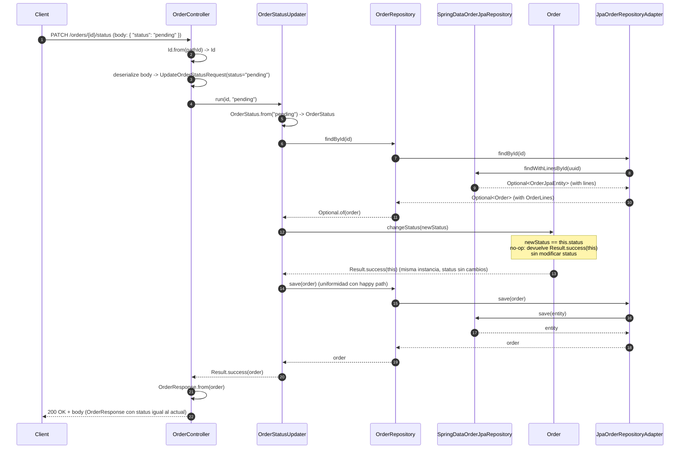
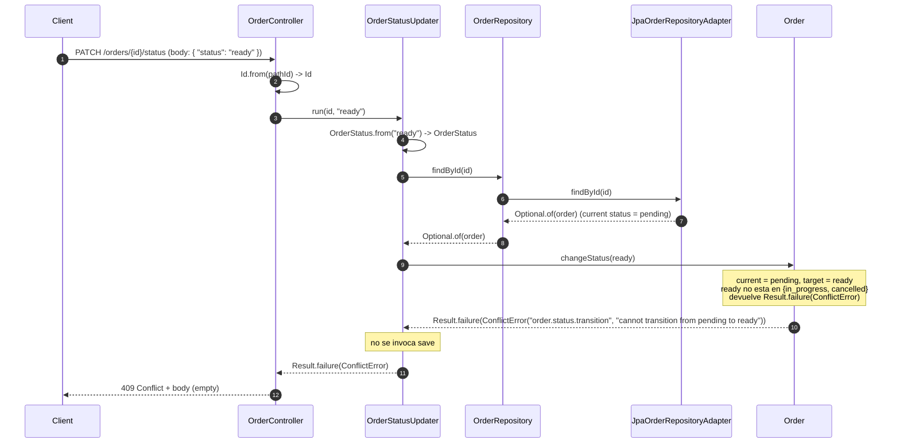
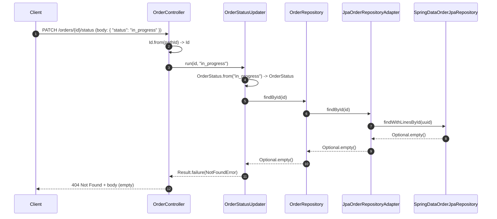

# Actualizacion de estado del pedido — arquitectura

## Overview

### Summary

Esta funcionalidad introduce la primera operacion de mutacion sobre pedidos ya existentes dentro del bounded context `orders` creado por `order-registration`: la transicion de estado de un pedido a lo largo de su ciclo de vida operativo (`pending` -> `in_progress` -> `ready` -> `delivered`/`cancelled`). La operacion se expone como `PATCH /orders/{id}/status`, recibe el nuevo estado en el body y devuelve la representacion completa del pedido (`OrderResponse`) tras aplicar la transicion.

La maquina de estados vive en el dominio, dentro del agregado `Order`, modelada como una tabla inmutable de transiciones validas (`Map<OrderStatus, Set<OrderStatus>>`) y se enforce en un metodo de dominio `Order.changeStatus(OrderStatus): Result<Order>`. La operacion es deliberadamente pequena en alcance: un unico endpoint, una unica operacion de mutacion (`status`), sin edicion de lineas, sin `Idempotency-Key`, sin control de concurrencia y sin emision de eventos de dominio en esta iteracion. Estas decisiones se documentan en `## Goals and Non-Goals` y se registran como `## Future Improvements` cuando aplique.

La arquitectura reutiliza el patron DDD y hexagonal establecido por `order-registration`: la maquina de estados en el dominio, la persistencia mediante los adaptadores JPA y en memoria del contexto `orders`, la traduccion de `Result<T>` a codigo HTTP en el adaptador de entrada, y el cuerpo de error literalmente vacio para `400`, `404` y `409` (alineado con `POST /orders`, `catalog/product` y `table-deletion`). La operacion extiende el puerto `OrderRepository` con `Optional<Order> findById(Id id)` (anticipado en `order-registration` como decision diferida para la primera feature que lo necesitara) y reutiliza `OrderRepository.save(Order)` para persistir el pedido actualizado, sin introducir una operacion `update` dedicada en el puerto.

### Related Feature Document

* `docs/design/orders/order-status-update.md`

### Traceability Notes

* Reutiliza los tipos compartidos `Result`, `DomainError`, `ValidationError`, `ConflictError`, `NotFoundError`, `CompositeValidationError`, `Id` definidos en `src/main/java/com/forkcore/api/shared/domain/`. En particular, `ConflictError` se reutiliza tal cual para "transicion de estado no valida", consistente con su uso previo para "Idempotency-Key conflict" en `POST /orders`.
* Reutiliza el agregado `Order`, el enum `OrderStatus`, la entidad interna `OrderLine` y los value objects `OrderTotal`, `OrderNotes`, `OrderLineQuantity`, `OrderLineUnitPrice` definidos por `order-registration` en `src/main/java/com/forkcore/api/orders/domain/`. Ninguno de estos tipos se modifica en su forma; solo se anade un nuevo metodo al agregado `Order`.
* Reutiliza el puerto de salida `OrderRepository` (declarado por `order-registration` con la unica operacion `save(Order): Order`) y lo extiende con `Optional<Order> findById(Id id)`. La adicion sigue la nota de `order-registration` ("`findById` se anade al puerto en la primera feature que lo necesite") y se motiva porque la transicion de estado necesita localizar el pedido antes de aplicar el cambio.
* Reutiliza los adaptadores de persistencia `JpaOrderRepositoryAdapter`, `InMemoryOrderRepository` y `SpringDataOrderJpaRepository` definidos por `order-registration`, y los extiende con la implementacion de `findById`. `SpringDataOrderJpaRepository` recibe un nuevo metodo derivado `findWithLinesById(UUID id)` anotado con `@EntityGraph(attributePaths = {"lines"})` para soportar la carga de la coleccion `OrderLine` en una sola query y evitar N+1.
* Reutiliza el caso de uso `OrderCreator` (de `order-registration`) y la entidad JPA `OrderJpaEntity` y `OrderLineJpaEntity` tal cual. No se introducen cambios en el esquema de base de datos: la columna `orders.status` (ya `VARCHAR(32)` desde `order-registration`) admite el conjunto completo del enum `OrderStatus` sin migracion.
* Reutiliza el adaptador HTTP `OrderController` (de `order-registration`) y lo extiende con un nuevo handler `PATCH /orders/{id}/status`. El handler sigue el mismo patron de traduccion de `Result` a HTTP que el handler `POST /orders` existente.
* Reutiliza el DTO HTTP `OrderResponse` (de `order-registration`) tal cual para la response. Introduce un nuevo DTO HTTP de entrada `UpdateOrderStatusRequest` (record con `String status`) con `@JsonIgnoreProperties(ignoreUnknown = true)` consistente con el patron de `CreateOrderRequest`.
* Reutiliza el modelo HTTP unificado del proyecto: cuerpo de error literalmente vacio para `400`, `404` y `409` (placeholder neutro), alineado con `POST /orders`, `catalog/product` y `table-deletion`. La politica de cuerpo de error para `500` se mantiene consistente con `order-registration` (cuerpo vacio via `OrderErrorAdvice`, ver `## D-arch-7`).
* Introduce el nuevo caso de uso `OrderStatusUpdater` que orquesta `findById` -> `changeStatus` -> `save` y devuelve `Result<Order>`. El caso de uso es invocado directamente por el adaptador HTTP, replicando la decision ya tomada para `OrderCreator` (no se introduce un puerto de entrada).
* No introduce un nuevo bounded context, un nuevo agregado, un nuevo value object, un nuevo evento de dominio, una nueva tabla, un nuevo indice ni una nueva migracion de esquema. Es una extension minima del contexto `orders` ya creado.

---

## Goals and Non-Goals

### Goals

- Permitir la transicion sincrona del estado de un pedido existente a lo largo del ciclo de vida operativo definido por la maquina de estados, sin reescribir el pedido ni modificar ningun otro campo distinto de `status`.
- Exponer el endpoint `PATCH /orders/{id}/status` que recibe el nuevo estado en el body y responde `200 OK` con la representacion completa del pedido actualizado (`OrderResponse`), consistente con la response de `POST /orders`.
- Modelar la maquina de estados de `OrderStatus` como una regla de negocio del agregado `Order`, enforzada en un metodo de dominio `Order.changeStatus(OrderStatus): Result<Order>` que devuelve `Result.success(order)` (con el mismo `order` en el no-op same-state o con el `order` actualizado en una transicion efectiva) o `Result.failure(ConflictError)` para transiciones invalidas.
- Definir el conjunto cerrado de transiciones validas: `pending -> in_progress`, `pending -> cancelled`, `in_progress -> ready`, `in_progress -> cancelled`, `ready -> delivered`, `ready -> cancelled`. Los estados `delivered` y `cancelled` son terminales: cualquier intento de transicion posterior se rechaza con `409 Conflict`.
- Localizar el pedido por `id` mediante `OrderRepository.findById(Id)`, que se anade al puerto del contexto `orders` en esta iteracion y se implementa en ambos adaptadores de persistencia (`JpaOrderRepositoryAdapter` e `InMemoryOrderRepository`).
- Reutilizar la operacion `OrderRepository.save(Order)` para persistir el pedido actualizado, sin aniadir una operacion `update` dedicada al puerto: la semantica de "guardar el estado actual del agregado" es la misma, independientemente de si el agregado es nuevo o preexistente.
- Tratar la transicion same-state (`status` solicitado == `status` actual) como un caso exitoso con `200 OK` y la representacion actual del pedido, sin error, sin contador de cambios y sin diferenciacion visible respecto a una transicion efectiva.
- Reutilizar el modelo HTTP unificado del proyecto: cuerpo de error literalmente vacio para `400`, `404` y `409`; cuerpo vacio para `500` (politica unificada con `400`, `404` y `409` via `OrderErrorAdvice`); traduccion de `Result.failure(NotFoundError)` a `404`, `Result.failure(ConflictError)` a `409` y `Result.failure(ValidationError)` o `CompositeValidationError` a `400`.
- Validar el formato del `id` del path mediante la factoria compartida `Id.from(String)` del value object `Id` y el formato del `status` del body mediante el enum `OrderStatus`, manteniendo el adaptador HTTP libre de reglas de negocio.

### Non-Goals

- Edicion de cualquier otro campo del pedido distinto de `status` (`notes`, `tableId`, `lines`, `total`). Estas operaciones pertenecen a features futuras (F6 en el diseno).
- Endpoint generico `PATCH /orders/{id}` para edicion multi-campo. Se difiere a una feature futura.
- Baja logica o eliminacion fisica de pedidos (`DELETE /orders/{id}`). Se difiere a una feature futura.
- Listado o consulta de pedidos (`GET /orders`, `GET /orders/{id}`). Se difiere a una feature futura.
- Transiciones inversas (`in_progress -> pending`, `ready -> in_progress`, etc.) o "saltos" en la maquina de estados (p. ej. `pending -> ready`). La unica operacion permitida desde un estado terminal es ninguna.
- Validacion de la existencia o el estado del `tableId` contra el contexto `tables`. Se mantiene la decision de `order-registration` (referencias externas por `id` sin comprobacion de integridad).
- Emision de eventos de dominio (`OrderStatusChanged`, `OrderCancelled`, etc.) como consecuencia de la transicion. La integracion con `billing`, `kitchen` u otros contextos queda diferida (F4).
- Registro de marcas de tiempo por transicion (`status_changed_at`, `pending_at`, ...) o de un historial de transiciones (`order_status_history`). Se difiere a una feature futura (F3).
- Audit log operativo (quien realizo la transicion, desde que IP, etc.). El proyecto no tiene aun un concepto de usuario autenticado.
- Soporte de la cabecera `Idempotency-Key` en `PATCH /orders/{id}/status`. A diferencia de `POST /orders`, este endpoint no expone politica de idempotencia en esta iteracion (F1). El comportamiento same-state ofrece una sensacion idempotente a nivel del estado del recurso, pero no garantiza idempotencia estricta sobre reintentos.
- Control de concurrencia explicito: ni lock optimista (`@Version`), ni lock pesimista, ni lock distribuido, ni compare-and-swap. La politica es "last write wins" (F2).
- Multi-tenant (`restaurantId`), descuentos, impuestos, propinas, division de cuenta, clientes, codigos QR, reservas de mesa. Heredado de `order-registration` y se difiere a iteraciones futuras.
- Reintroducir un cuerpo de error HTTP no vacio (no Problem Details, no `{"errors":...}`) en este endpoint. Se adopta el placeholder neutro alineado con `POST /orders`, `catalog/product` y `table-deletion` (F8).
- Autenticacion, autorizacion, rate limiting, TLS. Estas preocupaciones son transversales al proyecto y se abordaran en su propia iteracion.
- Soporte de multi-step state changes atomicos: una transicion es siempre un cambio de un unico estado a otro. No se contempla "avanzar hasta `ready` en una sola llamada" ni operaciones batch.

---

## Affected Contexts

| Context  | Type      | Impact                                                                                              |
| -------- | --------- | --------------------------------------------------------------------------------------------------- |
| Orders   | Modified  | Anade el caso de uso `OrderStatusUpdater`, el endpoint `PATCH /orders/{id}/status`, el metodo de dominio `Order.changeStatus(OrderStatus): Result<Order>`, la maquina de estados como campo estatico del agregado, la operacion `OrderRepository.findById(Id)` en el puerto y en sus adaptadores, y los DTOs HTTP `UpdateOrderStatusRequest`. La entidad JPA `OrderJpaEntity`, `OrderLineJpaEntity` y `SpringDataOrderJpaRepository` se extienden minimamente (nuevo metodo derivado `findWithLinesById`). El esquema de base de datos no cambia |
| Catalog  | Unchanged | No se introduce ni modifica ningun componente del contexto `catalog`                                 |
| Tables   | Unchanged | No se introduce ni modifica ningun componente del contexto `tables`                                 |
| Shared   | Unchanged | No se introduce ningun nuevo tipo en el nucleo `shared.domain`. Se reutilizan `Result`, `DomainError`, `ValidationError`, `CompositeValidationError`, `ConflictError`, `NotFoundError` e `Id` ya existentes |

### Notes

El contexto `orders` sigue siendo propietario del ciclo de vida del pedido. Su relacion con `catalog` y `tables` no se ve afectada por esta iteracion: `orders` no introduce ni nuevas dependencias hacia `catalog` ni hacia `tables`. La unica modificacion al contexto `orders` es la adicion de un nuevo caso de uso y de un nuevo metodo de dominio, junto con la ampliacion del puerto de persistencia. La logica de transicion vive en el agregado `Order` y se testea de forma aislada, sin levantar el caso de uso ni el adaptador HTTP.

`shared` permanece inalterado: el `ConflictError` ya existente (utilizado por `POST /orders` para "Idempotency-Key conflict") se reutiliza tal cual para "transicion de estado no valida". La decision de no introducir un tipo de error dedicado se documenta en `## D-arch-6`.

`catalog` y `tables` permanecen inalterados en su contrato publico: no se introducen ni se eliminan endpoints, operaciones de dominio, value objects ni esquemas. La consistencia con el resto del proyecto se mantiene: la traduccion de `Result` a HTTP en el adaptador HTTP, el uso de `Id.from(String)` para validar el `id` del path y la politica de cuerpo de error vacio para `400`/`404`/`409` son las mismas que en `POST /orders` y en `catalog/product`.

---

## Domain Model Impact

### Aggregates

| Aggregate | Type     | Purpose                                                                                          |
| --------- | -------- | ------------------------------------------------------------------------------------------------ |
| Order     | Modified | Aggregate root del contexto `orders`. Se le anade el metodo de dominio `changeStatus(OrderStatus): Result<Order>` que enforce la maquina de estados y devuelve el pedido actualizado o un `ConflictError` |

### Entities

| Entity    | Type     | Description                                                                                                                            |
| --------- | -------- | -------------------------------------------------------------------------------------------------------------------------------------- |
| Order     | Modified | Aggregate root del contexto `orders`. Mantiene `lines: List<OrderLine>`, `status`, `total`, `tableId`, `notes`. Nuevo metodo de dominio `changeStatus(OrderStatus): Result<Order>` que consulta la maquina de estados (un `Map<OrderStatus, Set<OrderStatus>>` estatico e inmutable) y devuelve `Result.success(this)` (mismo `this` en no-op y en transicion efectiva) o `Result.failure(ConflictError)` |
| OrderLine | Unchanged| Entidad interna del agregado `Order`. Se identifica por su propio `Id` UUIDv7. Mantiene `productId: Id`, `quantity`, `unitPrice: BigDecimal` (snapshot historico). No se ve afectada por la transicion de estado del pedido padre |

### Value Objects

| Value Object        | Type      | Description                                                                                                                |
| ------------------- | --------- | -------------------------------------------------------------------------------------------------------------------------- |
| OrderStatus         | Unchanged | Enum cerrado del estado del pedido: `pending`, `in_progress`, `ready`, `delivered`, `cancelled`. En esta iteracion se admiten todos los valores para updates (no solo `pending` como en el alta) |
| OrderTotal          | Unchanged | `BigDecimal` no negativo. La transicion de estado no recalcula el `total`; se devuelve tal cual esta persistido            |
| OrderNotes          | Unchanged | String opcional. La transicion de estado no lo modifica                                                                     |
| OrderLineQuantity   | Unchanged | Entero mayor o igual a 1. La transicion de estado no lo modifica                                                            |
| OrderLineUnitPrice  | Unchanged | `BigDecimal` no negativo. La transicion de estado no lo modifica                                                           |
| Id                  | Unchanged | Value object compartido. Se reutiliza la factoria segura `Id.from(String): Result<Id>` para validar el `id` del path        |

### Domain Notes

* El metodo de dominio `Order.changeStatus(OrderStatus newStatus): Result<Order>` se anade al agregado `Order` manteniendo la consistencia con el patron de "valido por construccion" de `Order.create(...)`. El metodo no muta campos inmutables del agregado (`id`, `lines`, `total`, `tableId`, `notes`): solo actualiza `status` cuando la transicion es valida. En el no-op same-state, el metodo devuelve `Result.success(this)` con la misma instancia, sin tocar ningun campo.
* La maquina de estados se modela como un `private static final Map<OrderStatus, Set<OrderStatus>>` en el agregado `Order`, inicializado una sola vez en un bloque estatico con `Map.ofEntries` y `Set.of` (Java 25). Cada entrada mapea un `OrderStatus` origen a un `Set<OrderStatus>` con los estados destino validos. Los estados terminales (`delivered`, `cancelled`) se modelan con `Set.of()` (conjunto vacio). La decision concreta de la representacion se documenta en `## D-arch-1`.
* El contrato del metodo `changeStatus` es:
  * Si `newStatus` coincide con `this.status` (same-state no-op): devuelve `Result.success(this)` con la misma instancia del agregado, sin modificar `status` ni ningun otro campo.
  * Si `newStatus` es un estado destino valido segun la maquina de estados para `this.status`: aplica el cambio sobre `this.status` y devuelve `Result.success(this)`. No se devuelve una copia nueva del agregado; se devuelve la misma instancia mutada.
  * Si `newStatus` no es un estado destino valido para `this.status` (incluido el caso de estado actual terminal): devuelve `Result.failure(ConflictError("order.status.transition", "cannot transition from <from> to <to>"))`. El agregado `this` permanece sin modificar (la mutacion solo se aplica cuando la transicion es valida).
* El metodo de dominio nunca lanza excepciones de validacion: cualquier transicion invalida se traduce a `Result.failure(ConflictError)`. Esta decision es consistente con `Order.create(...)` y con el resto de factorias/metodos del dominio, que nunca lanzan excepciones de validacion.
* El agregado `Order` no se acopla a la operacion de persistencia: `OrderRepository.save(order)` lo invoca el caso de uso `OrderStatusUpdater`, no el agregado. El agregado solo expone el metodo `changeStatus` y mantiene la responsabilidad de "valido por construccion" en su salida.
* La maquina de estados se modela dentro del agregado para que la regla "que transiciones son validas" viva en un solo punto y se testee de forma aislada, sin levantar el caso de uso ni el adaptador HTTP. Anadir o quitar una transicion valida es un cambio de un solo punto en el codigo de dominio (la entrada correspondiente en el `Map`).
* El comportamiento same-state no es un caso especial: el metodo `changeStatus` lo trata como una transicion valida (porque el estado destino esta trivialmente en el conjunto de "estados destino" del estado origen en la maquina, o porque el metodo chequea `newStatus == this.status` antes de consultar la maquina). Esto evita inconsistencias entre el caso same-state y el caso "estado actual terminal" (que tambien debe devolver `200 OK` en same-state: `delivered -> delivered` es valido aunque `delivered` sea terminal).
* El `ConflictError` que produce el metodo de dominio lleva un codigo legible por maquina (`"order.status.transition"`) y un mensaje legible por humanos (`"cannot transition from <from> to <to>"`). El codigo es estable y permite a futuros consumidores (logs, metricas, futuros endpoints de error estructurado) identificar la naturaleza del fallo sin procesar el mensaje.

---

## Application Services

### Use Cases

| Use Case            | Type | Description                                                                                                                                                                                                                                                                                                  |
| ------------------- | ---- | ------------------------------------------------------------------------------------------------------------------------------------------------------------------------------------------------------------------------------------------------------------------------------------------------------------ |
| OrderStatusUpdater  | New  | Caso de uso que localiza un pedido por `id` mediante `OrderRepository.findById`, aplica la transicion de estado mediante el metodo de dominio `Order.changeStatus` y persiste el pedido actualizado mediante `OrderRepository.save(order)`. Recibe parametros primitivos (`String id`, `String newStatus`) y devuelve `Result<Order>`. Nunca lanza excepciones de validacion |

`OrderStatusUpdater` no introduce un record primitivo de aplicacion propio: la entrada son dos `String` (`id`, `newStatus`) que el caso de uso transforma en `Id` y `OrderStatus` mediante las factorias compartidas. Esta decision evita ruido sin beneficio, dado que la entrada tiene solo dos campos.

### Application Flow

1. El adaptador HTTP `OrderController` recibe `PATCH /orders/{id}/status` con el `id` del pedido en el path y un body JSON de la forma `{ "status": "<new_status>" }`. No se admite la cabecera `Idempotency-Key`; si llega, se ignora silenciosamente.
2. El adaptador HTTP valida el formato del `id` del path mediante la factoria compartida `Id.from(String): Result<Id>`. Si la validacion falla, responde `400 Bad Request` con cuerpo vacio y termina. Si el `id` es valido, obtiene un `Id` y delega en el caso de uso.
3. El adaptador HTTP deserializa el body a `UpdateOrderStatusRequest` (record con `String status`) con `@JsonIgnoreProperties(ignoreUnknown = true)`. Si el body esta malformado, Jackson falla y el adaptador HTTP responde `400 Bad Request` con cuerpo vacio, consistente con la politica uniforme del proyecto. Si el `Content-Type` no es JSON, Spring responde `400 Bad Request` con cuerpo vacio antes de invocar al handler.
4. `OrderStatusUpdater.run(id, newStatus)` recibe el `Id` validado y el `String newStatus` del body.
5. El caso de uso convierte `newStatus` a `OrderStatus` mediante la factoria del enum (decision concreta del arquitecto, ver `## D-arch-2` y la nota de implementacion: `OrderStatus.from(String): Result<OrderStatus>` o un value object equivalente que devuelva `Result<OrderStatus>`). Si el `String` no coincide con ningun valor del enum, el caso de uso devuelve `Result.failure(ValidationError("status", "must be one of [pending, in_progress, ready, delivered, cancelled]"))` y termina. El adaptador HTTP traduce a `400 Bad Request` con cuerpo vacio.
6. El caso de uso invoca `OrderRepository.findById(id)`. Si la operacion devuelve `Optional.empty()`, el caso de uso devuelve `Result.failure(NotFoundError)` y el adaptador HTTP traduce a `404 Not Found` con cuerpo vacio.
7. Si el pedido existe, el caso de uso invoca el metodo de dominio `order.changeStatus(newStatus): Result<Order>`. El metodo evalua la transicion contra la maquina de estados:
   * Si la transicion es valida (incluido el caso same-state), el metodo devuelve `Result.success(order)` con la misma instancia del agregado (mismo `this` en no-op, mismo `this` con `status` actualizado en transicion efectiva).
   * Si la transicion no es valida (estado destino no permitido, o estado actual terminal —distinto del mismo estado destino—), el metodo devuelve `Result.failure(ConflictError)`. El adaptador HTTP traduce a `409 Conflict` con cuerpo vacio.
8. Si el caso de uso recibio `Result.success(order)` del metodo de dominio, invoca `OrderRepository.save(order)` y devuelve `Result.success(order)` al adaptador HTTP. La llamada a `save` se realiza tanto en transiciones efectivas como en no-ops same-state, por simplicidad y uniformidad (decision `D-arch-3`).
9. El adaptador HTTP construye la response `OrderResponse.from(order)` (mismo DTO que en `POST /orders`) y responde `200 OK` con cuerpo `OrderResponse`.
10. El caso de uso nunca lanza excepciones de validacion. Cualquier excepcion tecnica no anticipada (por ejemplo, una excepcion de conexion a la base de datos durante `findById` o `save`) es interceptada por el `OrderErrorAdvice` del paquete `orders.infrastructure.in.web`, que la traduce a `500 Internal Server Error` con cuerpo vacio (politica unificada del contexto `orders`, ver `## D-arch-7`).

---

## Domain Services

### Domain Services

Ninguno en esta iteracion.

La maquina de estados no es un servicio de dominio: vive dentro del agregado `Order` como un campo estatico inmutable (`Map<OrderStatus, Set<OrderStatus>>`) y se enforce en el metodo de dominio `Order.changeStatus`. Mantenerla dentro del agregado garantiza que la regla "que transiciones son validas" se aplica siempre que se manipule un `Order`, independientemente del mecanismo (HTTP, caso de uso, futuro consumidor asincrono), y que se testea de forma aislada sin levantar el caso de uso ni el adaptador HTTP. La decision de no introducir un `OrderStatusService` separado se documenta en `## D-arch-1`.

---

## Domain Events

### Events

Ninguno en esta iteracion.

No se introduce un evento de dominio `OrderStatusChanged` en esta feature. La adicion de emision de eventos de dominio desde `OrderStatusUpdater` (o desde el agregado `Order`) se difiere a una iteracion futura y se registra en `## Future Improvements` (F4), consistente con la decision de `order-registration` de no introducir un evento `OrderCreated` en el MVP. Si en el futuro otros contextos (por ejemplo `billing` o `kitchen`) necesitan reaccionar a las transiciones, el caso de uso o el agregado podran emitir el evento sin necesidad de modificar el contrato del puerto actual.

---

## Ports

### Incoming Ports

Ninguno.

`OrderStatusUpdater` es invocado directamente por el adaptador HTTP `OrderController`, replicando la decision ya tomada para `OrderCreator` en `order-registration` (y para `ProductCreator`, `ProductUpdater`, `ProductDeleter` y `TableCreator` en los modulos `catalog/product` y `tables`). No se introduce una interfaz `UpdateOrderStatusUseCase` ni un `Command` en esta iteracion. La decision se documenta en `## D-arch-8`.

### Outgoing Ports

| Port                 | Purpose                                                                                                                                                |
| -------------------- | ------------------------------------------------------------------------------------------------------------------------------------------------------ |
| OrderRepository      | Persistir pedidos del contexto `orders`. Extendido en esta iteracion con `Optional<Order> findById(Id id)` ademas de la operacion `Order save(Order order)` ya existente |

### Port Contracts

`OrderRepository`:

* `Order save(Order order): Order` (existente desde `order-registration`, sin cambios)
* `Optional<Order> findById(Id id): Optional<Order>` (nuevo en esta iteracion)

`findById` devuelve `Optional.of(order)` con el pedido persistido (incluyendo su coleccion `OrderLine`) si existe un `OrderJpaEntity` con el `Id` proporcionado, o `Optional.empty()` en cualquier otro caso. El adaptador JPA traduce el `EntityNotFoundException` que Spring Data lanza internamente a `Optional.empty()` para mantener el contrato del puerto uniforme (decision `D-arch-5`). La coleccion `OrderLine` se carga eagerly en una sola query mediante `@EntityGraph(attributePaths = {"lines"})` para evitar N+1.

`save` mantiene su semantica original ("persistir el estado actual del agregado") y se reutiliza para el alta (`OrderCreator`) y para la transicion de estado (`OrderStatusUpdater`). La decision de no introducir una operacion `update` dedicada se documenta en `## D-arch-4` y en `## Trade-offs`.

### Port Notes

* El caso de uso `OrderStatusUpdater` no inyecta `ProductRepository` ni `TableRepository`: solo depende de `OrderRepository`. La autonomia del dominio `orders` frente a `catalog` y `tables` no se ve afectada por esta iteracion.
* La adicion de `findById` al puerto estaba anticipada en `order-registration` (ver "Port Notes" de la arquitectura de `order-registration`: "`findById` se anade al puerto en la primera feature que lo necesite"). Esta feature es esa primera necesidad: la transicion de estado requiere localizar el pedido por `id` antes de aplicar la transicion.
* `OrderRepository.save(Order)` se llama con un agregado que ya existia, lo que puede parecer semantica de "update" mas que de "save". La decision de mantener una unica operacion `save` y dejar la distincion nuevo-vs-existente al estado del agregado (id presente en BD vs. id nuevo) es deliberada y consistente con la convencion del proyecto. Aniadir una operacion `update` paralela introduciria una firma mas sin necesidad inmediata (YAGNI).

---

## Repository Impact

### New Repositories

Ninguno.

No se introduce un nuevo repositorio ni un nuevo adaptador de persistencia. La persistencia se realiza sobre las mismas tablas (`orders` y `order_lines`) y a traves de los mismos adaptadores ya definidos por `order-registration`.

### Modified Repositories

| Repository                       | Change                                                                                                                                                                                                                  |
| -------------------------------- | ----------------------------------------------------------------------------------------------------------------------------------------------------------------------------------------------------------------------- |
| `OrderRepository`                | Modificado: se anade `Optional<Order> findById(Id id): Optional<Order>` al contrato del puerto. La operacion `save(Order): Order` existente no se modifica                                                            |
| `SpringDataOrderJpaRepository`   | Modificado: se anade `Optional<OrderJpaEntity> findWithLinesById(UUID id)` anotado con `@EntityGraph(attributePaths = {"lines"})` para cargar la coleccion `OrderLine` en una sola query y evitar N+1                  |
| `JpaOrderRepositoryAdapter`      | Modificado: implementa `findById(Id id)` delegando en `SpringDataOrderJpaRepository.findWithLinesById(UUID)` y mapeando `OrderJpaEntity` (con `OrderLineJpaEntity` cargadas eagerly) a `Order` (con `OrderLine` rehidratadas). Traduce `EntityNotFoundException` a `Optional.empty()` para mantener el contrato del puerto |
| `InMemoryOrderRepository`        | Modificado: implementa `findById(Id id)` consultando el `Map<String, Order>` interno y devolviendo `Optional.of(order)` o `Optional.empty()` segun corresponda. Mantiene la paridad con el adaptador JPA              |

### Notes

* El metodo `findWithLinesById(UUID)` se nombra con el sufijo `WithLines` para indicar explicitamente que la coleccion `OrderLine` se carga eagerly, distinguientose asi del `findById(UUID)` que `JpaRepository` provee por defecto y que devolveria la coleccion con `FetchType.LAZY`. La anotacion `@EntityGraph(attributePaths = {"lines"})` genera una sola query con `LEFT JOIN FETCH` sobre `order_lines`, equivalente a un `JOIN FETCH` de Hibernate.
* `JpaOrderRepositoryAdapter.findById(Id)` captura `EntityNotFoundException` (que Spring Data lanza cuando `findById` por convencion no encuentra la entidad) solo si la llamada pasa por el `findById` por defecto; con `findWithLinesById` la firma ya devuelve `Optional`, asi que la traduccion es innecesaria para este metodo. Si en el futuro se introducen otros metodos derivados que lancen `EntityNotFoundException`, el adaptador debera capturarla para mantener el contrato del puerto. La decision de explicitar este comportamiento se documenta en `## D-arch-5`.
* El adaptador `JpaOrderRepositoryAdapter` mantiene la conversion entre `OrderJpaEntity` (con `status` mapeado a `OrderStatus` mediante un `AttributeConverter` o un mapeo directo a `String`, decision de implementacion) y `Order` (con `status` como enum `OrderStatus`). La columna `orders.status` ya admite los valores completos del enum desde `order-registration` (`VARCHAR(32)`); no se requiere ninguna modificacion al esquema ni al `AttributeConverter`.
* `InMemoryOrderRepository.findById(Id)` consulta el `Map<String, Order>` interno y devuelve `Optional.of(order)` si el `id` esta presente o `Optional.empty()` si no. La implementacion mantiene la paridad con el adaptador JPA en terminos de contrato (mismo `Optional<Order>` por entrada, mismo `Id` por clave) sin asumir nada sobre la representacion interna del agregado. La mutacion del agregado que devuelve `findById` no se propaga al `Map` hasta que el caso de uso invoque `save(order)`, evitando asi que una lectura posterior vea un agregado mutado por una transicion aun no persistida.

---

## External Integrations

### New Integrations

Ninguna.

No se introduce ninguna nueva integracion externa en esta iteracion. La unica operacion de E/S es la lectura/escritura de pedidos contra la base de datos PostgreSQL ya configurada para `order-registration`. La conversion de `String` a `OrderStatus` es una operacion local sobre el enum y no requiere ninguna dependencia externa.

### Changes Required

* Ninguna. No se requieren cambios en la configuracion de la base de datos, no se requieren migraciones de esquema y no se introducen nuevas dependencias en `build.gradle`. La columna `orders.status` ya admite los valores completos del enum `OrderStatus` desde la migracion `V3__create_orders_tables.sql` introducida por `order-registration`.

---

## Data Model Impact

### New Persistence Models

Ninguno.

No se introduce ninguna nueva tabla ni ninguna nueva entidad JPA. Las entidades `OrderJpaEntity` y `OrderLineJpaEntity` definidas por `order-registration` se reutilizan tal cual, y el esquema de las tablas `orders` y `order_lines` permanece inalterado.

### Schema Changes

Ninguna.

El esquema de base de datos no se modifica en esta iteracion. La columna `orders.status` ya es `VARCHAR(32)` desde la migracion `V3__create_orders_tables.sql` introducida por `order-registration`, y admite el conjunto completo de valores del enum `OrderStatus` (`pending`, `in_progress`, `ready`, `delivered`, `cancelled`) sin necesidad de alteracion. No se anaden columnas (`status_changed_at`, `pending_at`, `pending_at`, etc.), no se anaden tablas (`order_status_history`), no se anaden indices y no se altera ninguna constraint.

### Persistence Notes

* La decision de admitir todos los valores del enum en updates se enforce primero en el dominio (la maquina de estados en `Order.changeStatus`) y se refleja en la aplicacion (el caso de uso traduce la transicion a un `Order` con `status` actualizado). La columna `orders.status` no impone ninguna constraint de valores permitidos: es responsabilidad del dominio y de la aplicacion mantener la coherencia. Este patron es consistente con la decision de `order-registration` de no duplicar reglas de dominio en el esquema.
* No se introduce una columna `updated_at` ni un trigger que registre la fecha de la transicion: la columna no existe en el esquema actual y su adicion se difiere a una feature futura (F3) que abordara el modelado de marcas de tiempo por transicion de forma global.
* La coleccion `OrderLine` se mapea con `FetchType.LAZY` por defecto (consistente con el patron de Hibernate). El nuevo metodo `findWithLinesById(UUID)` sobreescribe este comportamiento para la operacion `findById` del adaptador JPA, cargando la coleccion eagerly mediante `@EntityGraph(attributePaths = {"lines"})`. Esto es necesario porque el caso de uso `OrderStatusUpdater` devuelve un `Order` completo y la response HTTP se construye con todas las lineas; un fetch lazy en el adaptador provocaria N+1 o `LazyInitializationException` al construir `OrderResponse` fuera de la transaccion de JPA.
* La conversion entre `OrderStatus` (enum del dominio) y el valor persistido en `orders.status` (`VARCHAR(32)`) se realiza mediante el `AttributeConverter` ya definido en `order-registration` (o mediante un mapeo directo a `String`, decision de implementacion). La columna admite `pending`, `in_progress`, `ready`, `delivered` y `cancelled` como valores validos; cualquier valor distinto lanzaria una excepcion de conversion al persistir, que se propagaria como un `500` (politica consistente con `order-registration`).

---

## Component Map

### Application layer (`com.forkcore.api.orders.application`)

| Component                | Type      | Responsibility                                                                                                                |
| ------------------------ | --------- | ----------------------------------------------------------------------------------------------------------------------------- |
| `OrderCreator`           | `@Service`| Caso de uso existente (sin cambios). Valida formatos, resuelve precios, construye el agregado `Order`, lo persiste. Recibe primitivos. Devuelve `Result<Order>` |
| `OrderStatusUpdater`     | `@Service`| Caso de uso nuevo. Localiza el pedido por `id` mediante `OrderRepository.findById`, valida el `String newStatus` contra el enum `OrderStatus`, aplica la transicion mediante `Order.changeStatus`, persiste el pedido actualizado. Recibe primitivos (`String id`, `String newStatus`). Devuelve `Result<Order>` |

### Domain layer (`com.forkcore.api.orders.domain`)

| Component            | Type        | Responsibility                                                                                                                          |
| -------------------- | ----------- | --------------------------------------------------------------------------------------------------------------------------------------- |
| `Order`              | Aggregate   | Aggregate root. Mantiene `lines`, `status`, `total`, `tableId`, `notes`. Factory `Order.create(...)` devuelve `Result<Order>`. Nuevo metodo de dominio `changeStatus(OrderStatus): Result<Order>` que enforce la maquina de estados (campo estatico `Map<OrderStatus, Set<OrderStatus>>`) y devuelve el mismo `this` o un `ConflictError` |
| `OrderLine`          | Entity      | Entidad interna del agregado. Mantiene `productId`, `quantity`, `unitPrice`. Sin cambios en esta iteracion                              |
| `OrderRepository`    | Port        | `save(Order): Order` (existente) y `Optional<Order> findById(Id id): Optional<Order>` (nuevo en esta iteracion). Salida de persistencia |

### Domain value objects (`com.forkcore.api.orders.domain.vo`)

| Component            | Type        | Responsibility                                                                                  |
| -------------------- | ----------- | ----------------------------------------------------------------------------------------------- |
| `OrderStatus`        | Enum        | `pending`, `in_progress`, `ready`, `delivered`, `cancelled`. Sin cambios en la forma; se anade una factoria `from(String): Result<OrderStatus>` (o equivalente) que el caso de uso invoca para validar el `String` del body |
| `OrderTotal`         | VO          | `BigDecimal` no negativo. Sin cambios                                                                              |
| `OrderNotes`         | VO          | String opcional. Sin cambios                                                                                       |
| `OrderLineQuantity`  | VO          | Entero `>= 1`. Sin cambios                                                                                          |
| `OrderLineUnitPrice` | VO          | `BigDecimal` no negativo. Sin cambios                                                                               |

### Shared kernel (`com.forkcore.api.shared.domain`)

| Component       | Type | Responsibility                                                                                       |
| --------------- | ---- | ---------------------------------------------------------------------------------------------------- |
| `Id`            | VO   | Identificador UUIDv7 time-ordered. Factoria segura `Id.from(String): Result<Id>` (sin cambios). Reutilizada para validar el `id` del path en `OrderStatusUpdater` |
| `ConflictError` | `DomainError` | Reutilizado tal cual para "transicion de estado no valida" (codigo `"order.status.transition"`, mensaje `"cannot transition from <from> to <to>"`). Ya se usaba en `POST /orders` para "Idempotency-Key conflict" |
| `NotFoundError` | `DomainError` | Reutilizado tal cual para "pedido inexistente" (decision concreta del arquitecto, ver `## D-arch-6`) |
| `ValidationError`, `CompositeValidationError` | `DomainError` | Reutilizados tal cual para "formato de `status` invalido" en el caso de uso                                            |

### Infrastructure layer — HTTP adapter (`com.forkcore.api.orders.infrastructure.in.web`)

| Component                  | Type           | Responsibility                                                                                                |
| -------------------------- | -------------- | ------------------------------------------------------------------------------------------------------------- |
| `OrderController`          | `@RestController` | `POST /orders` (existente) y `PATCH /orders/{id}/status` (nuevo). El nuevo handler recibe el `id` del path, deserializa el body a `UpdateOrderStatusRequest`, delega en `OrderStatusUpdater`, traduce `Result` a HTTP (200/400/404/409) |
| `CreateOrderRequest`       | DTO (record)   | DTO HTTP de entrada para `POST /orders`. Sin cambios                                                            |
| `OrderResponse`            | DTO (record)   | DTO HTTP de salida. Reutilizado tal cual para la response de `PATCH /orders/{id}/status`                     |
| `UpdateOrderStatusRequest` | DTO (record)   | DTO HTTP de entrada para `PATCH /orders/{id}/status`. `record UpdateOrderStatusRequest(@JsonIgnoreProperties(ignoreUnknown = true) String status)`. Anotado con `@JsonIgnoreProperties(ignoreUnknown = true)` consistente con `CreateOrderRequest` |

### Infrastructure layer — persistence (`com.forkcore.api.orders.infrastructure.out.persistence`)

| Component                          | Type        | Responsibility                                                                                                |
| ---------------------------------- | ----------- | ------------------------------------------------------------------------------------------------------------- |
| `OrderJpaEntity`                   | `@Entity`   | Entidad JPA raiz. `@Table(name = "orders")`. Sin cambios                                                       |
| `OrderLineJpaEntity`               | `@Entity`   | Entidad JPA de linea. `@Table(name = "order_lines")`. Sin cambios                                            |
| `SpringDataOrderJpaRepository`     | Interface   | `JpaRepository<OrderJpaEntity, UUID>`. Anadido `Optional<OrderJpaEntity> findWithLinesById(UUID id)` con `@EntityGraph(attributePaths = {"lines"})` |
| `JpaOrderRepositoryAdapter`        | `@Repository` | Adaptador que implementa `OrderRepository.save(Order)` y `OrderRepository.findById(Id)`, mapeando entre agregado y entidades JPA. `findById` traduce `EntityNotFoundException` a `Optional.empty()` para mantener el contrato del puerto |
| `InMemoryOrderRepository`          | Class       | Doble de pruebas. Implementa `OrderRepository.save(Order)` y `OrderRepository.findById(Id)` con un `Map<String, Order>` (almacenamiento en memoria) |

### Notes

* Cada componente vive en un paquete con la convencion hexagonal del proyecto: `domain`, `domain.vo`, `application`, `infrastructure.in.web`, `infrastructure.out.persistence`. No se introducen nuevos paquetes ni se mueven componentes entre paquetes.
* El dominio no depende de Spring, HTTP ni JPA. Los adaptadores HTTP y de persistencia viven en `infrastructure` y no se filtran al dominio ni a la aplicacion. La maquina de estados vive en el agregado, no en infraestructura.
* El caso de uso `OrderStatusUpdater` no inyecta `IdempotencyKeyStore`, `ProductPriceProvider`, `ProductRepository` ni `TableRepository`. Solo depende de `OrderRepository`. Esta es una diferencia importante con `OrderCreator` (que ademas inyecta `ProductPriceProvider`): `OrderStatusUpdater` no realiza ninguna operacion de E/S contra `catalog` ni contra `tables`, lo que mantiene la transicion de estado como una operacion puramente local al contexto `orders`.

---

## Sequence Diagrams

### Happy path (effective transition)

```mermaid
sequenceDiagram
    autonumber
    participant Client
    participant OrderController
    participant OrderStatusUpdater
    participant OrderRepository
    participant SpringDataOrderJpaRepository
    participant Order
    participant JpaOrderRepositoryAdapter

    Client->>OrderController: PATCH /orders/{id}/status (body: { "status": "in_progress" })
    OrderController->>OrderController: Id.from(pathId) -> Id
    OrderController->>OrderController: deserialize body -> UpdateOrderStatusRequest(status="in_progress")
    OrderController->>OrderStatusUpdater: run(id, "in_progress")
    OrderStatusUpdater->>OrderStatusUpdater: OrderStatus.from("in_progress") -> OrderStatus
    OrderStatusUpdater->>OrderRepository: findById(id)
    OrderRepository->>JpaOrderRepositoryAdapter: findById(id)
    JpaOrderRepositoryAdapter->>SpringDataOrderJpaRepository: findWithLinesById(uuid)
    SpringDataOrderJpaRepository-->>JpaOrderRepositoryAdapter: Optional<OrderJpaEntity> (with lines)
    JpaOrderRepositoryAdapter-->>OrderRepository: Optional<Order> (with OrderLines)
    OrderRepository-->>OrderStatusUpdater: Optional.of(order)
    OrderStatusUpdater->>Order: changeStatus(newStatus)
    Note over Order: consulta maquina de estados:<br/>pending -> {in_progress, cancelled}<br/>newStatus in allowed set
    Order-->>OrderStatusUpdater: Result.success(this) (status actualizado)
    OrderStatusUpdater->>OrderRepository: save(order)
    OrderRepository->>JpaOrderRepositoryAdapter: save(order)
    JpaOrderRepositoryAdapter->>SpringDataOrderJpaRepository: save(entity)
    SpringDataOrderJpaRepository-->>JpaOrderRepositoryAdapter: entity
    JpaOrderRepositoryAdapter-->>OrderRepository: order (in-memory identity)
    OrderRepository-->>OrderStatusUpdater: order
    OrderStatusUpdater-->>OrderController: Result.success(order)
    OrderController->>OrderController: OrderResponse.from(order)
    OrderController-->>Client: 200 OK + body
```



### Same-state no-op (status == currentStatus)



### Invalid transition (409)



### Order not found (404)



---

## HTTP Layer

### Request

* Metodo: `PATCH`
* Path: `/orders/{id}/status` donde `{id}` es el `id` del pedido (UUID).
* Cabeceras:
  * `Content-Type: application/json` (obligatorio; un body no JSON se rechaza como `400` con cuerpo vacio).
  * `Idempotency-Key` no se admite en este endpoint. Si llega, se ignora silenciosamente.
* Body: `UpdateOrderStatusRequest { status: String }`.
  * `status`: obligatorio, no vacio, no `null`. Debe coincidir exactamente (case-sensitive, lowercase) con un valor del enum `OrderStatus`: `pending`, `in_progress`, `ready`, `delivered`, `cancelled`.
  * Cualquier otro campo al margen de `status` se ignora silenciosamente como dato no reconocido por el contrato. Esto se enforce en el DTO HTTP con `@JsonIgnoreProperties(ignoreUnknown = true)` para que Jackson no falle al deserializar.

Ejemplo de request:

```json
{
  "status": "in_progress"
}
```

### Success Response

* Status: `200 OK`
* Cuerpo: `OrderResponse { id, status, total, tableId, notes, lines: [ { productId, quantity, unitPrice } ] }`. El `status` de la response es el estado del pedido tras la operacion (igual al estado actual en un no-op, igual al estado solicitado en una transicion efectiva). El resto de campos se devuelven tal como estan persistidos; no se recalculan. No hay cabecera `Location` (a diferencia de `POST /orders`): la operacion no crea un nuevo recurso.

Ejemplo de response (transicion efectiva `pending` -> `in_progress`):

```json
{
  "id": "22222222-2222-2222-2222-222222222222",
  "status": "in_progress",
  "lines": [
    { "productId": "0f4f7f2c-6f5d-4d20-91be-0c5dc1f0f1cd", "quantity": 1, "unitPrice": 12.50 },
    { "productId": "1a2b3c4d-5e6f-7a8b-9c0d-1e2f3a4b5c6d", "quantity": 2, "unitPrice":  2.20 }
  ],
  "tableId": "11111111-1111-1111-1111-111111111111",
  "notes": "sin cebolla",
  "total": 16.90
}
```

### Error Responses

* `400 Bad Request` con cuerpo literalmente vacio (placeholder neutro) en los casos detallados en `## Validation and Error Handling`.
* `404 Not Found` con cuerpo literalmente vacio cuando el pedido no existe.
* `409 Conflict` con cuerpo literalmente vacio cuando la transicion solicitada no es valida para el estado actual del pedido (estado destino no permitido por la maquina de estados, o estado actual terminal —distinto del mismo estado destino—).
* `500 Internal Server Error` para fallos tecnicos inesperados (por ejemplo, perdida de conexion a la base de datos). Cuerpo: vacio, interceptado por `OrderErrorAdvice` (politica unificada con `400`, `404` y `409` para todo el contexto `orders`). La politica de cuerpo de error es **unificada** para `400`, `404` y `409` (cuerpo vacio). La distincion entre error de cliente e infraestructura vive en el codigo de estado, no en el body.

### Error body policy per status

| Status | Body                                                | Rationale                                                                                          |
| ------ | --------------------------------------------------- | -------------------------------------------------------------------------------------------------- |
| 200    | `OrderResponse` JSON                                 | Representacion del pedido actualizado (o actual, en no-op same-state)                              |
| 400    | Empty body                                          | Placeholder neutro alineado con `POST /orders`, `catalog/product` y `table-deletion`              |
| 404    | Empty body                                          | Placeholder neutro (misma linea que `400` y `409`)                                                |
| 409    | Empty body                                          | Placeholder neutro (misma linea que `400` y `404`)                                                |
| 500    | Empty body                                  | Cuerpo vacio via `OrderErrorAdvice` (politica unificada con `400`, `404` y `409` para todo el contexto `orders`). El `OrderErrorAdvice` (`basePackageClasses = OrderController.class`) intercepta cualquier excepcion no anticipada y devuelve `500` con cuerpo vacio. Esta politica ya aplica a `POST /orders` (heredada de `order-registration`) y se aplica a `PATCH /orders/{id}/status` por la misma razon. |

---

## Idempotency Design

No aplica en esta iteracion.

`PATCH /orders/{id}/status` **no** soporta la cabecera `Idempotency-Key`. A diferencia de `POST /orders`, este endpoint no mantiene una cache de respuestas, no calcula un fingerprint del body ni distingue entre "misma transicion dos veces" y "reintento de una transicion fallida". La adicion de `Idempotency-Key` se difiere a una iteracion futura y se registra en `## Future Improvements` (F1).

El endpoint ofrece una sensacion idempotente a nivel del estado del recurso gracias al comportamiento same-state (FR6): un cliente que reintenta el mismo `PATCH` con el mismo body despues de un timeout de red termina en el mismo estado sin duplicar el efecto. Esta idempotencia "a nivel de recurso" es suficiente para los reintentos mas comunes (cliente que recibe timeout justo despues de que la transicion se aplico y reintenta el mismo body), pero no cubre el caso de un timeout de red justo despues de una transicion que se aplico y un reintento con un body distinto. Para ese caso, el cliente debera implementar su propia politica de reintento (p. ej. "leer el estado actual del pedido antes de reintentar") o esperar a F1.

---

## Validation and Error Handling

### Validation Rules

* `id` del path: obligatorio, formato UUID valido. Validado por `Id.from(String)` invocado desde el adaptador HTTP. Si falla, `400 Bad Request` con cuerpo vacio sin invocar al caso de uso.
* `status` del body: obligatorio, no vacio, no `null`, debe coincidir exactamente (case-sensitive, lowercase) con un valor del enum `OrderStatus`. Validado por la factoria del enum (`OrderStatus.from(String): Result<OrderStatus>` o equivalente, decision de implementacion) invocada desde el caso de uso. Si falla, `Result.failure(ValidationError("status", "..."))` y `400 Bad Request` con cuerpo vacio.
* Body JSON malformado o `Content-Type` ausente o no JSON: detectado por Jackson antes de invocar al caso de uso, `400 Bad Request` con cuerpo vacio consistente con la politica uniforme del proyecto.
* Body con campos adicionales al margen de `status`: ignorados silenciosamente por Jackson (con `@JsonIgnoreProperties(ignoreUnknown = true)` en el DTO `UpdateOrderStatusRequest`). Esta operacion **no** actualiza `tableId`, `notes`, `lines` ni `total` aunque el cliente los envie.
* `Idempotency-Key` en la cabecera: ignorada silenciosamente. No se admite en este endpoint.
* El caso de uso no asume que la request ya esta validada: revalida el formato del `status` en su entrada y delega la validacion de la transicion en el metodo de dominio del agregado.

### Error Mapping (in `OrderController.updateStatus(...)`)

| Failure | Result type from use case | HTTP status | Body |
| ------- | ------------------------- | ----------- | ---- |
| `id` del path ausente, blank o UUID invalido | Detectado por el adaptador HTTP antes de invocar al caso de uso (via `Id.from(String)`) | `400 Bad Request` | Empty (placeholder neutro) |
| `status` del body ausente, `null`, vacio o con valor que no coincide con el enum | `Result.failure(ValidationError("status", "must be one of [pending, in_progress, ready, delivered, cancelled]"))` | `400 Bad Request` | Empty |
| Body JSON malformado o `Content-Type` no JSON | Detectado por Jackson antes de invocar al caso de uso | `400 Bad Request` | Empty (politica uniforme del proyecto) |
| Pedido no existe (`OrderRepository.findById` devuelve `Optional.empty()`) | `Result.failure(NotFoundError)` | `404 Not Found` | Empty |
| Transicion invalida (estado destino no permitido, o estado actual terminal distinto del mismo estado destino) | `Result.failure(ConflictError("order.status.transition", "cannot transition from <from> to <to>"))` | `409 Conflict` | Empty |
| Transicion same-state (estado actual == estado solicitado) | `Result.success(this)` con la misma instancia del agregado, sin modificacion de `status` | `200 OK` | `OrderResponse` (con `status` igual al actual) |
| Transicion efectiva (estado destino valido y distinto del actual) | `Result.success(this)` con la instancia mutada (solo `status` actualizado) | `200 OK` | `OrderResponse` (con `status` igual al solicitado) |
| Excepcion tecnica no anticipada (fallo de conexion a la base de datos, etc.) | La excepcion es interceptada por `OrderErrorAdvice` (paquete `orders.infrastructure.in.web`) | `500 Internal Server Error` | Empty body (politica unificada) |

### 500 Body Policy

**Decision** (`D-arch-7`): La respuesta `500` mantiene **cuerpo vacio**, alineado con la politica unificada de cuerpo vacio para `400`, `404` y `409` en el contexto `orders`. El `OrderErrorAdvice` (ubicado en `com.forkcore.api.orders.infrastructure.in.web`, `basePackageClasses = OrderController.class`) intercepta cualquier excepcion no anticipada lanzada desde cualquier adaptador HTTP del paquete `orders` y devuelve `500 Internal Server Error` con cuerpo vacio.

**Rationale**:

* Consistencia con la politica ya implementada en `order-registration`: el mismo `OrderErrorAdvice` cubre `POST /orders` y `PATCH /orders/{id}/status`.
* Politica unificada para todos los errores del contexto `orders`: cuerpo vacio para `400`, `404`, `409` y `500`. Esto elimina la incoherencia historica entre endpoints de `orders` y endpoints de otros contextos (`catalog/product`, `table-deletion`, `table-registration`).
* El cuerpo vacio se considera el placeholder neutro del proyecto: reduce exposicion de informacion sensible y mantiene el contrato HTTP simple y predecible.

**Concrete mechanism**: El `OrderErrorAdvice` (`@RestControllerAdvice(basePackageClasses = OrderController.class)`) declara un `@ExceptionHandler(Exception.class)` que captura cualquier excepcion no anticipada lanzada desde `OrderController` o cualquier otro `@RestController` del paquete `com.forkcore.api.orders.infrastructure.in.web` y devuelve `500` con cuerpo vacio. Tambien declara un `@ExceptionHandler(HttpMessageNotReadableException.class)` que captura fallos de deserializacion JSON y devuelve `400` con cuerpo vacio. Ambos handlers son globales al paquete, no por endpoint. El caso de uso `OrderStatusUpdater` y el adaptador `OrderController.updateStatus` no usan `try/catch`; las excepciones no anticipadas se propagan hasta el advice.

**Alternatives considered** (and rejected):

* *Introducir un `@ExceptionHandler` local en `OrderController` para `PATCH` que devuelva `500` con cuerpo vacio.* Rejected: el `OrderErrorAdvice` global del paquete `orders` ya cubre este caso, por lo que aniadir un handler local duplicaria la logica y reintroduciria inconsistencia.
* *Traducir excepciones tecnicas a un `DomainError` dentro del caso de uso.* Rejected: el caso de uso debe permanecer libre de HTTP. Traducir la excepcion a un error de dominio acoplaria el caso de uso a la realidad de que la operacion se expone sobre HTTP.
* *Aplicar la politica de `order-registration` de cuerpo vacio para `500` tambien en este endpoint sin coordinacion.* Ya es la realidad. La politica unificada de cuerpo vacio para `500` YA se aplica a este endpoint via el `OrderErrorAdvice` global. La unificacion del formato de cuerpo de error con `table-registration` (que aun usa cuerpo estructurado `{"errors":[...]}`) sigue siendo un proyecto de iteracion futura (F8).

### Adapter Notes

* `OrderController.updateStatus(...)` no usa `try/catch`. Mapea `Result.failure(...)` a HTTP responses por tipo (`ValidationError` o `CompositeValidationError` -> `400`, `NotFoundError` -> `404`, `ConflictError` -> `409`, exito -> `200`). Las excepciones no anticipadas se propagan al contenedor de Spring.
* El caso de uso nunca conoce `HttpStatus`, `ResponseEntity`, `Idempotency-Key` ni el formato del cuerpo de error. La traduccion de `Result` a codigo HTTP vive exclusivamente en el adaptador HTTP.
* Todas las respuestas de error (`400`, `404`, `409`) tienen el cuerpo literalmente vacio (no `null`, no `{}`, no espacios en blanco). La response `200` lleva `OrderResponse` en el cuerpo. La response `500` lleva el cuerpo vacio, interceptado por el `OrderErrorAdvice` global del contexto `orders` (politica unificada con `POST /orders`).
* El adaptador HTTP valida el formato del `id` del path con `Id.from(String)` antes de invocar al caso de uso. Si `Id.from` devuelve `Result.failure(ValidationError)`, el adaptador responde `400 Bad Request` con cuerpo vacio sin invocar al caso de uso. Esto evita una llamada innecesaria a `OrderRepository.findById` con un `Id` malformado.
* El adaptador HTTP deserializa el body a `UpdateOrderStatusRequest` con `@JsonIgnoreProperties(ignoreUnknown = true)` para soportar el "ignored silently" de campos no contractuales (consistente con `CreateOrderRequest`).

---

## Observability and Operations

### Logs esperados

* Transicion efectiva: log INFO con `orderId`, `previousStatus`, `newStatus` y `durationMs`. Permite reconstruir la secuencia de transiciones de un pedido y medir latencia.
* Same-state no-op: log DEBUG (no INFO) con `orderId`, `currentStatus`. Permite distinguir operativamente una transicion efectiva de un no-op sin saturar los logs en condiciones nominales.
* Error `400` (formato de `id` o de `status`): log INFO con `orderId` (si estaba presente y era parseable) o `null`, y el tipo de error de validacion. No incluye el body crudo para evitar fuga de datos.
* Error `404` (pedido inexistente): log INFO con `orderId`. Permite detectar IDs malformados o pedidos borrados en operaciones de cliente.
* Error `409` (transicion invalida): log WARN con `orderId`, `currentStatus`, `requestedStatus` y el codigo `order.status.transition`. Permite detectar intentos de transiciones no permitidas (cliente desactualizado, bug, ataque).
* Error `500` (fallo tecnico): log ERROR con la excepcion (incluyendo stack trace), el `orderId` y el contexto relevante. El `OrderErrorAdvice` registra la excepcion en el log (`LOG.error("Unhandled exception in orders controller", exception)`) y devuelve `500` con cuerpo vacio, sin exponer el stack trace ni el mensaje de la excepcion en la response HTTP.

### Metricas esperadas

* `orders.status.update.requests.total{outcome="200|400|404|409|500"}`: contador de requests por outcome. Permite calcular tasas de exito y de error.
* `orders.status.update.transitions.total{from="<status>",to="<status>"}`: contador de transiciones efectivas (excluye no-ops). Permite visualizar la distribucion de transiciones en el flujo operativo real.
* `orders.status.update.latency.ms`: histograma de latencia end-to-end del endpoint. Permite detectar regresiones de performance en `findById` o `save`.
* `orders.status.update.conflicts.total{from="<status>",to="<status>"}`: contador de transiciones rechazadas con `409`. Permite detectar clientes que intentan transiciones no permitidas o bugs de cliente.

### Operaciones

* El endpoint no requiere reinicio del servicio para aplicar cambios de configuracion. No se introducen `@ConfigurationProperties` en esta iteracion.
* El endpoint no requiere migracion de base de datos. La columna `orders.status` ya admite el conjunto completo del enum desde `order-registration`.
* El endpoint no requiere coordinacion con multiples instancias (no hay cache compartida, no hay lock distribuido). Cada instancia sirve sus propias requests independientemente.

---

## Trade-offs

### Decisiones de diseno aprobadas (heredadas del documento de diseno)

* **T-1: Maquina de estados en el dominio, no en el caso de uso ni en el adaptador HTTP.** **Decision**: `Order.changeStatus(OrderStatus): Result<Order>` dentro del agregado `Order`, con la maquina modelada como `Map<OrderStatus, Set<OrderStatus>>` estatica e inmutable. **Alternativas**: maquina en el caso de uso, en el adaptador HTTP, o en un `OrderStatusService` separado. **Rationale**: la regla de transicion es una regla de negocio del agregado, no una preocupacion del caso de uso ni del adaptador HTTP. Mantenerla en el dominio garantiza que se aplica siempre que se manipule un `Order`, independientemente del mecanismo (HTTP, caso de uso, futuro consumidor asincrono), y que se testea de forma aislada. **Downside**: cualquier cambio en la maquina es un cambio de API del dominio; aceptable porque la maquina es estable.
* **T-2: Reutilizar `OrderRepository.save(Order)` para el update de estado, sin aniadir una operacion `update` dedicada.** **Alternativas**: aniadir `update(Order): Order` paralela a `save`; aniadir `updateStatus(Id, OrderStatus): Order` especifica. **Rationale**: `save` ya expresa "persistir el estado actual del agregado"; el agregado esta validado por el metodo de dominio antes de la llamada; aniadir `update` o `updateStatus` introduce firmas sin necesidad inmediata (YAGNI) y acoplamiento entre el puerto y una operacion concreta. **Downside**: el puerto `save` se llama con un agregado preexistente, lo que puede parecer semantica de "update"; la distincion nuevo-vs-existente se delega al estado del agregado en la base de datos. Consistente con la convencion del proyecto.
* **T-3: Sin control de concurrencia explicito (politica "last write wins").** **Alternativas**: `@Version` sobre `OrderJpaEntity`; `WHERE id = ? AND status = ?` explicito; lock distribuido (Redis, ZooKeeper). **Rationale**: la transicion es razonablemente idempotente a nivel del recurso (transicionar `pending -> in_progress` y luego `in_progress -> ready` concurrentemente puede dar lugar a una carrera, pero el efecto visible suele ser benigno). Para casos sensibles (dos camareros intentando cancelar el mismo pedido a la vez), la politica "last write wins" puede dar lugar a resultados no intencionados, pero la complejidad introducida por el control de concurrencia no se justifica para el MVP. **Downside**: dos updates concurrentes sobre el mismo pedido pueden sobrescribirse mutuamente. El endurecimiento se registra en F2.
* **T-4: Sin soporte de `Idempotency-Key` en este endpoint.** **Alternativas**: reutilizar el `IdempotencyKeyStore` y la politica de `POST /orders`; introducir una politica especifica para transiciones. **Rationale**: la naturaleza del endpoint es naturalmente idempotente a nivel del estado del recurso (transicionar al mismo estado dos veces es un no-op, FR6). Esto cubre el caso de reintento mas comun. Aniadir `Idempotency-Key` introducira complejidad (mantenimiento de la cache, decision sobre que se considera "misma transicion") sin un beneficio claro para el MVP. **Downside**: un cliente que recibe un timeout en la response antes de saber si la transicion se aplico no puede protegerse con `Idempotency-Key` contra una posible doble transicion; puede ocurrir un no-op (si la primera transicion se aplico) o una doble escritura (si la primera fallo por timeout de red justo despues de la escritura). La adicion se registra en F1.
* **T-5: Transicion same-state como `200 OK` con la representacion actual, no como `409 Conflict` ni como `200 OK` con flag.** **Alternativas**: `409` con `ConflictError("already in state <status>")`; `200` con `{"changed": false, ...}`. **Rationale**: el `200 OK` con la representacion actual ofrece una respuesta util y completa, consistente con cualquier otra transicion efectiva, y elimina un caso especial de error. Convencion habitual en APIs REST para operaciones idempotentes a nivel del estado del recurso. **Downside**: el cliente no puede distinguir programaticamente entre una transicion efectiva y un no-op a partir del codigo de estado; debe comparar el `status` enviado con el recibido. Aceptable.
* **T-6: Cuerpo de error literalmente vacio para `400`, `404` y `409` en este endpoint, alineado con `POST /orders`, `catalog/product` y `table-deletion`.** **Alternativas**: adoptar el cuerpo estructurado `{"errors":[...]}` de `table-registration`; introducir Problem Details. **Rationale**: replicar el modelo HTTP unificado del proyecto. Consistencia con `POST /orders` especialmente importante porque `PATCH /orders/{id}/status` opera sobre recursos creados por `POST /orders` y debe ofrecer el mismo modelo de error. **Downside**: el endpoint diverge temporalmente de `table-registration` en el formato de cuerpo de error; los clientes deben esperar ambos formatos segun el endpoint. La unificacion del formato se registra en F8 (heredado de `order-registration`).

### Decisiones arquitectonicas tomadas en este documento (D-arch-N)

* **T-7 (D-arch-1)**: Representacion de la maquina de estados como `private static final Map<OrderStatus, Set<OrderStatus>>` en el agregado `Order`, inicializado una sola vez con `Map.ofEntries` y `Set.of` (Java 25). Estados terminales con `Set.of()`. Rejected alternatives: `EnumSet` por caso (menos legible), `switch` exhaustivo (menos extensible), clase `OrderStatusTransitions` separada (introduce un tipo sin agregar capacidad).
* **T-8 (D-arch-2)**: Firma del metodo de dominio: `Order.changeStatus(OrderStatus newStatus): Result<Order>`. Devuelve `Result.success(this)` (misma instancia) para same-state y para transiciones efectivas, y `Result.failure(ConflictError("order.status.transition", "..."))` para transiciones invalidas. Rejected alternatives: `Order.transitionTo(OrderStatus): void` con mutacion in-place y `try/catch` de una excepcion del dominio (rompe "valido por construccion"); `Order.apply(OrderStatus): boolean` (boolean no expresa el tipo de error).
* **T-9 (D-arch-3)**: El caso de uso invoca `OrderRepository.save(order)` siempre (transicion efectiva o no-op) por simplicidad y uniformidad. No hay `updated_at` ni triggers en el esquema actual que hagan la escritura del no-op costosa u observable. Si F2 (optimistic locking) se introduce, el `save` del no-op seguira siendo un no-op desde la perspectiva del dominio.
* **T-10 (D-arch-4)**: `OrderRepository.findById(Id id): Optional<Order>` se anade al puerto. La operacion estaba anticipada en `order-registration` ("`findById` se anade al puerto en la primera feature que lo necesite"). Esta feature es esa primera necesidad.
* **T-11 (D-arch-5)**: `SpringDataOrderJpaRepository.findWithLinesById(UUID id)` anotado con `@EntityGraph(attributePaths = {"lines"})` para cargar la coleccion `OrderLine` eagerly en una sola query (evita N+1). `JpaOrderRepositoryAdapter.findById(Id)` traduce `EntityNotFoundException` a `Optional.empty()` para mantener el contrato del puerto.
* **T-12 (D-arch-6)**: `ConflictError` se reutiliza tal cual (sin nuevo tipo de error) para "transicion de estado no valida" con codigo `"order.status.transition"` y mensaje `"cannot transition from <from> to <to>"`. Consistente con su uso previo en `POST /orders` para "Idempotency-Key conflict". El adaptador HTTP traduce a `409` con cuerpo vacio.
* **T-13 (D-arch-7)**: Cuerpo de error para `500` es vacio, interceptado por el `OrderErrorAdvice` global del contexto `orders` (politica unificada con `400`, `404` y `409`, consistente con la realidad del codigo de `order-registration`). La unificacion del formato de cuerpo de error del proyecto con endpoints de otros contextos (`table-registration` que aun usa cuerpo estructurado) sigue siendo F8.
* **T-14 (D-arch-8)**: Validacion del `id` del path en el adaptador HTTP, antes de invocar al caso de uso. El adaptador usa `Id.from(String)` para validar formato y solo delega al caso de uso si el `Id` es valido. La validacion del `status` vive en el caso de uso, que invoca la factoria del enum `OrderStatus.from(String): Result<OrderStatus>` y traduce a `Result.failure(ValidationError)` si el valor no coincide. El adaptador HTTP no valida el enum por su cuenta.

---

## Concrete Decisions

| Decision | Choice | Rationale |
| -------- | ------ | --------- |
| **D-arch-1** State machine representation | `private static final Map<OrderStatus, Set<OrderStatus>>` field on `Order`, initialized once with `Map.ofEntries` + `Set.of` (Java 25). Terminal states map to `Set.of()`. | Simplest readable representation. A single static map is easy to read, easy to extend (one line per transition) and easy to test. Alternatives (`EnumSet` per case, `switch` exhaustive, separate `OrderStatusTransitions` class) are rejected as either less readable or as adding a type without adding capability. |
| **D-arch-2** Domain method signature | `Order.changeStatus(OrderStatus newStatus): Result<Order>`. Returns `Result.success(this)` for same-state no-op and for effective transitions, `Result.failure(ConflictError("order.status.transition", "..."))` for invalid transitions. The same `this` is returned; no copy is made. | Consistent with the canonical `Order.create(...): Result<Order>` factory pattern. Preserves "valid by construction" by refusing to mutate on invalid input. Rejected alternatives: `Order.transitionTo(OrderStatus): void` (breaks "valid by construction" by requiring a `try/catch` of a domain exception in the use case); `Order.apply(OrderStatus): boolean` (boolean is not expressive enough to communicate the domain error). |
| **D-arch-3** Same-state no-op and `save` call | The use case ALWAYS calls `OrderRepository.save(order)`, both on effective transitions and on same-state no-ops. | Simplicity and uniformity. There are no `updated_at` columns or triggers in the current schema that would make the no-op `save` expensive or observable. If F2 (optimistic locking) lands, the no-op `save` will still be a no-op from the domain's perspective. |
| **D-arch-4** `OrderRepository.findById` added to the port | `OrderRepository.findById(Id id): Optional<Order>` is added to the port. `OrderRepository.save(Order): Order` is unchanged. | Anticipated in `order-registration` ("`findById` se anade al puerto en la primera feature que lo necesite"). This feature is that first need. The addition is backward compatible: existing implementations that did not need `findById` (none in this codebase) are not affected. |
| **D-arch-5** JPA eager loading for `OrderLine` | `SpringDataOrderJpaRepository.findWithLinesById(UUID id)` annotated with `@EntityGraph(attributePaths = {"lines"})`. `JpaOrderRepositoryAdapter.findById(Id)` delegates to it. | The response needs the full `Order` including its `OrderLine` list. Eager loading with a single JOIN query avoids N+1. The `WithLines` suffix makes the fetch strategy explicit, distinguishing the method from the default `JpaRepository.findById(UUID)` which would return `OrderLine`s with `FetchType.LAZY`. |
| **D-arch-6** Domain error type for invalid transitions | `ConflictError` reused as-is (no new error type). Code: `"order.status.transition"`. Message: `"cannot transition from <from> to <to>"`. | Already used by `POST /orders` for "Idempotency-Key conflict". The HTTP translation (`409` with empty body) is identical. Introducing a new `InvalidStatusTransitionError` would add a type without adding capability. |
| **D-arch-7** HTTP error body policy | `400`, `404`, `409`, `500` -> empty body, applied uniformly via `OrderErrorAdvice` (`@RestControllerAdvice(basePackageClasses = OrderController.class)`) for the entire `orders` context. `200` -> `OrderResponse` JSON. `No Idempotency-Key` support. No concurrency control. | the unified empty-body policy for all errors (`400`/`404`/`409`/`500`) is the actual behavior of the existing `OrderErrorAdvice` inherited from `order-registration`. No `Idempotency-Key` is needed because the endpoint is naturally same-state-idempotent at the resource level (FR6). No concurrency control because the MVP use case is not sensitive enough to justify the complexity (F2). |
| **D-arch-8** HTTP path validation | The `id` is taken from the path and validated by the shared `Id.from(String)` factory in the HTTP adapter. The use case receives an already-valid `Id`. The `status` is taken from the body as `String` and validated by the use case via `OrderStatus.from(String)`. | Validation lives in domain factories, not in the HTTP adapter. The adapter's only validation is path format (because a malformed path id would cause the use case to receive a malformed `Id`); the body is passed through to the use case, which validates it. This keeps the use case self-contained and testable in isolation. |

---

## Future Improvements

* F1. Anadir soporte de la cabecera `Idempotency-Key` en `PATCH /orders/{id}/status`, reutilizando el `IdempotencyKeyStore` y la politica de `POST /orders` (mismo body -> `200 OK` cacheado, body distinto -> `409 Conflict`, clave nueva o ausente -> ejecucion normal). Heredado del diseno de la feature.
* F2. Anadir control de concurrencia optimista via `@Version` sobre `OrderJpaEntity` (o una columna `updated_at` comparada en el `WHERE` del update), de modo que dos updates concurrentes sobre el mismo pedido fallen con `409 Conflict` en lugar de sobrescribirse mutuamente. Heredado del diseno de la feature.
* F3. Registrar marcas de tiempo por transicion (`status_changed_at`, o columnas dedicadas `pending_at`, `in_progress_at`, `ready_at`, `delivered_at`, `cancelled_at`) o una tabla `order_status_history` con una fila por transicion. Heredado del diseno de la feature.
* F4. Emitir un evento de dominio `OrderStatusChanged(Id orderId, OrderStatus previousStatus, OrderStatus newStatus, Instant changedAt)` desde el caso de uso `OrderStatusUpdater` o desde el agregado. Heredado del diseno de la feature.
* F5. Anadir validacion del `tableId` contra el contexto `tables` durante la transicion. Heredado del diseno de la feature.
* F6. Anadir un endpoint generico `PATCH /orders/{id}` para actualizar otros campos del pedido (`notes`, `tableId`, posiblemente `lines`). Heredado del diseno de la feature.
* F7. Anadir transiciones inversas o de "operator correction" (`in_progress -> pending`, `ready -> in_progress`, etc.). Heredado del diseno de la feature.
* F8. Reintroducir un esquema de cuerpo de error HTTP no vacio (estructurado o Problem Details) para `400`, `404` y `409` del proyecto, sustituyendo el placeholder neutro actual, una vez que se unifique el formato entre todos los endpoints (heredado de `order-registration`).
* F9. Anadir `restaurantId` al modelo de `Order` para soportar multi-tenant (heredado de `order-registration`).
* F10. Anadir soporte para emitir `OrderStatusChanged` y un `audit log` operativo (quien realizo la transicion, desde que IP, con que token) en cuanto el proyecto introduzca autenticacion y autorizacion. Heredado del diseno de la feature.
* F11. Indexar y consultar pedidos por `status` o por `status_changed_at` para soportar vistas operativas. Heredado del diseno de la feature.

---

## Open Questions

Ninguna pregunta abierta para el usuario en esta iteracion. Todas las decisiones del diseno aprobado estan codificadas en este documento de arquitectura, y todas las decisiones diferidas del diseno (DD1 a DD7) se han cerrado en `## Concrete Decisions` (D-arch-1 a D-arch-8) con un default concreto, una justificacion breve y un caveat de implementacion. Las decisiones `D-arch-3` (same-state siempre llama a `save`) y `D-arch-5` (`@EntityGraph` con `WithLines`) son las que mas se benefician de una revision del usuario antes de pasar a la fase de implementacion, porque introducen pequenas divergencias respecto al patron de `order-registration` (save uniforme vs. save condicional, sufijo `WithLines` vs. `findById` directo). `D-arch-7` se ha corregido para alinearse con la realidad del codigo: el `OrderErrorAdvice` ya existente define la politica unificada de cuerpo vacio para todos los errores del contexto `orders`, y se aplica tambien a este endpoint.

Si en una iteracion futura se decide reintroducir un esquema de cuerpo de error concreto para `400`, `404` y `409` del modulo `orders` (en el contexto de la unificacion del formato del proyecto), el adaptador HTTP de `OrderController.updateStatus(...)` y el `OrderErrorAdvice` de `OrderController.create(...)` tendran que revisarse de forma conjunta. Esto no es una pregunta abierta, sino una observacion para una iteracion futura registrada en `## Future Improvements` (F8) del documento de diseno.
