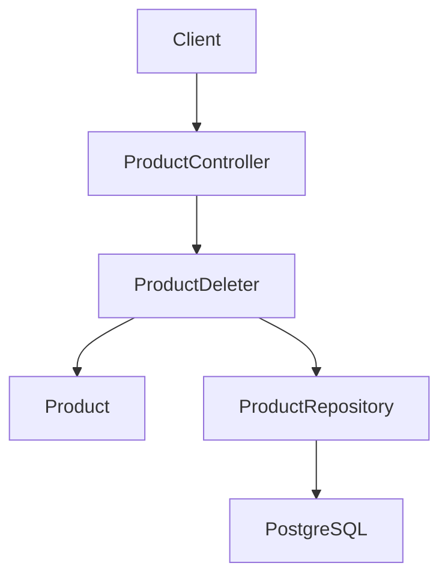
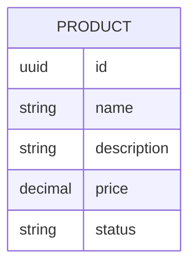

# Baja de productos

## Introduction
- Esta funcionalidad permite eliminar productos del catalogo para reflejar su baja operativa cuando ya no deben participar en los procesos del restaurante.
- Su objetivo es completar la capacidad basica de gestion del modulo `catalog/product` introduciendo una operacion de borrado, acompanando al alta (`product-registration`), a la consulta (`product-retrieval`) y a la actualizacion (`product-update`).
- Resuelve la ausencia de un flujo para retirar productos del catalogo una vez que fueron dados de alta, manteniendo el mismo bounded context y modulo que el resto de operaciones de producto.
- La solucion propuesta introduce el endpoint `DELETE /products/{id}` en el bounded context `catalog` y, de forma paralela, completa la migracion del modulo `catalog/product` a un modelo HTTP unificado: el formato de errores del modulo deja de ser Problem Details y se adopta cuerpo vacio como placeholder neutro, los casos de uso reciben los identificadores como `String` y los validan internamente, y el adaptador HTTP traduce los `Result` por tipo de `DomainError` en lugar de delegar en un advice global. La baja de productos sigue siendo fisica: la fila del producto deja de existir en el repositorio.

---

## Scope

### In Scope
- Definir el endpoint HTTP `DELETE /products/{id}` para eliminar un producto existente del catalogo.
- Aplicar una baja fisica: la fila del producto se elimina del repositorio de persistencia.
- Responder `204 No Content` con cuerpo vacio cuando la baja se realiza sobre un producto que existia.
- Responder `404 Not Found` con un cuerpo de error simple cuando el producto no existe, ya sea porque nunca fue creado o porque ya fue eliminado previamente.
- Mantener la semantica idempotente en el efecto: llamadas repetidas sobre el mismo `id` dejan al producto en estado no existente, y el sistema distingue `204` (primera baja) de `404` (subsiguientes o inexistente inicial) solo mediante el codigo de respuesta.
- Reutilizar las mismas reglas de identificacion y validacion de `id` que el resto del modulo `catalog/product` (mismo formato y misma representacion que `product-registration` y `product-update`).
- El `id` del producto se obtiene unicamente del path; no se lee ningun `id` del body.
- La validacion de formato del `id` la realiza el value object compartido `Id` mediante una factoría segura `Id.from(String)`, alineada con la convencion de los demas VOs del modulo (`ProductName.from`, `ProductPrice.from`, `ProductStatus.from`). Dicha factoría devuelve `Result<Id>` y, ante un input malformado, retorna `Result.failure(new ValidationError("id", "<mensaje>"))` con el mismo estilo de mensaje que el resto de VOs del modulo.
- Los casos de uso `ProductDeleter` y `ProductUpdater` reciben el `id` como `String` y delegan la validacion en `Id.from`. La validacion no se realiza en el adaptador HTTP, que se limita a traducir el `Result` del caso de uso a los codigos HTTP correspondientes.
- La migracion del modulo `catalog/product` a un modelo HTTP unificado: los cuatro metodos del `ProductController` (`get`, `create`, `update`, `delete`) traducen los `Result` de los casos de uso a codigos HTTP siguiendo una politica uniforme, sin `try/catch` de `IllegalArgumentException` y sin lanzar `ProductErrorHandler.invalidProduct(...)` ni `ProductErrorHandler.productNotFound(...)` en ningun endpoint.
- La eliminacion de las clases `ProductErrorHandler`, `InvalidProductException` y `ProductNotFoundException` del paquete `src/main/java/com/forkcore/api/catalog/product/infrastructure/in/web/`. El advice global que traducia excepciones a `ProblemDetail` deja de existir en este modulo.
- La actualizacion de los tres archivos de aceptacion existentes (`product-registration.feature`, `product-update.feature`, `product-retrieval.feature`) para eliminar las aserciones de Problem Details (`the problem response title should be ...`, `the problem response detail should be ...`) y conservar unicamente las aserciones de codigo de estado (`the product response status code should be ...`) donde aplique.
- La eliminacion de los step definitions `the problem response title should be {string}` y `the problem response detail should be {string}` de `ProductSharedSteps`, que dejan de tener callers tras la actualizacion de los tres `.feature`.
- No se adopta Problem Details en el modulo `catalog/product`. El formato concreto del cuerpo de error (`400`, `404`, `500`) queda fuera del alcance de esta iteracion y se definira cuando se unifique el formato de errores del modulo. Hasta entonces, las respuestas de error del modulo llevan cuerpo vacio como placeholder neutro.

### Out of Scope
- Baja logica o soft delete: la fila se elimina fisicamente, no se marca con un campo de baja.
- Restauracion o "undo" de productos eliminados: una vez borrados, dejan de existir.
- Eliminaciones en cascada sobre otros agregados fuera de `catalog`: la baja se limita a la fila del producto.
- Eliminacion masiva o por lote: este flujo opera sobre un unico `id` por request.
- Auditoria o registro historico de bajas: no se conserva trazabilidad de quien o cuando elimino un producto en esta iteracion.
- Autorizacion y autenticacion: fuera de alcance, igual que en `product-registration`, `product-retrieval` y `product-update`.
- Cambios en las reglas de alta, consulta o actualizacion ya definidas.
- Definir un cuerpo de error concreto (no vacio) para las respuestas `400`, `404` y `500` del modulo. Esa decision queda aplazada y se tomara cuando se unifique el formato de errores del modulo `catalog/product`.
- Reintroducir Problem Details o cualquier esquema concreto de cuerpo de error en el modulo `catalog/product`.
- Migrar otros modulos del proyecto fuera de `catalog/product` (por ejemplo, `orders` o cualquier otro bounded context). El alcance de esta funcionalidad se limita al modulo `catalog/product`.

---

## Requirements

### Functional Requirements
- FR1: El sistema debe exponer `DELETE /products/{id}` para eliminar un producto existente del catalogo y responder `204 No Content` con cuerpo vacio.
- FR2: Si el producto identificado por `id` no existe en el momento de la baja, el sistema debe responder `404 Not Found` con un cuerpo de error simple cuya forma concreta queda fuera del alcance de esta iteracion y se definira mas adelante, cuando se unifique el formato de errores del modulo `catalog/product`.
- FR3: Una segunda llamada a `DELETE /products/{id}` sobre un mismo `id` ya eliminado debe responder `404 Not Found`. La operacion es idempotente en su efecto (el producto permanece no existente) aunque el codigo de respuesta refleje el estado actual.
- FR4: La baja es fisica: la fila del producto se elimina del repositorio de persistencia, no se mantiene con un marcador de baja ni se archiva.
- FR5: El identificador del producto a eliminar se toma exclusivamente del path de la URL. El sistema no debe leer ningun `id` del body ni de query params.
- FR6: El cuerpo de error para `404` es literalmente vacio (sin `null`, sin `{}`, sin espacios en blanco), como placeholder neutro. Esta decision se revisara cuando se unifique el formato de errores del modulo `catalog/product`, momento en el que se podra reintroducir un esquema concreto de campos. En esta iteracion, ninguna respuesta de error del modulo lleva `ProblemDetail`.
- FR7: La respuesta exitosa `204 No Content` no debe incluir cuerpo ni representacion del producto eliminado.
- FR8: Si el `id` del path no respeta el formato esperado, el caso de uso debe devolver `Result.failure(ValidationError("id", "<mensaje>"))` y el adaptador HTTP debe responder `400 Bad Request` con cuerpo vacio. El adaptador HTTP no debe capturar excepciones del parseo ni validar el `id` localmente.
- FR9: La validacion de formato del `id` la realiza exclusivamente el value object `Id` mediante la factoría `Id.from(String)`, que devuelve `Result<Id>`. Los casos de uso propagan el `Result.failure(ValidationError)` sin lanzar excepciones.
- FR10: Por consistencia con `ProductDeleter`, los casos de uso `ProductUpdater`, y por extension cualquier caso de uso futuro que reciba un identificador por path, reciben el `id` como `String` y delegan la validacion en `Id.from`. El adaptador HTTP no contiene logica de validacion de id.
- FR11: El adaptador HTTP de `ProductController` realiza el mapeo de `Result` a codigo HTTP para los cuatro endpoints (`GET`, `POST`, `PATCH`, `DELETE`) siguiendo una politica uniforme: `Result.success` -> codigo 2xx correspondiente (200 para GET, 201 para POST, 200 para PATCH, 204 para DELETE); `Result.failure(NotFoundError)` -> 404 con cuerpo vacio; cualquier otro `Result.failure(DomainError)` -> 400 con cuerpo vacio. Ningun endpoint captura `IllegalArgumentException` ni lanza `InvalidProductException` o `ProductNotFoundException`.
- FR12: Las clases `ProductErrorHandler`, `InvalidProductException` y `ProductNotFoundException` se eliminan del modulo `catalog/product`. El advice global que traducia excepciones a `ProblemDetail` deja de ser necesario en este modulo.
- FR13: Los archivos `product-registration.feature`, `product-update.feature` y `product-retrieval.feature` se actualizan para eliminar las aserciones de Problem Details (`the problem response title should be ...`, `the problem response detail should be ...`). Las aserciones de codigo de estado (`the product response status code should be ...`) se conservan.
- FR14: Los step definitions `the problem response title should be {string}` y `the problem response detail should be {string}` se eliminan de `ProductSharedSteps` por no tener callers tras la actualizacion de los tres `.feature`.

### Non-Functional Requirements
- Performance: La baja debe ser sincrona y de baja latencia para uso operativo interno, limitada por una lectura por `id` y un borrado en el repositorio.
- Scalability: El diseno debe permitir incorporar futuras operaciones de borrado mas avanzadas (baja logica, borrado por lote) sin romper el contrato base de baja individual.
- Availability: La API debe responder de forma determinista con `204`, `400` o `404` segun corresponda, sin estados ambiguos.
- Maintainability: La regla de existencia previa al borrado no debe duplicarse en multiples lugares; debe vivir en el caso de uso `ProductDeleter` y apoyarse en el mismo puerto de repositorio que el resto del modulo.
- Observability: La operacion debera poder trazarse mas adelante diferenciando bajas exitosas, intentos sobre `id` inexistente y rechazos por formato de `id` invalido.

---

## Architecture Overview

### Components
- API Layer: Adaptador REST unico `ProductController` que expone los cuatro endpoints del modulo (`GET /products`, `POST /products`, `PATCH /products/{id}`, `DELETE /products/{id}`) y traduce los `Result` de los casos de uso a codigos HTTP siguiendo la politica uniforme definida en FR11. No contiene logica de validacion de entrada ni depende de un advice global para la traduccion de errores.
- Application Layer: Casos de uso `ProductDeleter`, `ProductUpdater`, `ProductRetriever` y `ProductCreator` que reciben los parametros de entrada y propagan el resultado a traves de `Result`. `ProductDeleter` y `ProductUpdater` reciben el `id` como `String` y delegan su validacion en `Id.from`.
- Domain Layer: Aggregate `Product` y value objects existentes, consultados unicamente para validar la presencia previa al borrado.
- Infrastructure Layer: Adaptador de persistencia capaz de recuperar un producto por `id` y eliminarlo fisicamente de PostgreSQL.

### Architecture Diagram (Mermaid)



### Notes
- La funcionalidad pertenece al bounded context `catalog` y al mismo modulo `catalog/product` ya introducido en `product-registration`, `product-retrieval` y `product-update`.
- La salida no reutiliza la representacion `ProductResponse` usada por alta, consulta y actualizacion: una baja exitosa no devuelve cuerpo, por lo que la consistencia de representacion aplica solo a los cuerpos de error.
- El cuerpo de error `404` no usa Problem Details en esta iteracion. Su forma concreta queda fuera de alcance y se definira mas adelante, manteniendo consistencia con el formato simple de error que se decida para el modulo.
- La operacion es de tipo comando: el caso de uso modifica estado y no retorna valor de negocio al controlador, solo la senal de exito o no existencia.
- La validacion de formato del id se delega completamente al value object `Id` mediante `Id.from(String)`. El adaptador HTTP no valida ni captura excepciones del parseo: traduce el `Result` del caso de uso a `204`, `400` o `404` segun el tipo de `DomainError` (`success`, `ValidationError`/`CompositeValidationError` o `NotFoundError` respectivamente).
- La migracion del modulo elimina el `ProductErrorHandler` y centraliza el mapeo de `Result` a HTTP en el propio `ProductController`. Esto simplifica la trazabilidad de los codigos HTTP y elimina el acoplamiento del adaptador HTTP con el framework de advice de Spring para la traduccion de errores.

---

## Data Design

### Data Model (Mermaid)



### Description
- Entities: `Product` como aggregate root ya existente.
- Relationships: Ninguna nueva para esta iteracion.
- Constraints: La operacion elimina la fila del producto; tras una baja exitosa, el `id` deja de estar presente en `PRODUCT` y no se conserva copia logica alguna. `id` es la clave por la que se localiza la fila, y como clave primaria ya cuenta con el indice necesario para la lectura y el borrado.

---

## Technology Stack
- Backend: Java 25
- Framework: Spring Boot 4, Spring Web MVC
- Database: PostgreSQL
- ORM: Por definir
- Messaging: No aplica en esta fase
- Testing: JUnit
- Infrastructure: Gradle

---

## Core Logic

### Workflow
1. Un cliente invoca `DELETE /products/{id}`.
2. El adaptador HTTP toma el `id` del path como `String` y delega en el caso de uso `ProductDeleter.run(id)` sin validar nada.
3. El caso de uso invoca `Id.from(id)`. Si devuelve `Result.failure(ValidationError)`, el caso de uso propaga ese `Result.failure` y termina.
4. Si `Id.from` devuelve `Result.success(id)`, el caso de uso consulta el producto a traves de `ProductRepository.findById(id)`.
5. Si el producto no existe, el caso de uso devuelve `Result.failure(new NotFoundError("Product", id.asString()))` y termina.
6. Si el producto existe, el caso de uso solicita su baja fisica a traves de `ProductRepository.delete(product)` y devuelve `Result.success()`.
7. El adaptador HTTP traduce la senal del caso de uso: `success` → `204 No Content` con cuerpo vacio; `NotFoundError` → `404 Not Found` con cuerpo de error simple y neutro; cualquier otro `DomainError` (incluido `ValidationError`) → `400 Bad Request` con cuerpo vacio.

### Business Rules
- La baja es fisica: la fila correspondiente al `id` se elimina del repositorio, sin campo `deleted_at`, `status = deleted` ni cualquier otro marcador.
- El unico `id` valido para localizar el producto a eliminar es el del path. Cualquier `id` presente en el body debe ignorarse; este endpoint no acepta body.
- Un producto inexistente en el momento de la llamada no es un error de validacion de entrada, sino un estado valido del recurso, y debe responderse `404 Not Found`.
- Llamadas repetidas sobre el mismo `id` son idempotentes en su efecto: el producto permanece no existente. La diferencia entre `204` y `404` refleja unicamente si esa llamada concreta fue la que provoco la baja.
- La operacion no debe propagar borrados en cascada a ningun otro agregado fuera de `catalog`.
- La respuesta `204` no incluye cuerpo; no se devuelve representacion del producto eliminado.
- La validacion de formato del id no se realiza en el adaptador HTTP. El unico responsable es la factoría `Id.from(String)`, que encapsula la posible `IllegalArgumentException` del parseo de UUID en un `Result.failure(ValidationError)`. Los adaptadores HTTP nunca capturan excepciones para validar el id.

### Edge Cases
- `id` inexistente en la primera llamada: el sistema debe responder `404 Not Found` con cuerpo de error simple, no `204`.
- `id` ya eliminado en una llamada posterior: el sistema debe responder `404 Not Found` con cuerpo de error simple.
- `id` con formato invalido en el path (por ejemplo, UUID malformado): `Id.from(id)` devuelve `Result.failure(ValidationError("id", "<mensaje>"))`, el caso de uso lo propaga y el adaptador HTTP responde `400 Bad Request` con cuerpo vacio. El adaptador HTTP no captura excepciones.
- `id` vacio en el path: `Id.from(id)` devuelve `Result.failure(ValidationError(...))`; el adaptador HTTP responde `400 Bad Request` con cuerpo vacio. El adaptador HTTP no captura excepciones.
- Llamadas concurrentes `DELETE` sobre el mismo `id`: la validacion del `id` (`Id.from`), la verificacion de existencia (`findById`) y el borrado (`delete`) se ejecutan como operaciones separadas en el caso de uso. Bajo una carrera extrema, dos llamadas podrian pasar la validacion, observar la fila presente y emitir el borrado; una de ellas eliminara cero filas tras la otra, pero ninguna de las dos observara un estado inconsistente y el sistema no necesitara compensacion. El efecto visible para los clientes sigue siendo idempotente (producto no existente), aunque en el caso limite ambas llamadas podrian responder `204` en lugar de una `204` y una `404`. No se introduce lock a nivel de base de datos ni sincronizacion adicional: la complejidad no se justifica para el MVP.

---

## Module-Wide Migration Notes

Esta seccion recoge los detalles de la migracion del modulo `catalog/product` a un modelo HTTP unificado, sin `ProductErrorHandler` y sin `ProblemDetail`. Los puntos contractuales y de comportamiento ya estan cubiertos en `## Requirements` (FR1-FR14); esta seccion sirve de guia de implementacion y de contrato de los pasos a aplicar al codigo existente.

### Endpoints affected

The migration away from `ProductErrorHandler` and `ProblemDetail` applies to all four controller methods of `ProductController`:

| Endpoint | Use case | Success mapping | Failure mapping |
| -------- | -------- | --------------- | --------------- |
| `GET /products` | `ProductRetriever` | `200 OK` with the list of products (empty list if none match) | `400` for `ValidationError` (e.g. invalid `status` filter), `500` for unexpected errors |
| `POST /products` | `ProductCreator` | `201 Created` with `Location: /products/{id}` and the created product body | `400` for any `DomainError` other than `NotFoundError` (which is unreachable from `create`) |
| `PATCH /products/{id}` | `ProductUpdater` | `200 OK` with the updated product body | `400` for `ValidationError` (id format, or field validation from `ProductName.from` / `ProductPrice.from` / `ProductStatus.from`), `404` for `NotFoundError` |
| `DELETE /products/{id}` | `ProductDeleter` | `204 No Content` with empty body | `400` for `ValidationError` (id format), `404` for `NotFoundError` |

### Failure-to-HTTP mapping rule

The uniform rule is:

```
switch (result) {
  case success -> 2xx with the success body (or 204 with empty body for DELETE)
  case failure(NotFoundError) -> 404 with empty body
  case failure(DomainError) -> 400 with empty body
}
```

This rule is implemented in each controller method without `try/catch` and without throwing any exception. The `ProductErrorHandler.invalidProduct(...)` and `ProductErrorHandler.productNotFound(...)` static factories are no longer called from any controller.

### Removal of `ProductErrorHandler`

After the migration, the following classes are removed from `src/main/java/com/forkcore/api/catalog/product/infrastructure/in/web/`:

- `ProductErrorHandler` (the `@RestControllerAdvice` class).
- `ProductErrorHandler.InvalidProductException` (the inner `RuntimeException`).
- `ProductErrorHandler.ProductNotFoundException` (the inner `RuntimeException`).

No other class in the project depends on these (a `rg` for `ProductErrorHandler` confirms the only callers are inside `ProductController`, which is being migrated).

### BDD `.feature` updates

The three existing acceptance `.feature` files are updated to remove the Problem Details assertions. Specifically:

- `src/test/resources/features/catalog/product-registration.feature`: the Scenario Outline that asserts `"the problem response title should be \"Invalid product\""` is updated to keep only the status-code assertion.
- `src/test/resources/features/catalog/product-update.feature`: the Scenario Outline `Reject updates with invalid validated fields` is updated to keep only the status-code assertion for each row.
- `src/test/resources/features/catalog/product-retrieval.feature`: the Scenario that asserts Problem Details for an invalid `status` filter is updated to keep only the status-code assertion.

The step definitions for these Problem Details assertions are removed from `ProductSharedSteps`.

---

## Performance Considerations
- Bottlenecks: La operacion depende de una lectura previa por `id` y un borrado posterior, por lo que la latencia de base de datos sera el factor dominante.
- Caching: No necesario para esta primera version de baja.
- Database optimization: El borrado se realiza por clave primaria, que ya cuenta con el indice adecuado; no se requieren indices adicionales.
- Scaling strategy: Mantener el caso de uso aislado para poder incorporar baja logica, auditoria o borrado por lote en el futuro sin acoplar al resto del modulo.
- Async processing: No aplica para esta baja sincrona.

---

## Security Considerations
- Authentication: Fuera de alcance por ahora, pero el endpoint debera poder protegerse mas adelante, igual que el resto de operaciones de catalogo.
- Authorization: Fuera de alcance por ahora; previsiblemente restringido a usuarios operativos o administrativos con capacidad de retirar productos.
- Input validation: Obligatoria para el `id` del path, reutilizando las mismas reglas de formato ya presentes en `product-registration` y `product-update`.
- Rate limiting: No prioritario en esta fase inicial interna.
- Encryption: No aplica a datos sensibles en esta iteracion; la baja no expone informacion del producto eliminado.
- Vulnerabilities: Evitar que un `id` en el body altere el objetivo real de la baja y evitar diferencias en el formato de error `404` respecto del resto del modulo. Evitar validacion de id o captura de excepciones en el adaptador HTTP: la validacion debe vivir en el value object `Id` y propagarse por `Result`. Un `try/catch` local en el controlador reintroduce acoplamiento a la implementacion de `Id.from` y rompe la consistencia con el resto del modulo.
- Eliminar `ProductErrorHandler` no reduce la postura de seguridad: la traduccion de errores a 400/404 sigue siendo explicita y trazable, y la eliminacion de `ProblemDetail` reduce la exposicion de informacion sensible en las respuestas de error.

---

## Trade-offs
- Decision:
  - Alternatives: Implementar baja logica con un campo `deleted_at` o `status = deleted` que conserve la fila y permita restaurar o auditar.
  - Reason: El usuario ha decidido baja fisica, alineada con la simplicidad del MVP y con la expectativa operativa de que un producto retirado no vuelva a aparecer en consultas.
  - Downsides: La operacion es irreversible: no hay restauracion posible, no queda huella del producto eliminado y no hay trazabilidad de quien o cuando lo dio de baja. Cualquier necesidad futura de auditoria, restauracion o analisis historico requerira reescribir este flujo. Adicionalmente, la migracion del modulo a un modelo HTTP unificado sin `ProductErrorHandler` y sin `ProblemDetail` pierde la capacidad de producir errores enriquecidos con informacion estructurada (`title`, `detail`, `errors`). Cualquier necesidad futura de reintroducir Problem Details o un esquema concreto de cuerpo de error requerira reescribir los cuatro metodos del controlador.

---

## Future Improvements
- Anadir baja logica y un endpoint de restauracion para escenarios donde la irreversibilidad deje de ser aceptable.
- Incorporar un registro de auditoria que registre `id` eliminado, momento y, eventualmente, actor responsable.
- Definir una politica explicita de borrado en cascada cuando el modelo de catalogo crezca y existan relaciones con otros agregados.
- Incorporar borrado por lote o borrado masivo filtrado por estado, si la operativa lo requiere.
- Anadir recuperacion puntual `GET /products/{id}` para complementar el flujo de baja con consulta directa.
- Definir estrategia explicita de concurrencia si el volumen de bajas simultaneas crece y la semantica `204` vs `404` bajo carrera deja de ser aceptable.
- Eliminar el sufijo `OrThrow` en `Id.fromStringOrThrow` una vez que todos los call sites del proyecto hayan migrado a `Id.from` o al constructor directo, dejando una sola API canonica para construir un `Id` a partir de un `String`.
- Reintroducir un esquema de cuerpo de error concreto (no vacio) para `400`, `404` y `500` del modulo `catalog/product`, manteniendo el contrato unificado de mapeo de `Result` a HTTP.
- Reintroducir Problem Details como opcion del modulo si las necesidades de trazabilidad o de exposicion de informacion estructurada lo requieren.

---

## Deferred Decisions
- **Formato del cuerpo de error**: el shape concreto del JSON que devolvera el endpoint en `400`, `404` y `500` queda deliberadamente fuera del alcance de esta iteracion. Se definira cuando se unifique el formato de errores del modulo `catalog/product` y se elimine Problem Details. El arquitecto debera modelar las respuestas de error con un cuerpo JSON simple y neutro, sin acoplar el diseno a Problem Details, RFC 9457 ni a un esquema concreto de campos.
- **Mensaje concreto del `ValidationError` para id malformado**: el wording exacto del `message` del `ValidationError("id", ...)` lo define el value object `Id.from(String)`. Debe seguir el mismo estilo declarativo, en minusculas y sin puntuacion final que usan los demas VOs del modulo (`ProductName.from`, `ProductPrice.from`, `ProductStatus.from`). Una sugerencia razonable es `"must be a valid UUID"`, pero la decision final la toma el arquitecto y debe quedar alineada con el resto de mensajes del modulo. El `field` del `ValidationError` es siempre `"id"`.
- **Politica de error 500 para errores tecnicos inesperados**: dado que el adaptador HTTP no captura excepciones, cualquier excepcion no anticipada (por ejemplo, un fallo de conexion a la base de datos) se propagara al contenedor de Spring, que por defecto devuelve un cuerpo de error con su propio formato. La decision de si ese formato debe alinearse con el modelo HTTP unificado del modulo (cuerpo vacio) o si debe mantener el formato por defecto de Spring queda fuera del alcance de esta iteracion y se abordara en una iteracion posterior si surge la necesidad.
