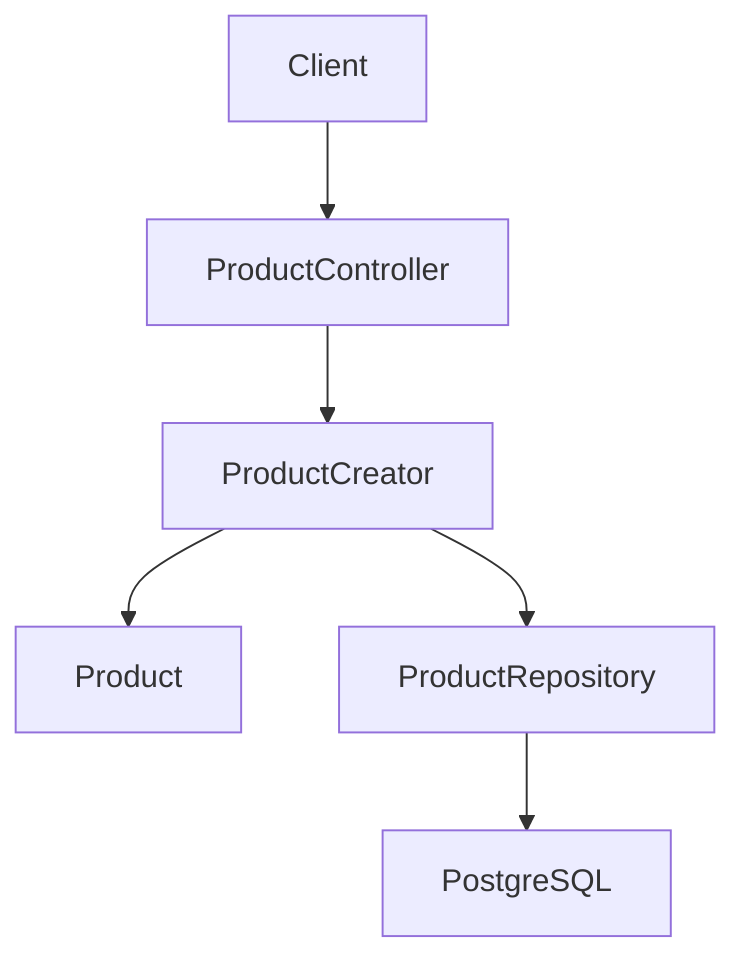
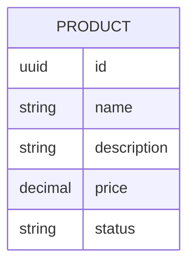

# Alta de productos

## Introduction
- Esta funcionalidad permite dar de alta productos que podran ser usados por la operativa del restaurante.
- Su objetivo es introducir un primer flujo de gestion de catalogo dentro del MVP.
- Resuelve la ausencia de una capacidad basica para registrar productos antes de que puedan participar en pedidos u otros procesos operativos.
- La solucion propuesta introduce un endpoint de creacion de productos ubicado dentro de un contexto de catalogo de productos, modelado con DDD y arquitectura hexagonal.

---

## Scope

### In Scope
- Definir el contexto de negocio responsable del alta de productos.
- Definir el endpoint de entrada para crear un producto.
- Definir el modelo de dominio minimo necesario para registrar un producto.
- Definir puertos y adaptadores necesarios para una implementacion hexagonal.

### Out of Scope
- Edicion de productos existentes.
- Baja logica o eliminacion de productos.
- Gestion avanzada de categorias, impuestos, variantes o modificadores.
- Publicacion de productos a otros canales o sistemas externos.

---

## Requirements

### Functional Requirements
- FR1: El sistema debe permitir registrar un producto nuevo mediante un endpoint HTTP.
- FR2: El sistema debe validar los datos minimos requeridos para crear un producto antes de persistirlo.
- FR3: El sistema debe devolver una representacion del producto creado con su identificador.
- FR4: El sistema debe impedir el alta de productos invalidos segun las reglas del dominio.
- FR5: El alta de productos debe quedar ubicada en un bounded context con responsabilidad clara y desacoplada del contexto de pedidos.

### Non-Functional Requirements
- Performance: La operacion de alta debe ser sincrona y de baja latencia para uso operativo interno.
- Scalability: El diseno debe permitir evolucionar a mas operaciones de catalogo sin acoplarse al flujo de pedidos.
- Availability: El endpoint debe responder con errores deterministas cuando la validacion o la persistencia fallen.
- Maintainability: La logica de negocio debe vivir en dominio y aplicacion, no en el controlador HTTP.
- Observability: La operacion debera poder trazarse mas adelante con logs y metricas de creacion de productos.

---

## Architecture Overview

### Components
- API Layer: Adaptador REST para recibir la solicitud de alta de producto.
- Application Layer: Caso de uso `ProductCreator` que orquesta validaciones de aplicacion y persistencia.
- Domain Layer: Aggregate `Product` y value objects del producto.
- Infrastructure Layer: Adaptador de persistencia para guardar productos en PostgreSQL.

### Architecture Diagram (Mermaid)

### Notes
- Se define el bounded context inicial como `catalog`.
- Dentro del contexto, el modulo de producto se organizara como `catalog/product/...`.
- El contexto de pedidos no debe crear ni gobernar productos; solo deberia consumirlos.
- El endpoint de alta es una puerta de entrada al contexto de catalogo, no al contexto de pedidos.

---

## Data Design

### Data Model (Mermaid)

### Description
- Entities: `Product` como aggregate root.
- Relationships: Ninguna obligatoria en esta primera iteracion.
- Constraints: El producto debe tener `id`, `name`, `price` y `status`; `description` puede venir vacia.

---

## Technology Stack
- Backend: Java 25
- Framework: Spring Boot 4, Spring Web MVC
- Database: PostgreSQL
- ORM: Por definir
- Messaging: No aplica en esta fase
- Testing: JUnit
- Infrastructure: Gradle

---

## Core Logic

### Workflow
1. Un cliente invoca el endpoint de alta de producto.
2. El adaptador HTTP transforma la request en los valores requeridos por aplicacion.
3. El caso de uso `ProductCreator` crea y valida el agregado `Product`.
4. El repositorio persiste el producto y se devuelve la respuesta de alta.

### Business Rules
- Un producto no debe crearse sin nombre.
- La descripcion del producto puede venir vacia.
- Un producto no debe crearse con un precio invalido.
- Si `status` no viene informado en el JSON de entrada, el sistema debe asignar `active` por defecto.
- No se define por ahora una regla de unicidad por `name`.

### Edge Cases
- Nombre vacio o con formato invalido.
- Descripcion vacia.
- Precio nulo, negativo o fuera de rango.
- `status` ausente en la request, que debe resolverse con el valor por defecto `active`.

---

## Performance Considerations
- Bottlenecks: Persistencia sin indices adecuados cuando crezca el catalogo.
- Caching: No necesario para el alta en esta primera version.
- Database optimization: Indexar los campos que terminen siendo unicos o de consulta frecuente.
- Scaling strategy: Mantener el caso de uso aislado para permitir nuevos adaptadores o procesos asincronos en el futuro.
- Async processing: No necesario para el alta inicial.

---

## Security Considerations
- Authentication: Fuera de alcance por ahora, pero el endpoint debera quedar preparado para integrarse luego.
- Authorization: Fuera de alcance por ahora; previsiblemente restringido a roles operativos o administrativos.
- Input validation: Obligatoria en borde y en dominio.
- Rate limiting: No prioritario en fase inicial interna.
- Encryption: No aplica a datos sensibles en esta iteracion.
- Vulnerabilities: Evitar validaciones solo en controlador y errores ambiguos de entrada.

---

## Trade-offs
- Decision:
  - Alternatives: Modelar productos dentro del contexto de pedidos.
  - Reason: Separar catalogo y pedidos reduce acoplamiento y protege el modelo de dominio.
  - Downsides: Introduce una frontera de contexto antes de que existan aun todos los flujos consumidores.

---

## Future Improvements
- Anadir actualizacion, baja logica y consulta de productos.
- Introducir categorias, disponibilidad y visibilidad del producto.
- Separar precios, impuestos y variantes si el dominio lo requiere.
- Asociar productos a un restaurante o tenant cuando el modelo multi-restaurante aparezca.
