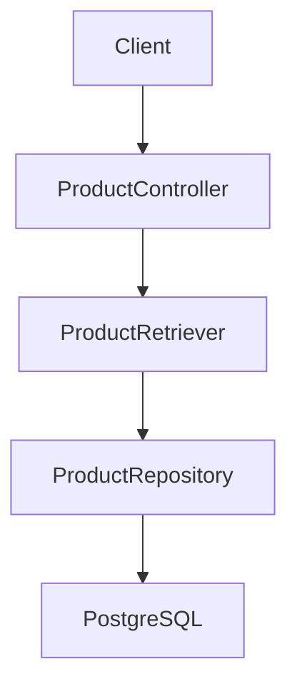
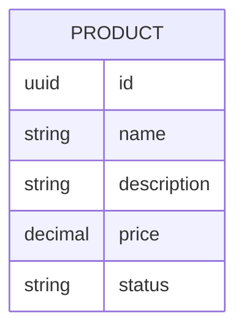

# Recuperacion de productos

## Introduction
- Esta funcionalidad permite recuperar productos del catalogo para su consulta operativa.
- Su objetivo es exponer una capacidad minima de lectura sobre el modulo existente `catalog/product`.
- Resuelve la ausencia de un flujo para listar productos ya registrados.
- La solucion propuesta introduce un endpoint `GET /products` consistente con el feature existente `product-registration` y con el bounded context `catalog`.

---

## Scope

### In Scope
- Definir el endpoint HTTP `GET /products`.
- Devolver todos los productos cuando no se informa filtro.
- Permitir un filtro opcional por query param `status`.
- Validar el valor de `status` y responder error cuando sea invalido.

### Out of Scope
- Paginacion.
- Ordenacion, busqueda por texto o filtros adicionales.
- Recuperacion de un producto puntual por `id`.
- Cambios en las reglas de alta de productos ya definidas en `product-registration`.

---

## Requirements

### Functional Requirements
- FR1: El sistema debe exponer `GET /products` para recuperar productos del catalogo.
- FR2: Si no se informa `status`, el sistema debe devolver todos los productos.
- FR3: Si se informa `status`, el sistema debe devolver solo los productos de ese estado.
- FR4: Si no existen productos, el sistema debe responder `200 OK` con `[]`.
- FR5: Si `status` es invalido, el sistema debe responder `400 Bad Request`.
- FR6: La representacion de cada producto recuperado debe ser consistente con la usada en `product-registration` (`id`, `name`, `description`, `price`, `status`).

### Non-Functional Requirements
- Performance: La consulta debe ser sincrona y adecuada para lectura operativa interna sin paginacion en esta etapa.
- Scalability: El diseno debe permitir incorporar paginacion y filtros adicionales mas adelante sin romper el contrato base.
- Availability: La API debe responder de forma determinista con `200` o `400` segun corresponda.
- Maintainability: La validacion de `status` debe mantenerse alineada con las reglas del dominio de producto existentes.
- Observability: La operacion debera poder trazarse mas adelante diferenciando consultas filtradas y no filtradas.

---

## Architecture Overview

### Components
- API Layer: Adaptador REST para recibir solicitudes de listado de productos.
- Application Layer: Caso de uso de consulta para recuperar productos, con o sin filtro por estado.
- Domain Layer: Aggregate `Product` y value object `ProductStatus` como fuente de validacion del filtro.
- Infrastructure Layer: Adaptador de persistencia capaz de recuperar todos los productos o filtrarlos por estado.

### Architecture Diagram (Mermaid)

### Notes
- La funcionalidad pertenece al bounded context `catalog`.
- Debe mantenerse el contrato de salida ya usado por el modulo `catalog/product`.
- La validacion del filtro `status` debe ser consistente con los estados ya admitidos por `ProductStatus`.

---

## Data Design

### Data Model (Mermaid)

### Description
- Entities: `Product` como aggregate root ya existente.
- Relationships: Ninguna nueva para esta iteracion.
- Constraints: El filtro `status` solo debe aceptar estados validos del dominio; la respuesta devuelve una coleccion de productos.

---

## Technology Stack
- Backend: Java 25
- Framework: Spring Boot 4, Spring Web MVC
- Database: PostgreSQL
- ORM: Por definir
- Messaging: No aplica en esta fase
- Testing: JUnit
- Infrastructure: Gradle

---

## Core Logic

### Workflow
1. Un cliente invoca `GET /products` con o sin query param `status`.
2. El adaptador HTTP transforma el filtro opcional para la capa de aplicacion.
3. Si `status` viene informado, el sistema lo valida segun las reglas de dominio existentes.
4. El caso de uso recupera todos los productos o solo los del estado solicitado.
5. La API responde `200 OK` con una lista de productos, que puede ser vacia.

### Business Rules
- Si `status` no viene informado, la consulta no debe aplicar filtro.
- Si `status` viene informado, solo se devuelven productos con ese estado.
- Si `status` no pertenece al conjunto de estados validos del dominio, la respuesta debe ser `400 Bad Request`.
- Una ausencia de resultados no es error; debe responderse `200 OK` con `[]`.

### Edge Cases
- Catalogo vacio.
- `status` con valor invalido.
- `status` informado con variaciones de formato que deban resolverse de forma consistente con el dominio existente.
- Resultado con mezcla de productos `active` e `inactive` cuando no se informa filtro.

---

## Performance Considerations
- Bottlenecks: La ausencia de paginacion puede volver costosa la lectura cuando el catalogo crezca.
- Caching: No necesario en esta primera version.
- Database optimization: Conviene prever indice por `status` si el filtro pasa a ser frecuente.
- Scaling strategy: Mantener el contrato simple para evolucionar luego a paginacion y filtros adicionales.
- Async processing: No aplica para esta consulta sincrona.

---

## Security Considerations
- Authentication: Fuera de alcance por ahora, pero el endpoint debera poder protegerse mas adelante.
- Authorization: Fuera de alcance por ahora; previsiblemente restringido a usuarios operativos o administrativos.
- Input validation: Obligatoria para el query param `status` cuando venga informado.
- Rate limiting: No prioritario en esta fase inicial interna.
- Encryption: No aplica a datos sensibles en esta iteracion.
- Vulnerabilities: Evitar aceptar estados arbitrarios o respuestas ambiguas ante filtros invalidos.

---

## Trade-offs
- Decision:
  - Alternatives: Introducir paginacion desde la primera version del listado.
  - Reason: Se prioriza una capacidad minima y consistente con el estado actual del modulo.
  - Downsides: El endpoint puede degradarse cuando el volumen de productos crezca.

---

## Future Improvements
- Anadir paginacion, ordenacion y filtros adicionales.
- Incorporar `GET /products/{id}` para consulta puntual.
- Definir criterios explicitos de orden por defecto para el listado.
- Anadir metricas y logs especificos para consultas filtradas por `status`.
