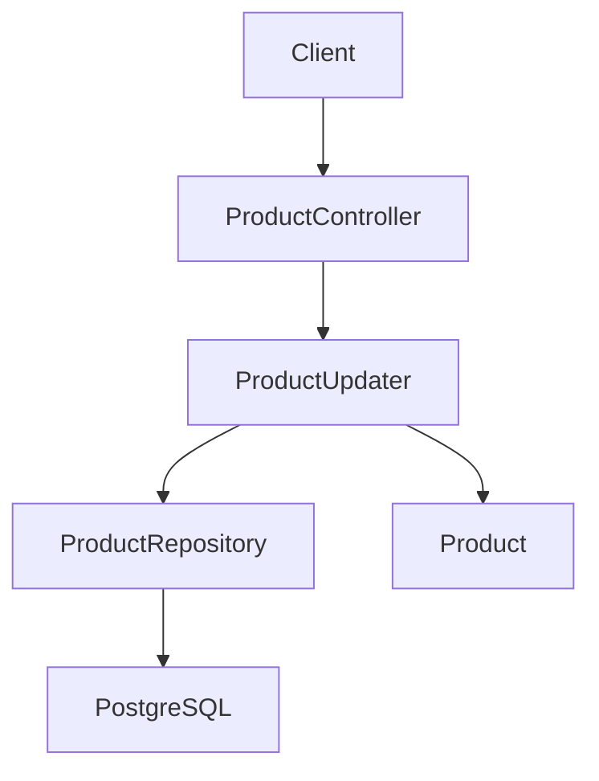
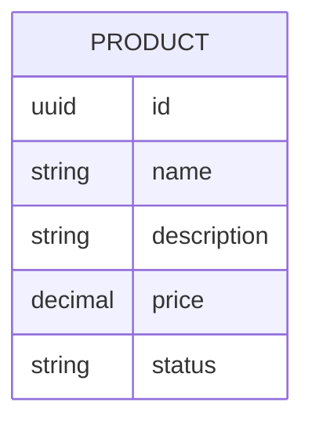

# Actualizacion de productos

## Introduction
- Esta funcionalidad permite actualizar productos ya existentes del catalogo para reflejar cambios operativos sin recrearlos.
- Su objetivo es completar la capacidad basica de gestion del modulo `catalog/product` incorporando una operacion de edicion parcial.
- Resuelve la ausencia de un flujo para modificar productos previamente dados de alta mediante `product-registration` y posteriormente consultados mediante `product-retrieval`.
- La solucion propuesta introduce el endpoint `PATCH /products/{id}` en el bounded context `catalog`, manteniendo consistencia con la representacion y reglas ya definidas para productos.

---

## Scope

### In Scope
- Definir el endpoint HTTP `PATCH /products/{id}` para actualizar un producto existente.
- Permitir actualizacion parcial de los campos `name`, `description`, `price` y `status`.
- Mantener sin cambios los campos omitidos en la request.
- Ignorar cualquier `id` informado en el body y tomar como fuente de verdad exclusivamente el `id` del path.
- Reutilizar las mismas validaciones de `product-registration` para `name`, `price` y `status`.
- Mantener una representacion de salida consistente con `product-registration` y `product-retrieval` (`id`, `name`, `description`, `price`, `status`).

### Out of Scope
- Creacion de productos cuando el `id` no exista.
- Cambio del identificador del producto.
- Actualizacion masiva de multiples productos.
- Introduccion de campos nuevos fuera del modelo actual de producto.
- Cambios en las reglas de consulta ya definidas en `product-retrieval`.

---

## Requirements

### Functional Requirements
- FR1: El sistema debe exponer `PATCH /products/{id}` para actualizar un producto existente del catalogo.
- FR2: Si el producto identificado por `id` no existe, el sistema debe responder `404 Not Found`.
- FR3: El sistema debe permitir actualizar todos los campos del producto excepto `id`.
- FR4: Si `id` viene informado en el body, el sistema debe ignorarlo y no debe usarlo para localizar ni modificar el producto.
- FR5: Los campos omitidos en la request PATCH deben conservar su valor actual.
- FR6: `description` debe poder actualizarse tanto a `null` como a `""`.
- FR7: `name`, `price` y `status`, cuando vengan informados en la request, deben validarse con las mismas reglas ya definidas en `product-registration`.
- FR8: La respuesta exitosa debe devolver la representacion completa del producto actualizado, consistente con `product-registration` y `product-retrieval`.

### Non-Functional Requirements
- Performance: La actualizacion debe ser sincrona y de baja latencia para uso operativo interno.
- Scalability: El diseno debe permitir incorporar futuras operaciones de edicion mas avanzadas sin romper el contrato base de actualizacion parcial.
- Availability: La API debe responder de forma determinista con exito, validacion o `404` segun corresponda.
- Maintainability: Las reglas de validacion no deben duplicarse; deben mantenerse alineadas con el alta de productos existente.
- Observability: La operacion debera poder trazarse mas adelante diferenciando actualizaciones exitosas, no-op y errores de validacion o inexistencia.

---

## Architecture Overview

### Components
- API Layer: Adaptador REST para recibir solicitudes de actualizacion parcial de productos.
- Application Layer: Caso de uso `ProductUpdater` que recupera el producto, aplica cambios parciales y orquesta la persistencia.
- Domain Layer: Aggregate `Product` y value objects existentes como fuente de reglas para cambios validos.
- Infrastructure Layer: Adaptador de persistencia capaz de recuperar un producto por `id` y guardar su nueva version.

### Architecture Diagram (Mermaid)

### Notes
- La funcionalidad pertenece al bounded context `catalog` y al mismo modulo `catalog/product` ya introducido en `product-registration`.
- El contrato de salida debe mantener la misma representacion de producto usada en `product-registration` y `product-retrieval`.
- La validacion de `name`, `price` y `status` debe permanecer trazable y consistente con las reglas ya definidas para el alta.
- La semantica de PATCH en este caso de uso es parcial: solo cambian los campos explicitamente presentes en la request, salvo `id`, que siempre se ignora.

---

## Data Design

### Data Model (Mermaid)

### Description
- Entities: `Product` como aggregate root ya existente.
- Relationships: Ninguna nueva para esta iteracion.
- Constraints: `id` es inmutable; los campos actualizables son `name`, `description`, `price` y `status`; `description` admite `null` y cadena vacia; `name`, `price` y `status` deben respetar las reglas vigentes de `product-registration` cuando se informan.

---

## Technology Stack
- Backend: Java 25
- Framework: Spring Boot 4, Spring Web MVC
- Database: PostgreSQL
- ORM: Por definir
- Messaging: No aplica en esta fase
- Testing: JUnit
- Infrastructure: Gradle

---

## Core Logic

### Workflow
1. Un cliente invoca `PATCH /products/{id}` con uno o varios campos a actualizar.
2. El adaptador HTTP toma el `id` del path como identificador objetivo e ignora cualquier `id` presente en el body.
3. El caso de uso recupera el producto existente; si no existe, responde `404 Not Found`.
4. El sistema aplica semantica PATCH parcial: solo modifica los campos explicitamente presentes en la request.
5. Para `name`, `price` y `status`, el sistema reutiliza las validaciones ya definidas en `product-registration`.
6. El producto actualizado se persiste y la API devuelve su representacion completa.

### Business Rules
- Todos los campos del producto pueden actualizarse excepto `id`.
- El `id` del body no participa en la logica de negocio y debe ser ignorado.
- La ausencia de un campo en la request significa "mantener valor actual", no "limpiar campo".
- `description` puede establecerse explicitamente en `null` o en `""`.
- Si `status` no viene informado en la request de actualizacion, no debe recalcularse ningun valor por defecto; debe mantenerse el valor actual.
- Las validaciones de `name`, `price` y `status` deben ser las mismas ya aprobadas para `product-registration`.
- La respuesta exitosa debe reflejar el estado final persistido del producto.

### Edge Cases
- `id` inexistente en el path, que debe responder `404 Not Found`.
- Request que incluye `id` en el body con un valor distinto al del path, que debe ignorarse sin cambiar el comportamiento de la operacion.
- Request parcial que actualiza solo `description` a `null`.
- Request parcial que actualiza solo `description` a `""`.
- Request parcial que omite `name`, `price` o `status`, manteniendo sus valores actuales.
- Request que informa `name`, `price` o `status` con valores invalidos segun `product-registration`.
- Request sin campos actualizables efectivos, que no debe modificar el producto.

---

## Performance Considerations
- Bottlenecks: La operacion depende de una lectura previa por `id` y una escritura posterior, por lo que la latencia de base de datos sera el factor dominante.
- Caching: No necesario para esta primera version de actualizacion.
- Database optimization: Conviene asegurar indice por `id`, ya implicito por clave primaria.
- Scaling strategy: Mantener el caso de uso aislado para poder incorporar auditoria, versionado o concurrencia mas adelante.
- Async processing: No aplica para esta actualizacion sincrona.

---

## Security Considerations
- Authentication: Fuera de alcance por ahora, pero el endpoint debera poder protegerse mas adelante.
- Authorization: Fuera de alcance por ahora; previsiblemente restringido a usuarios operativos o administrativos.
- Input validation: Obligatoria para los campos presentes en la request, reutilizando reglas existentes del dominio.
- Rate limiting: No prioritario en esta fase inicial interna.
- Encryption: No aplica a datos sensibles en esta iteracion.
- Vulnerabilities: Evitar que un `id` en el body altere el objetivo real de la actualizacion y evitar diferencias de validacion respecto de `product-registration`.

---

## Trade-offs
- Decision:
  - Alternatives: Tratar la actualizacion como reemplazo completo tipo PUT o permitir usar el `id` del body.
  - Reason: PATCH parcial reduce friccion para cambios operativos pequeños y usar solo el `id` del path evita ambiguedad sobre el recurso objetivo.
  - Downsides: Requiere distinguir con claridad entre campo omitido y campo informado para ser vaciado, especialmente en `description`.

---

## Future Improvements
- Anadir recuperacion puntual `GET /products/{id}` para complementar el flujo de actualizacion con consulta directa.
- Incorporar auditoria de cambios sobre productos.
- Definir estrategia explicita de concurrencia si aparecen ediciones simultaneas.
- Evaluar soporte para actualizaciones masivas o por lote si el negocio lo requiere.
