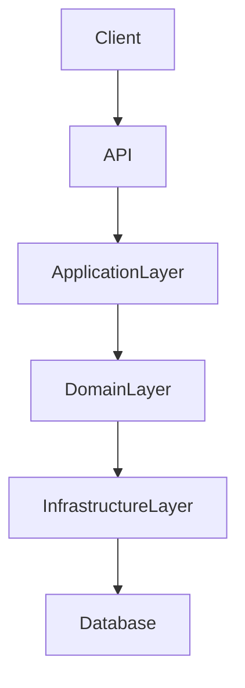
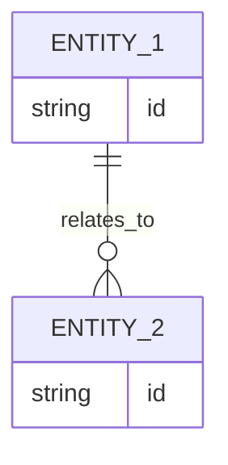

# Feature Title

## Introduction
- Brief overview of the feature
- Purpose of the feature
- Problem it solves
- High-level description of the solution

---

## Scope

### In Scope
- 
- 
- 

### Out of Scope
- 
- 
- 

---

## Requirements

### Functional Requirements
- FR1:
- FR2:
- FR3:

### Non-Functional Requirements
- Performance:
- Scalability:
- Availability:
- Maintainability:
- Observability:

---

## Architecture Overview

### Components
- API Layer:
- Application Layer:
- Domain Layer:
- Infrastructure Layer:

### Architecture Diagram (Mermaid)

### Notes
- 
- 
- 

---

## Data Design

### Data Model (Mermaid)

### Description
- Entities:
- Relationships:
- Constraints:

---

## Technology Stack
- Backend:
- Framework:
- Database:
- ORM:
- Messaging:
- Testing:
- Infrastructure:

---

## Core Logic

### Workflow
1.
2.
3.
4.

### Business Rules
- 
- 
- 

### Edge Cases
- 
- 
- 

---

## Performance Considerations
- Bottlenecks:
- Caching:
- Database optimization:
- Scaling strategy:
- Async processing:

---

## Security Considerations
- Authentication:
- Authorization:
- Input validation:
- Rate limiting:
- Encryption:
- Vulnerabilities:

---

## Trade-offs
- Decision:
  - Alternatives:
  - Reason:
  - Downsides:

---

## Future Improvements
- 
- 
- 
