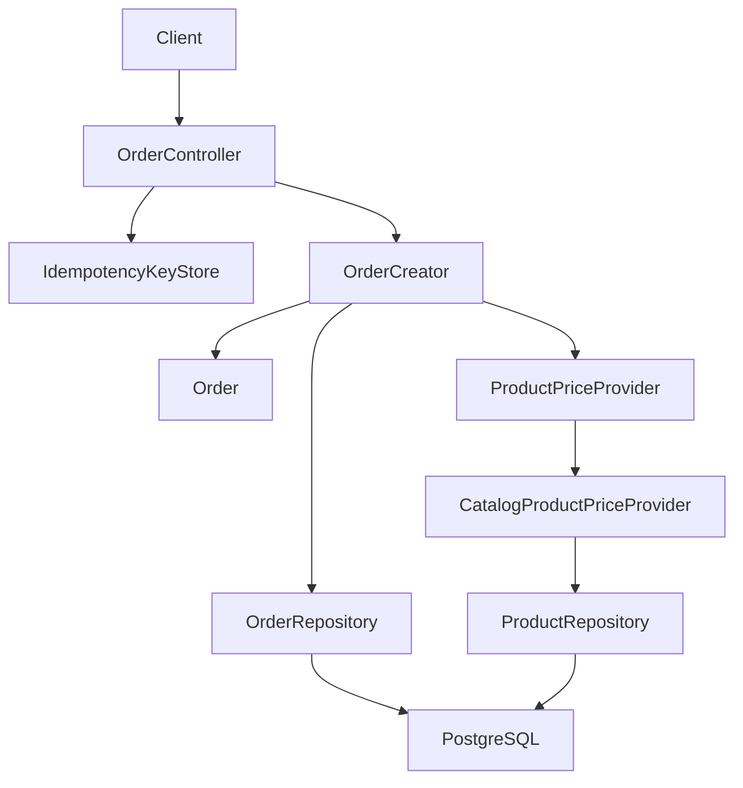
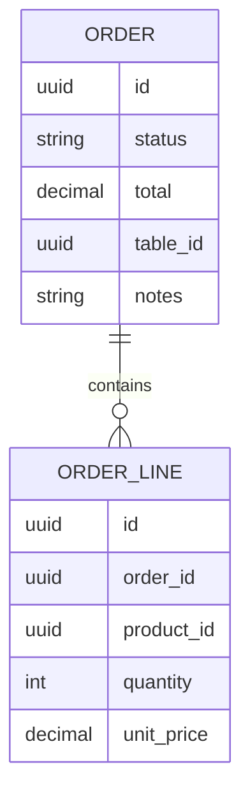

# Alta de pedido

## Introduction
- Esta funcionalidad permite dar de alta pedidos que representan la operativa del restaurante y agrupan lineas de productos asociadas, opcionalmente, a una mesa.
- Su objetivo es introducir el primer flujo de gestion de pedidos dentro del MVP, en un nuevo bounded context `orders` desacoplado de `tables` y con una integracion explicita y de sentido unico con `catalog` para resolver precios de productos.
- Resuelve la ausencia de una capacidad basica para registrar pedidos antes de que puedan participar en procesos operativos como el seguimiento de estado, la vinculacion con mesas o la facturacion.
- La solucion propuesta introduce el endpoint `POST /orders` en un nuevo bounded context `orders`, modelado con DDD y arquitectura hexagonal, con agregado `Order`, lineas como entidades internas, y referencias externas por `id` hacia `catalog` y `tables`.
- El `unitPrice` de cada linea se resuelve en el servidor mediante un puerto de dominio `ProductPriceProvider` implementado por un adaptador de infraestructura que consulta el contexto `catalog` (a traves de su `ProductRepository`); el cliente no aporta `unitPrice` en la request y el valor resuelto se persiste como snapshot historico en la linea para que el `total` del pedido sea estable frente a cambios de precio en el catalogo.

---

## Scope

### In Scope
- Definir un nuevo contexto de negocio `orders` responsable del alta de pedidos.
- Definir el endpoint de entrada `POST /orders` para crear un pedido nuevo.
- Definir el modelo de dominio minimo necesario para registrar un pedido: agregado `Order`, lineas (`OrderLine`), value objects de soporte y el enum cerrado de estado (`OrderStatus`).
- Definir los puertos y adaptadores necesarios para una implementacion hexagonal del contexto `orders` (puerto de repositorio, adaptador JPA, adaptador en memoria, adaptador HTTP, y puerto de resolucion de precios `ProductPriceProvider` con su adaptador que consulta `catalog`).
- Definir el contrato del cuerpo de la request: lista de lineas (minimo 1) con `productId` y `quantity`, `tableId` opcional, `notes` opcional; y del cuerpo de la response: representacion del pedido creado con `id`, `lines` (con `unitPrice` resuelto en servidor), `tableId`, `notes`, `status`, `total`.
- Definir el contrato de idempotencia mediante la cabecera HTTP `Idempotency-Key`, con la politica estandar documentada (misma clave + mismo body devuelve 201 cacheado, misma clave + body distinto devuelve 409, clave nueva o ausente ejecuta el flujo normal).
- Resolver el `unitPrice` de cada linea en el servidor consultando el contexto `catalog` mediante un puerto `ProductPriceProvider`; el `unitPrice` nunca llega del cliente y se persiste como snapshot historico en la linea.
- Calcular el `total` del pedido en el servidor a partir del `unitPrice` resuelto y de la `quantity`; el cliente nunca envia el `total` ni el `status` inicial.
- Crear siempre el pedido en estado `pending`; las transiciones de estado se abordaran en una feature futura ("Seguimiento del estado del pedido").
- Responder `201 Created` con cabecera `Location: /orders/{id}` y cuerpo `OrderResponse` en el caso exitoso.
- Responder `400 Bad Request` con cuerpo literalmente vacio como placeholder neutro para errores de validacion de entrada, de formato de identificadores, de `productId` inexistente en el catalogo y de `productId` sin precio resoluble; responder `409 Conflict` con cuerpo literalmente vacio para colision de `Idempotency-Key` con body distinto.
- Registrar el conjunto cerrado de estados del enum `OrderStatus` (`pending`, `in_progress`, `ready`, `delivered`, `cancelled`) aunque en esta iteracion solo se persista `pending`.

### Out of Scope
- Edicion o actualizacion total o parcial de pedidos existentes.
- Baja logica o eliminacion fisica de pedidos.
- Listado o consulta de pedidos por identificador u otros criterios.
- Transiciones de estado (`pending` -> `in_progress` -> `ready` -> `delivered`/`cancelled`). El MVP solo crea en `pending`; la maquina de estados vivira en la feature "Seguimiento del estado del pedido".
- Validacion de la existencia o el estado de `tableId` contra el contexto `tables`. Las referencias externas se almacenan por `id` sin comprobacion de integridad, que se difiere a una integracion futura entre bounded contexts.
- Captura de datos de cliente (`customerName`, `customerId`) o referencias a un futuro bounded context `customers`.
- Reservas, ocupacion o rotacion de mesas; estas pertenecen al contexto `tables`.
- Codigos QR, division de cuenta, cierre de servicio ometricas operativas.
- Soporte multi-tenant o campo `restaurantId`. La adicion de multi-tenant queda registrada en "Future Improvements".
- Sincronizacion adicional o lock a nivel de base de datos para serializar altas concurrentes sobre el mismo `Idempotency-Key`. La complejidad no se justifica para el MVP; el efecto visible para los clientes debe seguir siendo idempotente para una misma pareja clave/body.
- Reintroducir un cuerpo de error HTTP no vacio (no Problem Details, no `{"errors":...}`) en este endpoint. Se adopta el placeholder neutro alineado con `catalog/product` y `table-deletion`.
- Desacoplamiento en linea del `orders` respecto al `catalog` (consumidor de eventos, lookup HTTP con cache, sincronizacion periodica). El MVP acopla los dos contextos a nivel de codigo mediante el puerto `ProductPriceProvider` y su adaptador; las opciones de desacoplo se difieren a iteraciones futuras y se registran en `## Future Improvements`.

---

## Requirements

### Functional Requirements
- FR1: El sistema debe permitir registrar un pedido nuevo mediante `POST /orders` y responder `201 Created` con cabecera `Location: /orders/{id}` y cuerpo con la representacion del pedido creado.
- FR2: La request debe incluir una lista de lineas `lines` con longitud minima 1. Cada linea debe contener, al menos, `productId` (UUID, referencia externa a `catalog.product.id`) y `quantity` (entero positivo). La request NO debe incluir `unitPrice` en ninguna linea: el `unitPrice` se resuelve en el servidor (ver FR17) y se persiste como snapshot historico en la linea.
- FR3: La request debe aceptar opcionalmente `tableId` (UUID, referencia externa a `tables.table.id`) y opcionalmente `notes` (string libre). Ambos son opcionales e independientes; pueden estar ambos ausentes, uno presente o ambos presentes. La request no debe aceptar `unitPrice` por linea, `total` global ni `status` inicial; si llegan, se ignoran silenciosamente como datos no reconocidos por el contrato.
- FR4: El sistema debe rechazar con `400 Bad Request` (cuerpo vacio) los siguientes casos: `lines` ausente o vacio; cualquier linea con `productId` ausente, vacio o con formato UUID invalido; cualquier linea con `quantity` ausente, `null`, `0` o negativo; `tableId` presente pero con formato UUID invalido; cualquier linea con `productId` que no exista en el catalogo o cuyo precio no sea resoluble (ver FR18). Los errores de validacion se agregan en un `CompositeValidationError` siguiendo el patron del resto del proyecto, pero el cuerpo de la respuesta HTTP permanece vacio per D7.a.
- FR5: El sistema debe crear siempre el pedido en estado `pending` y debe ignorar cualquier campo `status` presente en la request. La maquina de estados completa (`pending`, `in_progress`, `ready`, `delivered`, `cancelled`) queda definida en el enum `OrderStatus` para uso futuro.
- FR6: El sistema debe calcular el `total` del pedido en el servidor como la suma de `line.unitPrice * line.quantity` sobre todas las lineas, donde `line.unitPrice` es el precio resuelto por `ProductPriceProvider` (ver FR17). La request no debe aceptar un campo `total`; si el cliente lo envia, se ignora silenciosamente como dato no reconocido por el contrato.
- FR7: El sistema debe soportar idempotencia opcional mediante la cabecera HTTP `Idempotency-Key: <uuid>`. Politica: misma `Idempotency-Key` + mismo body -> el servidor devuelve el `201 Created` original con la misma `Location: /orders/{id}` y el mismo cuerpo, sin crear un pedido duplicado; misma `Idempotency-Key` + body distinto -> el servidor responde `409 Conflict` con cuerpo vacio; nueva `Idempotency-Key` (o ausencia de cabecera) -> el servidor ejecuta el flujo normal y devuelve `201` con el nuevo pedido.
- FR8: La respuesta `201` cacheada por idempotencia debe ser indistinguible de la respuesta `201` original: mismo codigo, misma cabecera `Location` y mismo cuerpo. La clave cacheada debe conservarse durante una ventana razonable (24h por defecto, configurable); los detalles concretos de mecanismo de almacenamiento (cache en memoria vs. almacenamiento persistente) los decide el arquitecto.
- FR9: El `Idempotency-Key` es opcional: los clientes que no la envien obtienen el comportamiento no idempotente habitual. El sistema no debe exigir la cabecera en el endpoint.
- FR10: La comparacion de "mismo body" para la politica de idempotencia se realiza sobre una representacion canonica del cuerpo de la request (por ejemplo, un hash estable del JSON canonico), de modo que diferencias puramente sintaticas no generen falsos positivos. Los detalles concretos de hashing los decide el arquitecto.
- FR11: El sistema no debe validar la existencia ni el estado del `tableId` en esta iteracion. Las referencias externas se almacenan tal cual llegan; la integridad referencial se difiere a una integracion futura entre bounded contexts.
- FR12: El cuerpo de error para `400` y `409` debe ser literalmente vacio (sin `null`, sin `{}`, sin espacios en blanco), como placeholder neutro, alineado con el modelo HTTP unificado de `catalog/product` y `table-deletion`.
- FR13: La representacion del pedido creado (`OrderResponse`) debe incluir `id`, `status`, `total`, `tableId` (puede ser `null`), `notes` (puede ser `null`) y `lines` (con `productId`, `quantity` y `unitPrice` por linea). El `unitPrice` por linea se incluye en la response para que el cliente pueda reconciliar el `total`; su valor es el resuelto en servidor por `ProductPriceProvider` y persistido como snapshot historico en la linea, no un dato enviado por el cliente.
- FR14: La validacion de formato de los `id` externos (`productId` en cada linea, `tableId` opcional) la realiza el value object compartido `Id` mediante la factorIa `Id.from(String)`, consistente con el resto del proyecto. La validacion no se realiza en el adaptador HTTP, que se limita a traducir el `Result` del caso de uso a los codigos HTTP correspondientes.
- FR15: El caso de uso `OrderCreator` no debe lanzar excepciones de validacion: cualquier error de formato o de regla de dominio se traduce a `Result.failure(DomainError)` y el adaptador HTTP lo refleja en el codigo HTTP correspondiente. Las excepciones tecnicas no anticipadas (fallo de conexion a la base de datos, etc.) se propagan y su traduccion a `500` se difiere a una decision arquitectonica fuera del alcance de esta iteracion.
- FR16: El contrato del puerto de salida `OrderRepository` debe incluir, como minimo, una operacion `Order save(Order order)` y una operacion `Optional<Order> findById(Id id)` (la primera para la persistencia del alta; la segunda para uso futuro por la feature de seguimiento de estado u otras operaciones que necesiten localizar un pedido). La inclusion de `findById` en esta iteracion queda como decision de arquitecto en `## Deferred Decisions`.
- **FR17 (resolucion de `unitPrice`)**: El sistema debe resolver el `unitPrice` de cada linea en el servidor invocando el puerto de dominio `ProductPriceProvider`, implementado en infraestructura por un adaptador que consulta el contexto `catalog` (a traves de su `ProductRepository`). El valor resuelto se obtiene como una instancia del value object compartido `ProductPrice(Id productId, BigDecimal unitPrice)` del nucleo `shared` (reutilizado por `catalog` y `orders`); su campo `unitPrice` se persiste en `OrderLine.unitPrice` como snapshot historico y se utiliza para calcular el `total` del pedido. La request del cliente no incluye `unitPrice` en ningun caso; el dominio no acepta `unitPrice` como dato de entrada.
- **FR18 (validacion de `productId` contra `catalog`)**: El sistema debe rechazar la request con `400 Bad Request` (cuerpo vacio per D7.a) cuando, tras invocar `ProductPriceProvider`, algun `productId` no exista en el catalogo o el producto exista pero no tenga un precio resoluble (catalogo sin `price` o con `price` no utilizable). El error se modela como `ValidationError("productId", "...")` y se agrega al `CompositeValidationError` junto con el resto de errores de la misma request.

### Non-Functional Requirements
- Performance: La operacion de alta debe ser sincrona y de baja latencia para uso operativo interno. La resolucion de `unitPrice` añade N lookups a `ProductRepository.findById` (uno por linea) y el calculo del `total` es O(n) sobre el numero de lineas; el orden de magnitud sigue siendo despreciable para pedidos pequenos.
- Scalability: El diseno debe permitir evolucionar a mas operaciones de pedidos (consulta, actualizacion, transiciones de estado) sin acoplarse a `tables` y desacoplando progresivamente de `catalog` mediante el puerto `ProductPriceProvider` (ver `## Future Improvements`). La politica de idempotencia debe ser reemplazable (cache en memoria por defecto, almacenamiento persistente en el futuro) sin afectar al caso de uso.
- Availability: El endpoint debe responder con errores deterministas (`201`, `400`, `409`) segun corresponda, sin estados ambiguos. La idempotencia debe absorber reintentos de cliente sin crear duplicados. Un fallo transitorio del `ProductPriceProvider` se traduce en `500` por la politica habitual del proyecto, sin que la transaccion quede en un estado parcial observable.
- Maintainability: La logica de negocio (validacion de lineas, resolucion de `unitPrice`, calculo del total, asignacion de estado inicial) debe vivir en dominio y aplicacion, no en el controlador HTTP. La politica de idempotencia vive en infraestructura y se invoca desde el caso de uso o el adaptador HTTP segun decida el arquitecto, sin filtrarse al dominio. El puerto `ProductPriceProvider` vive en el dominio `orders` y su adaptador vive en `orders.infrastructure.out.catalog`, manteniendo la frontera DDD y la posibilidad de reemplazar el mecanismo subyacente.
- Observability: La operacion debera poder trazarse mas adelante con logs y metricas de creacion de pedidos, distinguiendo altas efectivas, rechazos por validacion, rechazos por formato de `id`, rechazos por `productId` inexistente o sin precio resoluble, conflictos de `Idempotency-Key` y respuestas cacheadas.

---

## Architecture Overview

### Components
- API Layer: Adaptador REST `OrderController` que expone `POST /orders` y traduce los `Result` del caso de uso a codigos HTTP siguiendo la politica uniforme del proyecto. Adicionalmente, el adaptador HTTP consulta y almacena en el componente de infraestructura `IdempotencyKeyStore` segun la politica de idempotencia definida en FR7-FR10.
- Application Layer: Caso de uso `OrderCreator` que orquesta la validacion de entrada, la resolucion de `unitPrice` mediante el puerto `ProductPriceProvider`, la construccion del agregado `Order`, el calculo del `total`, la asignacion del estado inicial y la persistencia. El caso de uso recibe parametros primitivos (`String` para `tableId`, lista de DTOs primitivos para `lines`, `String` para `notes`, `String` para `idempotencyKey`) y devuelve `Result<Order>`. No captura excepciones de validacion; delega la validacion de formato en los value objects y la resolucion de precios en el puerto de dominio.
- Domain Layer: Aggregate `Order` y value objects del pedido: `OrderLine` (con `productId: Id`, `quantity: OrderLineQuantity` y `unitPrice: OrderLineUnitPrice` poblado en servidor a partir del valor resuelto por `ProductPriceProvider`), `OrderStatus` (enum cerrado), `OrderNotes` (opcional), `OrderTotal` (decimal no negativo). Adicionalmente, el dominio declara el puerto de salida `ProductPriceProvider` (interfaz con `Optional<ProductPrice> findPrice(Id productId)`, alineado con el estilo `Optional<T>` de `ProductRepository.findById`). El value object `ProductPrice` (record con `Id productId` y `BigDecimal unitPrice`) que el puerto devuelve **no vive en el dominio `orders`**: vive en el nucleo compartido `shared` (paquete propuesto `com.forkcore.api.shared.domain.ProductPrice`, junto a `Id` y `FieldUpdate`) y es reutilizado tanto por `catalog` (donde modela el precio de un `Product`) como por `orders` (donde aparece en el contrato del puerto y como insumo para `OrderLineUnitPrice`). El agregado `Order` se construye mediante `Order.create(...)` que devuelve `Result<Order>`; un `Order` construido se considera valido por construccion.
- Infrastructure Layer:
  - Adaptadores de persistencia: `JpaOrderRepositoryAdapter` y `InMemoryOrderRepository`, ambos implementando el contrato `OrderRepository` del dominio. Entidades JPA separadas (`OrderJpaEntity`, `OrderLineJpaEntity`) y un `SpringDataOrderJpaRepository` que extiende `JpaRepository`.
  - Adaptador de resolucion de precios: `CatalogProductPriceProvider` (Spring `@Component`) en `com.forkcore.api.orders.infrastructure.out.catalog`, implementa `ProductPriceProvider` inyectando el `ProductRepository` del contexto `catalog` (mismo modulo Gradle, distinto paquete Java) y mapea el `Product` resultante a un `ProductPrice(productId, unitPrice)`. Si `ProductRepository.findById` devuelve `Optional.empty()` o el `Product` no expone un precio utilizable, el adaptador devuelve `Optional.empty()` y el caso de uso traduce la ausencia a un `ValidationError`. El mecanismo concreto (import directo de `ProductRepository` desde el mismo modulo Gradle) se documenta como decision MVP en `## Deferred Decisions` y es reemplazable (HTTP, evento, cache) sin afectar al caso de uso, gracias a la frontera del puerto.
  - Componente de idempotencia: `IdempotencyKeyStore` (interfaz en infraestructura) con una implementacion por defecto en memoria (`InMemoryIdempotencyKeyStore`) que asocia una `Idempotency-Key` al fingerprint del body y a la respuesta cacheada (`201` con `Location` y cuerpo). La eleccion del mecanismo de almacenamiento concreto (en memoria vs. persistente) y de la ventana de retencion (24h por defecto, configurable) queda como decision del arquitecto y se lista en `## Deferred Decisions`.

### Architecture Diagram (Mermaid)



### Notes
- Se define un nuevo bounded context `orders`. Su relacion con `tables` es de estricta autonomia: el `orders` no inyecta ni consulta `TableRepository`; las referencias externas a `tableId` se almacenan como `Id` (UUID) y la integridad referencial se difiere a una integracion futura.
- Su relacion con `catalog` es de sentido unico a traves del puerto `ProductPriceProvider`: el `orders` depende de `catalog` para resolver precios, pero `catalog` no conoce la existencia de `orders`. El proyecto es un unico modulo Gradle, por lo que el adaptador `CatalogProductPriceProvider` puede reutilizar `ProductRepository` mediante un import directo de `com.forkcore.api.catalog.product.domain.ProductRepository`; la frontera del puerto mantiene el acoplamiento explicito y reemplazable por mecanismos desacoplados (HTTP, evento, cache) en iteraciones futuras.
- `ProductPrice` es un value object del nucleo compartido `shared` (paquete propuesto `com.forkcore.api.shared.domain.ProductPrice`, junto a `Id` y `FieldUpdate`) y es reutilizado por `catalog` y por `orders`. Este es el caso canonico de relacion **shared kernel** entre bounded contexts: ambos contextos necesitan expresar exactamente el mismo concepto (el precio de un producto) y el tipo es pequeno, estable y semantica compartida, por lo que el coste del acoplamiento via `shared` es bajo y la alternativa (un tipo distinto en cada contexto, con traduccion en la frontera) introduce duplicacion y riesgo de deriva sin beneficio. La forma unificada del value object es `record ProductPrice(Id productId, BigDecimal unitPrice)`, consistente con el contrato que `ProductPriceProvider.findPrice(Id)` necesita devolver en `orders` y suficiente para que `catalog` exprese el precio de un `Product` (donde el `productId` es implicito en el agregado `Product` y por tanto redundante, pero incluirlo es innocuo y aporta trazabilidad en la frontera del puerto). El paquete Java final, la migracion del tipo actual `com.forkcore.api.catalog.product.domain.vo.ProductPrice(BigDecimal value)` al nuevo `ProductPrice(Id, BigDecimal)` y la estrategia de backward compatibility para callers existentes de `catalog` quedan como decisiones del arquitecto (ver `## Deferred Decisions`). El nucleo `shared` no es "generico": ademas de primitives tecnicos (`Id`, `FieldUpdate`, `Result`, familia `DomainError`), tambien aloja value objects de dominio compartidos entre bounded contexts como `ProductPrice`.
- Dentro del contexto `orders`, el modulo de pedido se organizara como `com.forkcore.api.orders.*`, siguiendo el mismo patron de empaquetado que `tables` (`com.forkcore.api.tables.*`) y la subdivision interna (`application`, `domain`, `domain/vo`, `infrastructure/in/web`, `infrastructure/out/persistence`). El adaptador `CatalogProductPriceProvider` se ubicara en `com.forkcore.api.orders.infrastructure.out.catalog`, siguiendo el patron de subdivisiones por puerto de salida.
- El calculo del `total` se realiza en el constructor del agregado `Order` a partir de las lineas ya enriquecidas con el `unitPrice` resuelto, de modo que el dominio garantiza la coherencia entre `lines` y `total` por construccion.
- El `unitPrice` resuelto se persiste en `OrderLine` como snapshot historico: aunque el precio del producto cambie en `catalog` despues del alta, el pedido mantiene el precio capturado en el momento de su creacion. Esta decision es deliberada y consistente con la naturaleza historica del pedido.
- La politica de idempotencia se modela como un componente de infraestructura (`IdempotencyKeyStore`) en lugar de un value object del dominio, porque depende del mecanismo de almacenamiento y de la ventana de retencion, que son detalles tecnicos ajenos al dominio del pedido. La traduccion de "clave + body" a "respuesta cacheada" sigue siendo transparente para el caso de uso: si la cache contiene una entrada, el adaptador HTTP reproduce la respuesta cacheada; si no, se delega al caso de uso y se almacena el resultado.
- El caso de uso `OrderCreator` no sabe de la cache de idempotencia. La responsabilidad de consultar y almacenar entradas vive en el adaptador HTTP o en un servicio de aplicacion intermedio, segun decida el arquitecto. La separacion mantiene al dominio ignorante de la politica HTTP.
- El conjunto cerrado de valores del enum `OrderStatus` se define completo (`pending`, `in_progress`, `ready`, `delivered`, `cancelled`) aunque en esta iteracion solo se persista `pending`. Las transiciones entre valores quedaran recogidas por la futura feature de seguimiento de estado.
- El body de error de `400` y `409` es literalmente vacio (placeholder neutro), alineado con `catalog/product` y `table-deletion`. Esta decision introduce una **divergencia temporal con `table-registration`**, que sigue usando el cuerpo estructurado `{"errors":[{"field":"...","message":"..."}]}`; la unificacion del formato de cuerpo de error queda registrada en `## Future Improvements`.

---

## Data Design

### Data Model (Mermaid)



### Description
- Entities:
  - `Order` como aggregate root del contexto `orders`. Se identifica por un `id` UUIDv7 generado por el dominio mediante `Id.create()` siguiendo el patron time-ordered ya usado por `Product` y `Table`.
  - `OrderLine` como entidad interna del agregado `Order`: se identifica por su `id` propio (UUIDv7) y mantiene una asociacion con su `Order` padre por `order_id`. La identidad propia de la linea se introduce para permitir futuras operaciones de modificacion o eliminacion de lineas concretas; en esta iteracion no se expone por HTTP.
- Relationships:
  - `Order 1--* OrderLine`: una `Order` contiene una o mas `OrderLine`. La composicion la gestiona el agregado: no se persiste una `OrderLine` sin su `Order` padre.
  - `OrderLine.product_id` es una referencia externa por `id` hacia `catalog.product.id`. No se modela como FK en el esquema de `orders` en esta iteracion; la integridad referencial se resuelve a nivel de aplicacion mediante `ProductPriceProvider`, que rechaza el alta si el `productId` no existe o no tiene precio resoluble (FR18). En el modelo fisico, `product_id` queda como un UUID logico que apunta a `catalog.product.id` sin constraint relacional.
  - `Order.table_id` es una referencia externa por `id` hacia `tables.table.id`. No se modela como FK en el esquema de `orders` en esta iteracion; no se valida la existencia ni el estado de la mesa.
- Constraints:
  - `Order.id` obligatorio, unico, generado por el dominio.
  - `Order.status` obligatorio en el modelo, valor cerrado del enum `OrderStatus`. En esta iteracion, el unico valor que puede persistirse en una nueva `Order` es `pending`; el resto de valores se reservan para uso futuro.
  - `Order.total` obligatorio, decimal no negativo, calculado por el dominio a partir de la suma de `line.unit_price * line.quantity` sobre los `unit_price` resueltos por `ProductPriceProvider`. No se acepta del cliente.
  - `Order.table_id` opcional, UUID valido cuando esta presente. Nullable.
  - `Order.notes` opcional. Nullable. Texto libre.
  - `OrderLine.id` obligatorio, unico, generado por el dominio.
  - `OrderLine.order_id` obligatorio, FK interna hacia `Order.id`.
  - `OrderLine.product_id` obligatorio, UUID valido (formato UUID validado por `Id.from`).
  - `OrderLine.quantity` obligatorio, entero mayor o igual a 1.
  - `OrderLine.unit_price` obligatorio, decimal mayor o igual a 0 (cero permitido solo si la operativa lo requiere; en el MVP se exigira estrictamente positivo). Su valor es **poblado por el servidor** a partir del precio resuelto por `ProductPriceProvider` en el momento del alta y proviene del value object compartido `ProductPrice(Id productId, BigDecimal unitPrice)` del nucleo `shared`; nunca llega del cliente.
  - Cardinalidad: `Order` debe tener al menos 1 `OrderLine` asociada; la lista vacia se rechaza en construccion.
- Notes:
  - El `unit_price` por linea es un "price snapshot" **resuelto por el servidor** desde el contexto `catalog` mediante el puerto `ProductPriceProvider` y persistido en el momento del alta. El valor se modela con el value object compartido `ProductPrice` del nucleo `shared` (reutilizado por `catalog` y `orders`), por lo que su tipo canonico es `ProductPrice(Id productId, BigDecimal unitPrice)` y el `BigDecimal unitPrice` que se persiste en la linea es el campo correspondiente de ese value object. Esto es consistente con D2.b-revisado (resolucion server-side via puerto) y necesario para que D3.a (calculo del total) sea computable sin aceptar datos de precio del cliente. La persistencia como snapshot historico garantiza que el `total` del pedido permanezca estable aunque los precios del catalogo cambien despues del alta.
  - El `product_id` se mantiene como referencia logica a `catalog.product.id` sin FK fisica: el acoplamiento entre esquemas se evita conscientemente, consistente con la estrategia BC-by-id del proyecto. La validacion de existencia y disponibilidad del producto se realiza en tiempo de alta a traves del puerto de dominio, no en tiempo de lectura mediante un FK.

---

## Technology Stack
- Backend: Java 25
- Framework: Spring Boot 4, Spring Web MVC
- Database: PostgreSQL
- ORM: Por definir
- Messaging: No aplica en esta fase
- Testing: JUnit
- Infrastructure: Gradle
- Componente de resolucion de precios: el mecanismo concreto por el que `ProductPriceProvider` consulta `catalog` (import directo de `ProductRepository` desde el mismo modulo Gradle, lookup HTTP, consumidor de eventos, sincronizacion periodica) es una **decision diferida al arquitecto** y se lista en `## Deferred Decisions`. El diseno no fija la tecnologia subyacente.
- Componente de idempotencia: el mecanismo de almacenamiento concreto (cache en memoria con `ConcurrentHashMap` para MVP, o almacenamiento persistente) y la ventana de retencion (24h por defecto, configurable) son **decisiones diferidas al arquitecto** y se listan en `## Deferred Decisions`. El diseno no fija la tecnologia subyacente.

---

## Core Logic

### Workflow
1. Un cliente invoca `POST /orders` con un cuerpo JSON que contiene `lines` (lista de objetos con `productId` y `quantity`), `tableId` opcional y `notes` opcional. Opcionalmente, incluye la cabecera `Idempotency-Key`.
2. El adaptador HTTP `OrderController` recibe la request. Si la cabecera `Idempotency-Key` esta presente, consulta `IdempotencyKeyStore.find(key)`:
   - Si existe una entrada para esa clave, se compara el fingerprint del body actual con el fingerprint almacenado:
     - Si coinciden, se reproduce la respuesta cacheada (`201 Created` con la misma `Location` y el mismo cuerpo) y termina.
     - Si no coinciden, se responde `409 Conflict` con cuerpo vacio y termina.
3. Si la cabecera no esta presente, o si esta presente pero la cache no contiene esa clave, el adaptador HTTP delega en el caso de uso `OrderCreator.run(lines, tableId, notes)` con parametros primitivos.
4. El caso de uso delega la validacion de cada campo en los value objects: `Id.from` para `productId` y `tableId`; `OrderLineQuantity.from` para `quantity`. La lista de lineas vacia y la lista nula se rechazan como `ValidationError`. Los errores se acumulan en un `CompositeValidationError`.
5. Una vez validados los formatos, el caso de uso invoca `ProductPriceProvider.findPrice(productId)` para cada `productId` de la request, en el orden en que aparecen en `lines`:
   - Si la respuesta es `Optional.empty()` para algun `productId` (producto inexistente en `catalog` o sin precio resoluble), se genera un `ValidationError("productId", "...")` y se agrega al `CompositeValidationError` junto con el resto de errores.
   - Si todos los `productId` resuelven un `ProductPrice`, el caso de uso extrae el `BigDecimal unitPrice` de cada `ProductPrice` y lo proyecta a `OrderLineUnitPrice` mediante su factoria, manteniendo la invariante de dominio "precio de linea no negativo por construccion".
6. Si las validaciones y la resolucion de precios son correctas, el caso de uso construye el agregado `Order` mediante `Order.create(...)`, que a su vez:
   - Asigna `id = Id.create()`.
   - Construye las `OrderLine` con `id = Id.create()` por linea y con `unitPrice` igual al precio resuelto en el paso 5.
   - Calcula `total = sum(line.unitPrice * line.quantity)` sobre las lineas ya enriquecidas.
   - Asigna `status = pending`.
   - Acepta `tableId` (nullable) y `notes` (nullable) tal cual.
7. El caso de uso invoca `OrderRepository.save(order)` y devuelve `Result.success(order)`.
8. El adaptador HTTP construye la response `OrderResponse.from(order)` (que incluye el `unitPrice` resuelto por linea y el `total` calculado), la registra en `IdempotencyKeyStore` asociada a la `Idempotency-Key` (si la request la incluia) y responde `201 Created` con cabecera `Location: /orders/{id}` y cuerpo `OrderResponse`.

### Business Rules
- Una `Order` no debe crearse sin al menos una `OrderLine`. Una lista `lines` nula o vacia se rechaza con `ValidationError("lines", "at least one line is required")`.
- Cada `OrderLine` requiere `productId` con formato UUID valido y `quantity` entero mayor o igual a 1. Cualquier violacion se traduce a un `ValidationError` y se acumula en un `CompositeValidationError` con el resto de errores de la misma request.
- El `unitPrice` de cada linea **no forma parte del contrato de entrada**; el cliente no envia `unitPrice` y el dominio no lo acepta. El servidor resuelve el `unitPrice` de cada linea mediante `ProductPriceProvider` en el momento del alta; el valor resuelto es el unico que se persiste en la linea y el unico que se utiliza para calcular el `total`.
- Si el puerto `ProductPriceProvider` no devuelve precio para un `productId` (producto inexistente o sin precio resoluble), el caso de uso rechaza la request con `400` agregando un `ValidationError("productId", "...")` al `CompositeValidationError`. El error se modela como error de validacion porque, desde el punto de vista del contrato HTTP, equivale a que la request aporta un dato de entrada (`productId`) que no satisface las precondiciones del alta.
- El `status` de la `Order` siempre se inicializa a `pending`. La request no debe aceptar un campo `status`; si llega, se ignora silenciosamente como dato no reconocido por el contrato.
- El `total` de la `Order` se calcula siempre en el servidor como `sum(line.unitPrice * line.quantity)` sobre todas las lineas, donde `line.unitPrice` es el precio resuelto por `ProductPriceProvider` en el momento del alta. La request no debe aceptar un campo `total`; si llega, se ignora silenciosamente.
- El `tableId` es opcional. Si esta presente, debe tener formato UUID valido y se persiste como `Id` (la validacion la realiza `Id.from`). Si esta ausente o es `null`, se persiste como `null` y el pedido queda "sin mesa".
- El `tableId` no se valida contra el contexto `tables` en esta iteracion: es una referencia externa por `id` sin comprobacion de existencia o estado. La integracion con `tables` se difiere a una iteracion futura.
- El `notes` es opcional. Si esta presente, se persiste como string libre (sin regla de longitud maxima, formato o charset en esta iteracion). Si esta ausente o es `null`, se persiste como `null`.
- El `Idempotency-Key`, si esta presente, debe ser una cadena no vacia (no se valida que sea un UUID estricto en esta iteracion; se acepta cualquier token razonable para evitar falsos rechazos). Los detalles del formato los decide el arquitecto.
- Para la politica de idempotencia, "mismo body" se evalua sobre el fingerprint del JSON canonico de la request, calculado consistentemente para el mismo contenido semantico. Los detalles del algoritmo de fingerprinting (SHA-256 sobre el body serializado, JSON canonico, normalizacion de espacios) los decide el arquitecto.
- Una entrada de `IdempotencyKeyStore` debe caducar tras la ventana de retencion configurada (24h por defecto, configurable). Pasado ese tiempo, reusar la misma `Idempotency-Key` se trata como una clave nueva.

### Edge Cases
- `lines` ausente o `null` en la request: `400 Bad Request` con cuerpo vacio. El campo `lines` no es opcional: el endpoint siempre exige al menos una linea.
- `lines` como array vacio `[]`: `400 Bad Request` con cuerpo vacio. Se rechaza como "at least one line is required".
- `lines` con alguna entrada que tiene `productId` ausente, vacio o con formato UUID invalido: `400 Bad Request` con cuerpo vacio. El resto de errores de la misma request se agregan en `CompositeValidationError` aunque el cuerpo HTTP no los muestre.
- `lines` con alguna entrada que tiene `quantity` ausente, `null`, `0` o negativo: `400 Bad Request` con cuerpo vacio. Si una linea acumula varios errores (p. ej. `productId` invalido y `quantity` negativo), todos se reportan agregados en el `CompositeValidationError` y la response HTTP sigue siendo cuerpo vacio.
- `lines` con alguna entrada que tiene `productId` que no existe en el catalogo: `400 Bad Request` con cuerpo vacio. El caso de uso traduce el `Optional.empty()` devuelto por `ProductPriceProvider.findPrice(productId)` a un `ValidationError("productId", "product not found or has no resolvable price: <id>")` y lo agrega al `CompositeValidationError`.
- `lines` con alguna entrada que tiene `productId` que existe en el catalogo pero cuyo `Product.price` no es utilizable (por ejemplo, `null` o un valor que el adaptador `CatalogProductPriceProvider` decida descartar): `400 Bad Request` con cuerpo vacio. El caso de uso lo trata igual que el caso anterior (mismo `Optional.empty()` desde el adaptador), y el `CompositeValidationError` lo acumula junto con el resto de errores.
- `ProductPriceProvider` falla por causa tecnica (por ejemplo, `ProductRepository.findById` lanza una excepcion de conexion a la base de datos): la excepcion se propaga al adaptador HTTP, que la traduce a `500 Internal Server Error` por la politica habitual del proyecto. La request no crea un pedido ni queda en estado parcial observable. La decision de politica exacta para `500` se difiere a `## Deferred Decisions`.
- `tableId` presente pero con formato UUID invalido: `400 Bad Request` con cuerpo vacio.
- `status` presente en el cuerpo de la request: se ignora silenciosamente. El pedido se crea siempre en `pending`. Documentado como comportamiento explicito, no como error.
- `total` presente en el cuerpo de la request: se ignora silenciosamente. El servidor calcula siempre el `total` a partir de las lineas con precios resueltos. Documentado como comportamiento explicito, no como error.
- `unitPrice` presente en alguna linea del cuerpo de la request: se ignora silenciosamente. El servidor ignora cualquier dato de precio del cliente y resuelve el `unitPrice` siempre desde `ProductPriceProvider`. Documentado como comportamiento explicito, no como error.
- `Idempotency-Key` presente, mismo body que la primera llamada: el servidor devuelve el `201` original con la misma `Location` y el mismo cuerpo. No se crea un pedido duplicado. La cache conserva la entrada durante la ventana de retencion.
- `Idempotency-Key` presente, body distinto al de la primera llamada: el servidor responde `409 Conflict` con cuerpo vacio. No se crea un pedido nuevo.
- `Idempotency-Key` presente y expirada (fuera de la ventana de retencion): se trata como clave nueva. El servidor ejecuta el flujo normal y crea un pedido nuevo.
- `Idempotency-Key` presente y malformada (vacia, solo espacios en blanco): se trata como si la cabecera no estuviera presente. El servidor ejecuta el flujo normal y crea un pedido nuevo. Comportamiento sujeto a la decision del arquitecto en `## Deferred Decisions`.
- Mas de un error de validacion en la misma request: el caso de uso agrega todos los `ValidationError` en un `CompositeValidationError` siguiendo el patron del resto del proyecto. La response HTTP sigue siendo `400` con cuerpo vacio per D7.a.
- Body JSON malformado o `Content-Type` ausente: la deserializacion falla en el adaptador HTTP antes de invocar al caso de uso; se responde `400 Bad Request` con cuerpo vacio por la politica uniforme del proyecto.
- Idempotency-Key: la cabecera debe leerse del HTTP, no del body. Un `Idempotency-Key` eventualmente presente en el body debe ignorarse.

---

## HTTP Contract

### Request
- Metodo: `POST`
- Path: `/orders`
- Cabeceras:
  - `Content-Type: application/json` (obligatorio; un body no JSON se rechaza como `400` con cuerpo vacio).
  - `Idempotency-Key: <token>` (opcional). Si esta presente, activa la politica de idempotencia definida en FR7-FR10.
- Body: `CreateOrderRequest { lines: [ { productId, quantity } ], tableId?, notes? }`.
  - `lines`: obligatorio, lista no vacia. Cada `lines[i]` requiere `productId` (UUID) y `quantity` (entero >= 1). **No incluye `unitPrice`**: el precio por linea lo resuelve el servidor mediante `ProductPriceProvider`.
  - `tableId`: opcional. Si esta presente, debe respetar el formato UUID.
  - `notes`: opcional, string libre.
  - `status`, `total` y `unitPrice` (por linea) **NO forman parte del contrato**: si el cliente los envia, se ignoran silenciosamente.
  - Cualquier otro campo fuera de `lines`, `tableId` y `notes` se ignora silenciosamente como dato no reconocido por el contrato.

Ejemplo de request:

```json
{
  "lines": [
    { "productId": "uuid-hamburguesa", "quantity": 1 },
    { "productId": "uuid-cocacola",   "quantity": 2 }
  ],
  "tableId": "uuid-mesa-7",
  "notes": "sin cebolla"
}
```

### Success Response
- Status: `201 Created`
- Cabecera: `Location: /orders/{id}` donde `{id}` es el `id` generado por el dominio para el pedido recien creado.
- Cuerpo: `OrderResponse { id, status, total, tableId, notes, lines: [ { productId, quantity, unitPrice } ] }`. El `unitPrice` por linea y el `total` son **resueltos y calculados por el servidor**; el cliente los recibe como parte de la representacion del pedido creado y los utiliza para reconciliar su UI o sistemas externos. El `unitPrice` por linea es el snapshot historico persistido en el momento del alta, no un dato enviado por el cliente.
- En el caso de respuesta cacheada por `Idempotency-Key` (mismo body), la response es indistinguible de la original: mismo codigo, misma `Location` y mismo cuerpo.

Ejemplo de response:

```json
{
  "id": "uuid-pedido",
  "status": "pending",
  "lines": [
    { "productId": "uuid-hamburguesa", "quantity": 1, "unitPrice": 12.50 },
    { "productId": "uuid-cocacola",   "quantity": 2, "unitPrice":  2.20 }
  ],
  "tableId": "uuid-mesa-7",
  "notes": "sin cebolla",
  "total": 16.90
}
```

### Error Responses
- `400 Bad Request` con cuerpo literalmente vacio (placeholder neutro) en los siguientes casos:
  - `lines` ausente, `null` o vacio.
  - Cualquier linea con `productId` ausente, vacio o con formato UUID invalido.
  - Cualquier linea con `quantity` ausente, `null`, `0` o negativo.
  - Cualquier linea con `productId` que no exista en el catalogo (FR18).
  - Cualquier linea con `productId` que exista en el catalogo pero no tenga un precio resoluble (FR18).
  - `tableId` presente pero con formato UUID invalido.
  - Body JSON malformado o `Content-Type` no JSON.
- `409 Conflict` con cuerpo literalmente vacio cuando el `Idempotency-Key` se ha reutilizado con un body distinto al de la primera llamada.
- `500 Internal Server Error` para fallos tecnicos inesperados, incluido un fallo del `ProductPriceProvider` (por ejemplo, una excepcion de conexion a la base de datos del `catalog`), con el formato por defecto de Spring (no especificado por esta arquitectura; ver `## Deferred Decisions`).

### Error body format divergence

Este endpoint adopta el cuerpo de error **literalmente vacio** de `catalog/product` y `table-deletion`, en linea con el modelo HTTP unificado del proyecto. En esta iteracion, `table-registration` sigue usando el cuerpo estructurado `{"errors":[{"field":"...","message":"..."}]}`. La unificacion del formato de cuerpo de error del proyecto queda registrada en `## Future Improvements`. Hasta entonces, los clientes que consuman el proyecto deben esperar ambos formatos segun el endpoint.

A modo ilustrativo, los formatos que **no** se usan en este endpoint son:

```json
{
  "errors": [
    { "field": "lines", "message": "at least one line is required" }
  ]
}
```

```json
{
  "type": "about:blank",
  "title": "Invalid order",
  "status": 400,
  "detail": "lines: at least one line is required"
}
```

Ninguno de los dos se emite desde `POST /orders`. La unica respuesta de error de este endpoint es cuerpo vacio.

### Divergencia entre request y response

El request **no incluye `unitPrice`** en ninguna linea (ver `### Request`). El response **si incluye `unitPrice`** por linea, junto con `total` (ver `### Success Response`). El `unitPrice` del response es el valor resuelto por el servidor mediante `ProductPriceProvider` y persistido como snapshot historico en la linea, no un dato enviado por el cliente. Esta asimetria es deliberada y refleja la regla "el servidor es la unica fuente de verdad para el precio del pedido".

---

## Performance Considerations
- Bottlenecks: La latencia de base de datos (escritura del `Order` y de sus `OrderLine`) y, marginalmente, los N lookups a `ProductRepository.findById` (uno por linea, secuenciales) y la consulta/almacenamiento en la cache de `IdempotencyKeyStore`. Para pedidos pequenos (N <= 10 lineas) el orden de magnitud es despreciable; para pedidos mas grandes o catologos remotos, la latencia de la resolucion de precios dominara y se abordara con los mecanismos desacoplados de `## Future Improvements`.
- Caching: La cache de idempotencia (`IdempotencyKeyStore`) es el unico caching del flujo. Su tamano y eviction policy dependen del mecanismo de almacenamiento (en memoria vs. persistente) que decida el arquitecto. El caching de precios en `ProductPriceProvider` se difiere a las opciones de desacoplo de `## Future Improvements` (consumidor de eventos, lookup HTTP con cache, sincronizacion periodica).
- Database optimization: `Order.id` ya cuenta con el indice de clave primaria; se recomienda un indice sobre `Order.table_id` para soportar futuras consultas por mesa. La integridad referencial externa (`product_id`, `table_id`) no se modela con FK en esta iteracion.
- Scaling strategy: Mantener el caso de uso `OrderCreator` aislado del mecanismo de idempotencia, del adaptador HTTP y del mecanismo subyacente de `ProductPriceProvider`, para poder incorporar un almacenamiento persistente de claves, una cache distribuida, o un consumidor asincrono de eventos del `catalog` y de `tables` sin reescribir el dominio.
- Async processing: No aplica para el alta sincrona. La recepcion de eventos de `catalog` o `tables` para enriquecer o validar el pedido se abordara en iteraciones futuras (ver `## Future Improvements`).

---

## Security Considerations
- Authentication: Fuera de alcance por ahora, pero el endpoint debera poder protegerse mas adelante, igual que el resto de operaciones del proyecto.
- Authorization: Fuera de alcance por ahora; previsiblemente restringido a roles operativos o administrativos con capacidad de registrar pedidos.
- Input validation: Obligatoria en borde (deserializacion JSON) y en dominio (value objects). El caso de uso no asume que la request ya esta validada.
- Rate limiting: No prioritario en fase inicial interna. La politica de idempotencia ayuda a absorber reintentos pero no protege contra abuso sostenido.
- Encryption: No aplica a datos sensibles en esta iteracion. Las lineas del pedido pueden contener informacion operativa del restaurante que, en caso de interceptacion, podria ser sensible; se debera evaluar TLS en el borde.
- Vulnerabilities:
  - **Manipulacion de precios por el cliente (riesgo cerrado en esta iteracion)**: la decision de no aceptar `unitPrice` en la request y resolverlo en el servidor mediante `ProductPriceProvider` cierra el vector por el cual un cliente podia fijar un `unitPrice` arbitrario (incluido cero) para manipular el `total` del pedido o saltarse restricciones de precio en `catalog`. El cliente no tiene control sobre el `unitPrice` persistido.
  - Evitar que un `Idempotency-Key` en el body altere el contrato: la cabecera HTTP es la unica fuente valida de la clave de idempotencia.
  - Evitar que un `status`, `total` o `unitPrice` (por linea) en el body alteren el comportamiento: el dominio siempre calcula `total` y `unitPrice` por linea, y siempre asigna `status = pending`. Cualquiera de estos campos en el body se ignora silenciosamente.
  - Evitar validaciones solo en controlador y errores ambiguos de entrada: la validacion vive en los value objects del dominio, siguiendo el patron del resto del proyecto.
  - El cuerpo de error vacio como placeholder neutro reduce la exposicion de informacion sensible en las respuestas de error, en linea con `catalog/product` y `table-deletion`.
  - **Resolucion de precios**: el adaptador `CatalogProductPriceProvider` consulta `ProductRepository` desde el mismo modulo Gradle. La exposicion de esta dependencia al exterior del proceso (HTTP, red) no ocurre en esta iteracion; queda diferida a las opciones de desacoplo de `## Future Improvements`, que introducen superficie de red y requieren las medidas de seguridad y resiliencia habituales (timeouts, circuit breakers, autenticacion, cifrado).

---

## Trade-offs
- Decision: Modelar pedidos en un nuevo bounded context `orders` separado de `catalog` y de `tables`.
  - Alternatives: Modelar pedidos como un tipo mas de `Product`, o como una relacion embebida dentro de `Table`.
  - Reason: Los pedidos tienen identidad, ciclo de vida y reglas propios; ademas, su modelo combina referencias externas (`productId`, `tableId`) con datos locales (`quantity`, `unitPrice`, `notes`, `status`, `total`). Mezclarlos acoplaria dos o tres dominios con preocupaciones distintas y bloquearia la evolucion independiente de cada uno.
  - Downsides: Introduce una nueva frontera de contexto antes de que existan todos los flujos consumidores. El `orders` introduce ademas una dependencia unidireccional respecto a `catalog` para resolver precios (ver siguiente trade-off), que se gestiona mediante un puerto y se difiere su posible desacoplo a iteraciones futuras.
- Decision: El `orders` resuelve precios de productos a traves de un puerto de dominio `ProductPriceProvider`, implementado en infraestructura por un adaptador (`CatalogProductPriceProvider`) que consulta el `ProductRepository` del contexto `catalog` (import directo de `com.forkcore.api.catalog.product.domain.ProductRepository`, dado que el proyecto es un unico modulo Gradle).
  - Alternatives: Inyectar directamente `ProductRepository` desde el caso de uso `OrderCreator` (sin puerto); o desacoplar `orders` y `catalog` desde el MVP mediante HTTP, evento o sincronizacion periodica.
  - Reason: Mantener la autonomia del dominio `orders` frente a `catalog`: el caso de uso no conoce `ProductRepository`, solo conoce el puerto. Esto permite reemplazar el mecanismo subyacente (HTTP, evento, cache) sin reescribir la logica de negocio, y permite testear el caso de uso con un stub del puerto. La eleccion de import directo desde el mismo modulo Gradle es el mecanismo mas simple viable para MVP; cualquier mecanismo desacoplado introduce latencia de red, consistencia eventual y superficie de fallo, y se difiere hasta que la operativa lo justifique.
  - Downsides: Acoplamiento a nivel de codigo y despliegue entre `orders` y `catalog` durante el MVP: cualquier cambio incompatible en `ProductRepository` o en la representacion de `Product` impacta a `orders`. La frontera del puerto mantiene el acoplamiento explicito y reemplazable, y el hecho de que `ProductPrice` viva en el nucleo `shared` y sea **el mismo tipo** para ambos contextos reduce adicionalmente el riesgo de acoplamiento por deriva de esquemas: `orders` y `catalog` acuerdan la forma de `ProductPrice` una sola vez (en `shared`), de modo que el unico acoplamiento residual entre contextos es la llamada runtime del adaptador `CatalogProductPriceProvider` a `ProductRepository`, mediada por el puerto y por tanto encapsulable, testeable y reemplazable. El mecanismo subyacente concreto (mecanismo de la llamada runtime, no la localizacion del tipo) queda como decision diferida para el arquitecto (ver `## Deferred Decisions`) y como opcion de evolucion a corto plazo (ver `## Future Improvements`).
- Decision: El `unitPrice` se persiste en `OrderLine` como snapshot historico del precio resuelto por `ProductPriceProvider` en el momento del alta, y el `total` se calcula sobre ese snapshot.
  - Alternatives: Recalcular `total` (y `unitPrice` por linea) en cada lectura a partir del precio actual del catalogo; o mantener ambos: snapshot historico para `total` y precio vivo para una vista "precio actual" paralela.
  - Reason: El `total` es una propiedad historica del pedido: debe persistirse con el pedido para soportar consultas, listados y reportes sin recalcular, y debe ser estable frente a cambios de precio en el catalogo. El `unitPrice` por linea es la base de ese calculo y debe persistirse junto a la linea por la misma razon.
  - Downsides: Duplicacion pequena del dato de precio (precio actual en `catalog`, precio historico en `OrderLine`) y necesidad de una politica explicita para responder a la pregunta "como se muestra el desfase entre precio historico y precio actual" cuando se introduce una vista de drift de precios. Esta politica se difiere a `## Future Improvements`.
- Decision: La politica de idempotencia vive en infraestructura (`IdempotencyKeyStore`) y se invoca desde el adaptador HTTP, no desde el caso de uso.
  - Alternatives: Hacer que el caso de uso gestione la cache de idempotencia, o modelar la idempotencia como un value object del dominio.
  - Reason: La idempotencia depende del mecanismo de almacenamiento y de la ventana de retencion, que son detalles tecnicos. Introducirlos en el caso de uso o en el dominio anadiria acoplamiento y dificultaria el reemplazo del mecanismo (de cache en memoria a almacenamiento persistente, por ejemplo) sin reescribir la logica de negocio.
  - Downsides: La traduccion "request -> respuesta cacheada" ocurre en el adaptador HTTP, lo que obliga a un cuidado adicional al testear el flujo. La decision final sobre la ubicacion exacta (adaptador HTTP vs. servicio de aplicacion intermedio) queda abierta en `## Deferred Decisions`.
- Decision: Cuerpo de error literalmente vacio para `400` y `409` en `POST /orders`, alineado con `catalog/product` y `table-deletion`.
  - Alternatives: Adoptar el cuerpo estructurado `{"errors":[{"field":"...","message":"..."}]}` de `table-registration` en este endpoint, o introducir Problem Details.
  - Reason: Replicar el modelo HTTP unificado del proyecto y mantener el alcance de `order-registration` paralelo a los endpoints mas recientes.
  - Downsides: El endpoint diverge temporalmente de `table-registration` en el formato de cuerpo de error. Los clientes deben esperar ambos formatos segun el endpoint que consuman. La unificacion del formato de cuerpo de error del proyecto queda registrada en `## Future Improvements`.
- Decision: El enum `OrderStatus` se define completo desde el inicio, aunque en esta iteracion solo se persista `pending`.
  - Alternatives: Definir `OrderStatus` solo con `pending` y ampliar el conjunto cuando se aborde la feature de seguimiento de estado.
  - Reason: Fijar el conjunto cerrado desde el inicio evita una migracion del enum cuando se introduzcan las transiciones y da claridad al modelo de dominio.
  - Downsides: Los valores `in_progress`, `ready`, `delivered` y `cancelled` aparecen en el codigo aunque no se usen todavia; el arquitecto debera evitar emitir respuestas que los expongan antes de tiempo.
- Decision: El `Idempotency-Key` es opcional y la cache se conserva durante una ventana razonable (24h por defecto, configurable).
  - Alternatives: Hacer la cabecera obligatoria y exigir idempotencia en todas las altas, o no soportar idempotencia en el MVP.
  - Reason: La opcion "obligatoria" rompe clientes existentes y exige mas superficie de error; la opcion "no soportarla" deja el endpoint fragil ante reintentos. Una cabecera opcional con ventana de retencion configurable es la politica estandar (alineada con Stripe, por ejemplo) y maximiza la compatibilidad con clientes que aun no la envian.
  - Downsides: Los clientes que confIan en reintentos deben enviar explicitamente la cabecera para evitar duplicados. La ventana concreta y el mecanismo de almacenamiento son decisiones del arquitecto y se difieren.

---

## Future Improvements
- Anadir actualizacion, baja logica o fisica y consulta de pedidos (incluido `GET /orders/{id}` y `GET /orders` con filtros).
- Introducir transiciones de estado controladas para `OrderStatus`: `pending` -> `in_progress` -> `ready` -> `delivered`/`cancelled`, en una nueva feature "Seguimiento del estado del pedido".
- Permitir la vinculacion y desvinculacion del pedido con una mesa (link, unlink, transfer) y soportar multiples mesas por pedido si el dominio lo requiere.
- Anadir validacion de `tableId` contra el contexto `tables` (existencia y/o estado) mediante algun mecanismo de integracion entre bounded contexts (consumidor de eventos, lookup HTTP, validacion asincrona, etc.). Esta integracion vivira en su propio bounded context o en una capa de aplicacion de soporte y requerira una politica explicita de que hacer con pedidos cuyo `tableId` deja de ser valido.
- Evolucionar el `ProductPriceProvider` para desacoplar `orders` de `catalog` en linea, pasando a un mecanismo con snapshot o cache en el servidor (consumidor de eventos del `catalog`, lookup HTTP con cache, sincronizacion periodica) que permita al `orders` resolver precios sin una dependencia online al `catalog`.
- Persistir la cache de `IdempotencyKeyStore` en un almacenamiento durable (por ejemplo, una tabla `idempotency_key` en PostgreSQL o una cache distribuida como Redis) para soportar multiples instancias del servicio y politicas de retencion mas sofisticadas.
- Anadir referencias a clientes (por ejemplo, un bounded context `customers`) y campos `customerId` y/o `customerName` en el alta de pedido.
- Anadir `restaurantId` al modelo de `Order` para soportar multi-tenant cuando el contexto operativo lo justifique.
- Reintroducir un esquema de cuerpo de error HTTP no vacio (estructurado o Problem Details) para `400`, `409` y `500` del proyecto, sustituyendo el placeholder neutro actual, una vez que se unifique el formato entre todos los endpoints.
- Indexar y consultar pedidos por `tableId`, `status` o `created_at` cuando la operativa lo justifique.
- Emitir un evento de dominio `OrderCreated` cuando otros contextos necesiten reaccionar al alta (por ejemplo, `billing` o `kitchen`).
- Anadir soporte para descuentos, impuestos o propinas por linea o globales, si el dominio lo requiere.
- Definir una politica explicita para mostrar el "drift" entre el `unitPrice` historico de la linea y el `unitPrice` actual del producto en el catalogo (vista paralela, flag en la respuesta, panel de operaciones, etc.).

---

## Deferred Decisions
- **Mecanismo por el que `ProductPriceProvider` consulta `catalog`**: el diseno no fija si la consulta se realiza mediante un import directo de `ProductRepository` desde el mismo modulo Gradle (MVP), un lookup HTTP entre modulos, un consumidor de eventos del `catalog` con cache local, una sincronizacion periodica, o un acceso compartido a base de datos. El arquitecto decide en funcion de la latencia admitible, la consistencia requerida, la topologia de despliegue y la disponibilidad de un broker o un endpoint HTTP. La interfaz `ProductPriceProvider` queda abierta para admitir varias implementaciones y el caso de uso `OrderCreator` permanece estable frente a cambios en el mecanismo subyacente. Independientemente del mecanismo elegido, el tipo que el puerto expone y devuelve es el `ProductPrice` compartido del nucleo `shared` (ver siguiente punto), por lo que el contrato del puerto queda fijado por el diseno y el mecanismo es la unica variable libre.
- **Localizacion y migracion del `ProductPrice` compartido en `shared`**: el diseno decide que `ProductPrice` vive en el nucleo `shared` (decision documentada en `## Architecture Overview`) y propone como paquete Java `com.forkcore.api.shared.domain.ProductPrice`, siguiendo la organizacion existente del nucleo (`shared.domain.Id`, `shared.domain.FieldUpdate`, `shared.domain.error.*`, `shared.domain.result.*`). El arquitecto confirma o ajusta el paquete, y decide la migracion del tipo actual `com.forkcore.api.catalog.product.domain.vo.ProductPrice(BigDecimal value)` al nuevo `ProductPrice(Id productId, BigDecimal unitPrice)`: estrategia de cambio compatible hacia atras para callers existentes de `catalog` (adaptadores JPA, tests, BDD step support), actualizacion del campo `Product.price` (que pasaria de `ProductPrice(BigDecimal value)` a `ProductPrice(Id productId, BigDecimal unitPrice)`, con el `Id` poblado desde el propio `id` del `Product`), y posibles reescrituras de codigo de presentacion, serializacion JPA o migracion de esquema de base de datos. Esta es una **decision arquitectonica** que se difiere fuera del alcance de este diseno, que solo fija la intencion: `ProductPrice` es un value object del nucleo `shared` reutilizado por `catalog` y `orders`.
- **Mecanismo de almacenamiento de `IdempotencyKeyStore`**: el diseno no fija si la cache vive en memoria (`ConcurrentHashMap` con eviction time-based) o en un almacenamiento persistente (tabla PostgreSQL, Redis u otro). El arquitecto decide en funcion de la operativa, el volumen esperado y la necesidad de soportar multiples instancias. La interfaz `IdempotencyKeyStore` queda abierta para admitir varias implementaciones.
- **Ventana de retencion de `IdempotencyKeyStore`**: el diseno propone 24h por defecto y la marca como configurable. El arquitecto decide el valor por defecto final y el mecanismo de configuracion (properties, variable de entorno, etc.).
- **Algoritmo de fingerprinting de "mismo body"**: el diseno dice "representacion canonica del body" y deja abierta la eleccion del algoritmo concreto (SHA-256 sobre JSON serializado, JSON canonico con orden estable de claves, normalizacion de espacios, etc.). El arquitecto decide el algoritmo concreto y garantiza que sea estable entre instancias del servicio.
- **Formato concreto de la `Idempotency-Key`**: el diseno dice "token razonable" y no exige UUID estricto. El arquitecto decide si validar el formato (por ejemplo, UUID v4) o aceptar cualquier cadena no vacia. La decision debe documentarse en el codigo y quedar alineada con el resto del proyecto.
- **Ubicacion exacta de la llamada a `IdempotencyKeyStore`**: el diseno dice "adaptador HTTP o servicio de aplicacion intermedio" y deja abierta la decision. El arquitecto decide si la consulta y el almacenamiento de entradas viven en el `OrderController` o en un componente separado (por ejemplo, un `IdempotencyService` o un `IdempotencyInterceptor`).
- **Inclusion de `findById(Id)` en `OrderRepository` en esta iteracion**: el diseno sugiere incluirla para uso futuro, pero la decision final la toma el arquitecto segun el principio YAGNI. Si no se incluye en esta iteracion, se aniade en la primera feature que la necesite.
- **Politica de error `500` para errores tecnicos inesperados**: dado que el adaptador HTTP no captura excepciones, cualquier excepcion no anticipada (por ejemplo, un fallo de conexion a la base de datos del propio `orders`, del `catalog` durante la resolucion de precios, o de la cache de idempotencia) se propagara al contenedor de Spring, que por defecto devuelve un cuerpo de error con su propio formato. La decision de si ese formato debe alinearse con el placeholder neutro o si debe mantener el formato por defecto de Spring queda fuera del alcance de esta iteracion.
- **Sincronizacion bajo carrera extrema para `Idempotency-Key`**: el diseno no introduce lock a nivel de base de datos ni sincronizacion adicional para serializar altas concurrentes que usen la misma `Idempotency-Key`. En una carrera extrema, dos requests con la misma clave y el mismo body podrian llegar al caso de uso antes de que la primera registre su entrada en la cache, con el riesgo teorico de crear dos pedidos y luego intentar cachear dos respuestas para la misma clave. El efecto visible para los clientes debe seguir siendo idempotente para una misma pareja clave/body, pero la decision de como garantizarlo de forma estricta (por ejemplo, lock pesimista, condicion `INSERT ... ON CONFLICT` o un patron de compare-and-swap sobre la clave) se aborda en una iteracion futura si la operativa lo requiere.
- **Modelado de moneda**: el proyecto no modela `Currency` en la actualidad; los precios son `BigDecimal` en una unidad implicita. De momento se mantiene `BigDecimal` con una unidad implicita; si en el futuro el modelo de negocio exige multimoneda, la decision afectara al value object compartido `ProductPrice` del nucleo `shared` (al que ya no habra que referirse como tipo propio de `catalog` o de `orders`) y a la conversion del `unitPrice` resuelto, y se aborda en una iteracion futura.
