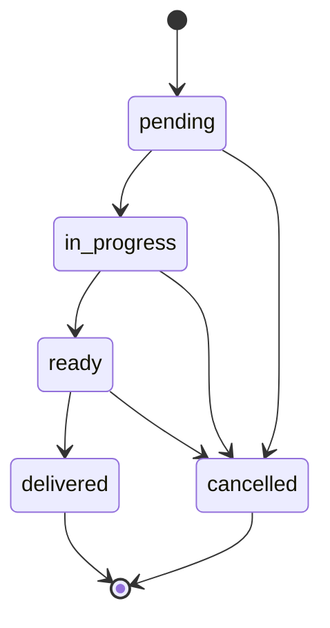
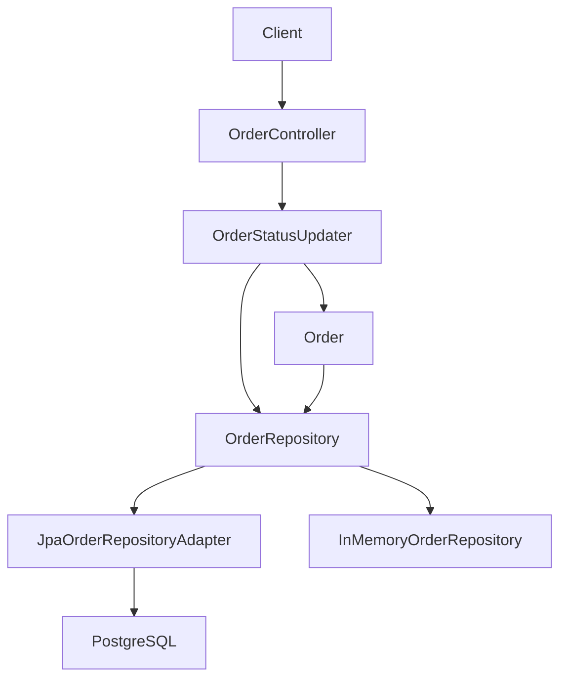
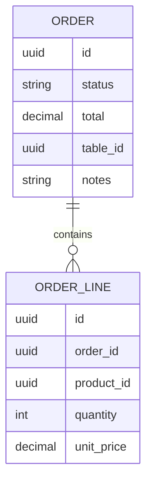

# Actualizacion de estado del pedido

## Introduction
- Esta funcionalidad introduce la capacidad de modificar el estado (`status`) de un pedido existente a lo largo de su ciclo de vida operativo, dentro del bounded context `orders` creado por la feature `order-registration`.
- Su objetivo es habilitar el primer flujo de seguimiento operativo del pedido (cocina, servicio, cancelacion) sin necesidad de reescribir el pedido: el cambio de estado es la unica operacion de mutacion que un pedido ya creado admite en esta iteracion.
- Resuelve la ausencia de transiciones de estado que ya quedo explicita como out-of-scope en `order-registration` (FR5 y "Out of Scope" -> "Transiciones de estado (`pending` -> `in_progress` -> `ready` -> `delivered`/`cancelled`)"). El enum `OrderStatus` ya se definio completo en `order-registration`; esta feature introduce la maquina de estados que conecta los valores del enum y permite avanzar de un estado a otro de forma controlada.
- La solucion propuesta introduce el endpoint `PATCH /orders/{id}/status` que recibe el nuevo estado en el body y devuelve la representacion completa del pedido (`OrderResponse`) tras aplicar la transicion, modelando la maquina de estados en el agregado `Order` y reutilizando el puerto `OrderRepository` con una nueva operacion `findById(Id)` para localizar el pedido antes de aplicar la transicion.
- La operacion es deliberadamente pequena en alcance: un unico endpoint, una unica operacion de mutacion (`status`), sin edicion de lineas, sin edicion de `tableId` ni de `notes`, sin historial, sin eventos de dominio, sin `Idempotency-Key` y sin control de concurrencia en esta iteracion. Estas decisiones se documentan explicitamente en `## Scope` y se registran como `## Future Improvements` cuando aplique.

---

## Scope

### In Scope
- Definir la maquina de estados de `OrderStatus` en el dominio, con el conjunto cerrado de transiciones validas: `pending -> in_progress`, `pending -> cancelled`, `in_progress -> ready`, `in_progress -> cancelled`, `ready -> delivered`, `ready -> cancelled`. Los estados `delivered` y `cancelled` son terminales: una vez alcanzados, no se permite ninguna transicion adicional.
- Definir el endpoint de entrada `PATCH /orders/{id}/status` para actualizar el estado de un pedido existente.
- Definir un metodo de dominio en el agregado `Order` (p. ej. `Order.changeStatus(OrderStatus newStatus): Result<Order>` o equivalente) que aplique la transicion contra la maquina de estados y devuelva un `Result` con el pedido actualizado o con un `DomainError` si la transicion no es valida.
- Definir el caso de uso `OrderStatusUpdater` que orquesta: localizacion del pedido por `id` mediante `OrderRepository.findById`, aplicacion de la transicion mediante el metodo de dominio del agregado, y persistencia del pedido actualizado mediante `OrderRepository.save(order)` (reutilizando la operacion ya existente en el puerto).
- Extender el puerto de salida `OrderRepository` (definido en `order-registration`) con la operacion `Optional<Order> findById(Id id)`, para soportar la localizacion del pedido antes de la transicion. La operacion se anade ahora porque la feature de seguimiento de estado la necesita por primera vez, tal como se anticipo en `order-registration` (FR16, `## Architecture Overview` y `## Deferred Decisions`).
- Implementar `findById` en ambos adaptadores de persistencia ya existentes: `JpaOrderRepositoryAdapter` (delegando en `SpringDataOrderJpaRepository`) e `InMemoryOrderRepository`.
- Definir el contrato del cuerpo de la request: exactamente `{ "status": "<new_status>" }` con `status` obligatorio, no vacio, y cuyo valor debe coincidir (case-sensitive, lowercase, match exacto) con un valor del enum `OrderStatus`. Cualquier otro campo en el body se ignora silenciosamente como dato no reconocido por el contrato.
- Definir el contrato del cuerpo de la response: representacion completa del pedido actualizado (`OrderResponse`), consistente con la response de `POST /orders`: `id`, `status`, `total`, `tableId`, `notes`, `lines` (con `productId`, `quantity` y `unitPrice` por linea).
- Responder `200 OK` con cuerpo `OrderResponse` en el caso exitoso, tanto cuando la transicion cambia el estado como cuando el estado solicitado coincide con el estado actual (no-op idempotente).
- Responder `400 Bad Request` con cuerpo literalmente vacio cuando el `id` de la URL no es un UUID valido, cuando el `status` del body esta ausente, vacio, o no coincide con ningun valor del enum `OrderStatus`, o cuando el body JSON esta malformado o el `Content-Type` no es JSON.
- Responder `404 Not Found` con cuerpo literalmente vacio cuando el pedido no existe.
- Responder `409 Conflict` con cuerpo literalmente vacio cuando la transicion solicitada no es valida para el estado actual del pedido (incluido el caso de intentar transicionar desde un estado terminal).
- Definir que la validacion de formato del `id` la realiza la factoria compartida `Id.from(String)`, consistente con el resto del proyecto.
- Definir que la validacion del `status` la realiza el enum `OrderStatus` (o un value object que envuelva la conversion `String -> OrderStatus`); el adaptador HTTP no valida el enum por su cuenta, traduce el `Result` del caso de uso a los codigos HTTP correspondientes.
- Definir que el caso de uso `OrderStatusUpdater` no lanza excepciones de validacion: cualquier error se traduce a `Result.failure(DomainError)` y el adaptador HTTP lo refleja en el codigo HTTP correspondiente.
- Reutilizar el modelo HTTP unificado del proyecto: cuerpo de error literalmente vacio para `400`, `404` y `409`, alineado con `POST /orders`, `catalog/product` y `table-deletion`.

### Out of Scope
- Edicion de cualquier otro campo del pedido distinto de `status` (`notes`, `tableId`, `lines`, `total`). Estas operaciones pertenecen a features futuras (ver `## Future Improvements`).
- Endpoint generico `PATCH /orders/{id}` para edicion multi-campo. Se difiere a una feature futura.
- Baja logica o eliminacion fisica de pedidos (`DELETE /orders/{id}`). Se difiere a una feature futura.
- Listado o consulta de pedidos (`GET /orders`, `GET /orders/{id}`). Se difiere a una feature futura.
- Transiciones inversas (`in_progress -> pending`, `ready -> in_progress`, `delivered -> ready`, etc.) o "saltos" en la maquina de estados (p. ej. `pending -> ready`). La unica operacion permitida desde un estado terminal es ninguna.
- Validacion de la existencia o el estado del `tableId` contra el contexto `tables` durante la transicion. Se mantiene la misma decision que en `order-registration`: las referencias externas se almacenan por `id` sin comprobacion de integridad. La validacion se difiere a una integracion futura entre bounded contexts.
- Emision de eventos de dominio (`OrderStatusChanged`, `OrderCancelled`, etc.) como consecuencia de la transicion. La integracion con `billing`, `kitchen` u otros contextos queda diferida a iteraciones futuras.
- Registro de marcas de tiempo por transicion (`status_changed_at`, `pending_at`, `in_progress_at`, `ready_at`, `delivered_at`, `cancelled_at`) o de un historial de transiciones (`order_status_history`).
- Audit log operativo (quien realizo la transicion, desde que IP, etc.). El proyecto no tiene aun un concepto de usuario autenticado.
- Multi-tenant o campo `restaurantId`. La adicion de multi-tenant queda registrada en `## Future Improvements` (heredado de `order-registration`).
- Soporte de la cabecera `Idempotency-Key` en `PATCH /orders/{id}/status`. A diferencia de `POST /orders`, este endpoint no expone politica de idempotencia en esta iteracion; la decision se documenta en `## Trade-offs` y la posibilidad de anadirla se registra en `## Future Improvements`.
- Control de concurrencia explicito: ni lock optimista (`@Version` sobre `OrderJpaEntity`), ni lock pesimista, ni lock distribuido, ni compare-and-swap. La politica en esta iteracion es "last write wins": dos updates concurrentes sobre el mismo pedido pueden sobrescribirse mutuamente. La decision se documenta en `## Trade-offs` y el endurecimiento se registra en `## Future Improvements`.
- Reintroducir un cuerpo de error HTTP no vacio (no Problem Details, no `{"errors":...}`) en este endpoint. Se adopta el placeholder neutro alineado con `POST /orders`, `catalog/product` y `table-deletion`. La unificacion del formato de cuerpo de error queda registrada en `## Future Improvements` (heredado de `order-registration`).
- Soporte de multi-step state changes atomicos: una transicion es siempre un cambio de un unico estado a otro. No se contempla "avanzar hasta `ready` en una sola llamada" ni operaciones batch.
- Concurrencia con la operacion `POST /orders`: no se introduce un mecanismo que reserve el pedido recien creado o que impida transiciones antes de que la escritura del alta sea visible. El contrato asume que el cliente espera a la response de `POST /orders` antes de transicionar.

---

## Requirements

### Functional Requirements
- FR1: El sistema debe permitir actualizar el estado de un pedido existente mediante `PATCH /orders/{id}/status` y responder `200 OK` con cuerpo con la representacion completa del pedido actualizado (`OrderResponse`), consistente con la response de `POST /orders`.
- FR2: La request debe incluir un body con exactamente `{ "status": "<new_status>" }`. El campo `status` es obligatorio, no vacio, y debe coincidir (case-sensitive, lowercase, match exacto) con un valor del enum `OrderStatus`. Cualquier otro campo presente en el body se ignora silenciosamente como dato no reconocido por el contrato.
- FR3: El `id` del pedido se toma del path de la URL. Si el `id` no respeta el formato UUID, el sistema debe responder `400 Bad Request` con cuerpo literalmente vacio, sin invocar al caso de uso.
- FR4: La maquina de estados del pedido define las siguientes transiciones validas, sin saltos ni retrocesos:

  | Estado actual | Estados destino validos                       |
  | ------------- | --------------------------------------------- |
  | `pending`     | `in_progress`, `cancelled`                    |
  | `in_progress` | `ready`, `cancelled`                          |
  | `ready`       | `delivered`, `cancelled`                      |
  | `delivered`   | (ninguno; estado terminal)                    |
  | `cancelled`   | (ninguno; estado terminal)                    |

  Cualquier transicion no listada en la tabla (incluido cualquier intento de transicionar desde un estado terminal) debe ser rechazada por el dominio con `409 Conflict`.
- FR5: Los estados `delivered` y `cancelled` son terminales: una vez que un pedido alcanza cualquiera de ellos, no se permite ninguna transicion posterior. El intento de transicionar desde un estado terminal debe responderse con `409 Conflict` con cuerpo literalmente vacio.
- FR6: Si el estado solicitado coincide con el estado actual del pedido (same-state request), el sistema debe responder `200 OK` con la representacion actual del pedido, sin modificar el estado, sin error y sin incrementar contadores. La respuesta debe ser indistinguible de la respuesta a una transicion efectiva. Este comportamiento da al endpoint una sensacion idempotente, aunque la idempotencia estricta (incluido el efecto sobre reintentos de cliente con la misma `Idempotency-Key`) no se implementa en esta iteracion.
- FR7: Si el pedido no existe (no hay `Order` con el `id` proporcionado), el sistema debe responder `404 Not Found` con cuerpo literalmente vacio. La busqueda se realiza mediante `OrderRepository.findById(Id)`.
- FR8: Si la transicion solicitada no es valida para el estado actual del pedido (estado destino no permitido por la maquina de estados, o estado actual terminal), el sistema debe responder `409 Conflict` con cuerpo literalmente vacio. El caso de uso devuelve `Result.failure(ConflictError)` y el adaptador HTTP lo traduce a `409`.
- FR9: Si el campo `status` del body esta ausente, vacio, es `null` o no coincide con ningun valor del enum `OrderStatus`, el sistema debe responder `400 Bad Request` con cuerpo literalmente vacio. La validacion la realiza el enum `OrderStatus` (o el value object que envuelva la conversion), no el adaptador HTTP.
- FR10: El caso de uso `OrderStatusUpdater` debe localizar el pedido antes de aplicar la transicion invocando `OrderRepository.findById(Id id)`, donde `Id` se construye mediante la factoria compartida `Id.from(String)` a partir del `id` del path. Si la operacion devuelve `Optional.empty()`, el caso de uso devuelve `Result.failure(NotFoundError)` y el adaptador HTTP lo traduce a `404 Not Found` con cuerpo vacio.
- FR11: Tras aplicar la transicion, el caso de uso `OrderStatusUpdater` debe persistir el pedido actualizado reutilizando la operacion ya existente `OrderRepository.save(Order)`. No se introduce una operacion dedicada `update` en el puerto: la semantica de "guardar el estado actual del agregado" es la misma que la del alta. La decision se documenta en `## Trade-offs`.
- FR12: El cuerpo de la response de error para `400`, `404` y `409` debe ser literalmente vacio (sin `null`, sin `{}`, sin espacios en blanco), como placeholder neutro, alineado con `POST /orders`, `catalog/product` y `table-deletion`.
- FR13: La representacion del pedido actualizado en la response (`OrderResponse`) debe incluir `id`, `status` (con el nuevo valor, o el mismo valor si la transicion fue un no-op), `total`, `tableId` (puede ser `null`), `notes` (puede ser `null`) y `lines` (con `productId`, `quantity` y `unitPrice` por linea), consistente con la response de `POST /orders`. El `unitPrice` por linea y el `total` se devuelven tal como estan persistidos en el momento de la lectura; no se recalculan.
- FR14: El caso de uso `OrderStatusUpdater` no debe lanzar excepciones de validacion: cualquier error de formato, de regla de dominio o de busqueda se traduce a `Result.failure(DomainError)` (en concreto, `ValidationError` para formato, `NotFoundError` para pedido inexistente, `ConflictError` para transicion invalida) y el adaptador HTTP lo refleja en el codigo HTTP correspondiente. Las excepciones tecnicas no anticipadas (fallo de conexion a la base de datos, etc.) se propagan y su traduccion a `500` se difiere a una decision arquitectonica fuera del alcance de esta iteracion, consistente con `order-registration`.
- FR15: La validacion de formato del `id` del path la realiza el value object compartido `Id` mediante la factoria `Id.from(String): Result<Id>`, consistente con el resto del proyecto. La validacion no se realiza en el adaptador HTTP, que se limita a traducir el `Result` del caso de uso a los codigos HTTP correspondientes.
- FR16: La validacion del valor de `status` la realiza el enum `OrderStatus` (o un pequeno value object que envuelva la conversion `String -> OrderStatus`). El adaptador HTTP no valida el enum por su cuenta: recibe el `String` del body, lo entrega al caso de uso, y traduce el `Result` resultante a `400` (formato) o a `409` (transicion invalida) segun corresponda. Esto mantiene la logica de transiciones en el dominio y al adaptador HTTP libre de reglas de negocio.
- FR17: La maquina de estados vive en el dominio (`Order` aggregate) y es la unica fuente de verdad sobre que transiciones son validas. El caso de uso y el adaptador HTTP nunca validan transiciones por su cuenta: delegan en el metodo de dominio del agregado y traducen el resultado.
- FR18: La operacion no soporta la cabecera `Idempotency-Key` en esta iteracion. A diferencia de `POST /orders`, no se mantiene una cache de respuestas para `PATCH /orders/{id}/status`, ni se compara el fingerprint del body, ni se distingue entre "misma transicion dos veces" y "reintento de una transicion fallida". El comportamiento same-state de FR6 ofrece una sensacion idempotente a nivel del estado del recurso, pero no garantiza idempotencia estricta sobre reintentos de cliente con la misma clave. La adicion de `Idempotency-Key` se registra en `## Future Improvements`.

### Non-Functional Requirements
- Performance: La operacion es sincrona y de baja latencia para uso operativo interno. Realiza una unica lectura (`OrderRepository.findById`) y una unica escritura (`OrderRepository.save`); la validacion de la transicion y la conversion de `status` son O(1). El orden de magnitud es despreciable para el MVP.
- Scalability: El diseno debe permitir evolucionar a mas operaciones de pedidos (consulta, actualizacion de otros campos, historial de transiciones, eventos de dominio) sin acoplarse a `tables` y sin reescribir el caso de uso. La adicion de `OrderRepository.findById` se realiza de forma compatible con la operacion `save` ya existente, y la maquina de estados vive en el agregado, no en el caso de uso, de modo que futuras ampliaciones (saltos condicionales, transiciones con condiciones, eventos) se anaden al dominio sin tocar el adaptador HTTP.
- Availability: El endpoint debe responder con errores deterministas (`200`, `400`, `404`, `409`) segun corresponda, sin estados ambiguos. La maquina de estados finita garantiza que cualquier secuencia de transiciones validas converge a un estado terminal (`delivered` o `cancelled`) o se mantiene en un estado no terminal, sin combinaciones imposibles.
- Maintainability: La logica de negocio (validacion del estado solicitado, validacion de la transicion, aplicacion del cambio) debe vivir en dominio, no en el controlador HTTP. La maquina de estados se modela como una tabla de transiciones en el agregado `Order` (o equivalente, ver `## Deferred Decisions`), de modo que anadir o quitar una transicion valida es un cambio de un solo punto en el codigo de dominio. El caso de uso se mantiene como un orquestador delgado: localizar, transicionar, persistir.
- Observability: La operacion debera poder trazarse mas adelante con logs y metricas de transiciones de estado, distinguiendo al menos: transiciones efectivas (`200` con cambio de estado), no-ops same-state (`200` sin cambio de estado), rechazos por formato de `id` (`400`), rechazos por `status` invalido (`400`), pedidos inexistentes (`404`) y transiciones invalidas (`409`). Los detalles concretos de instrumentacion los decide el arquitecto.

---

## Architecture Overview

### Components
- API Layer: Adaptador REST `OrderController` (extendido) que expone, junto al ya existente `POST /orders`, el nuevo endpoint `PATCH /orders/{id}/status`. El adaptador HTTP traduce los `Result` del caso de uso a codigos HTTP siguiendo la politica uniforme del proyecto. El adaptador HTTP no valida la maquina de estados: recibe el `id` del path, el `status` del body como `String`, y los entrega al caso de uso. No consulta ni almacena en `IdempotencyKeyStore` en este endpoint (decision documentada en FR18 y en `## Trade-offs`).
- Application Layer: Caso de uso `OrderStatusUpdater` que orquesta la localizacion del pedido (`OrderRepository.findById`), la aplicacion de la transicion (mediante el metodo de dominio del agregado `Order`, p. ej. `Order.changeStatus(OrderStatus)`), y la persistencia del pedido actualizado (`OrderRepository.save(order)`). El caso de uso recibe parametros primitivos (`String id`, `String newStatus`) y devuelve `Result<Order>`. No captura excepciones de validacion; delega la validacion de formato en `Id.from` y la validacion de la transicion en el dominio.
- Domain Layer: Aggregate `Order` extendido con un metodo de dominio para aplicar transiciones de estado contra la maquina de estados. La maquina de estados se modela como una tabla inmutable de transiciones validas (`Map<OrderStatus, Set<OrderStatus>>` o equivalente) y se enforce dentro del metodo de dominio. El metodo devuelve un `Result<Order>` con el pedido actualizado en caso de exito (incluido el no-op same-state) o un `ConflictError` si la transicion no es valida. Los value objects `OrderStatus` y `Id` se reutilizan tal como se definieron en `order-registration`. El puerto de salida `OrderRepository` se extiende con `Optional<Order> findById(Id id)`, manteniendo la operacion `Order save(Order order)` ya existente.
- Infrastructure Layer:
  - Adaptadores de persistencia extendidos: `JpaOrderRepositoryAdapter` e `InMemoryOrderRepository`, ambos implementando el contrato ampliado `OrderRepository` con `findById` ademas de `save`. La entidad JPA `OrderJpaEntity` y el `SpringDataOrderJpaRepository` no se modifican salvo en lo necesario para soportar el lookup por `id` (mapeo del `id` ya existente, decision concreta del arquitecto, ver `## Deferred Decisions`).
  - DTOs HTTP: `UpdateOrderStatusRequest` (record con `String status`), y el `OrderResponse` ya existente se reutiliza tal cual para la response.

### Architecture Diagram (Mermaid)

Diagrama de la maquina de estados del pedido:



Diagrama de flujo del request `PATCH /orders/{id}/status`:



### Notes
- Se reutiliza el bounded context `orders` introducido por `order-registration`. No se introduce un nuevo bounded context, un nuevo agregado ni un nuevo puerto de entrada: `OrderStatusUpdater` es invocado directamente por el adaptador HTTP `OrderController`, replicando la decision ya tomada para `OrderCreator` (ver `order-registration` arquitectura, "Incoming Ports" -> "Ninguno").
- La maquina de estados se modela en el dominio (`Order` aggregate) y se enforce en el metodo de dominio. El caso de uso y el adaptador HTTP son agn osticos a la forma concreta de la maquina: solo conocen su entrada (estado actual, estado solicitado) y su salida (`Result<Order>`).
- La operacion `OrderRepository.findById(Id)` se anade al puerto en esta iteracion porque la feature de seguimiento de estado la necesita por primera vez, tal como se anticipo en `order-registration` (FR16 del diseno, "Out of Scope" del diseno -> ninguna mencion, y `## Deferred Decisions` -> "Inclusion de `findById(Id)` en `OrderRepository` en esta iteracion"). Ambos adaptadores ya existentes (`JpaOrderRepositoryAdapter` e `InMemoryOrderRepository`) implementan la nueva operacion, manteniendo la paridad entre el doble de pruebas y la implementacion JPA.
- La operacion `OrderRepository.save(Order)` se reutiliza para persistir el pedido actualizado, tal como se usa ya en `order-registration`. No se introduce una operacion `update` dedicada en el puerto: la semantica de "guardar el estado actual del agregado" es la misma, independientemente de si el agregado es nuevo o si ya existia. Esta decision se documenta en `## Trade-offs`.
- El comportamiento same-state (`200 OK` con la representacion actual, sin modificacion) se modela como un caso especial del metodo de dominio: si el estado solicitado coincide con el actual, el metodo devuelve el mismo pedido sin aplicar cambios, lo que permite a la vez la sensacion idempotente para el cliente y la ausencia de escrituras redundantes en la base de datos. La decision concreta sobre si el caso de uso invoca `save` en el no-op o lo evita (para no incrementar `updated_at` ni disparar triggers) queda como decision del arquitecto, ver `## Deferred Decisions`.
- El body de error de `400`, `404` y `409` es literalmente vacio (placeholder neutro), alineado con `POST /orders`, `catalog/product` y `table-deletion`. Esta decision introduce una **divergencia temporal con `table-registration`**, que sigue usando el cuerpo estructurado `{"errors":[{"field":"...","message":"..."}]}`; la unificacion del formato de cuerpo de error queda registrada en `## Future Improvements` (heredado de `order-registration`).
- El endpoint **no** soporta la cabecera `Idempotency-Key` en esta iteracion, a diferencia de `POST /orders`. La razon principal es que la semantica del endpoint es naturalmente idempotente a nivel del estado del recurso (transicionar al mismo estado dos veces es un no-op), y la ausencia de creacion de recursos nuevos reduce la motivacion de una cache de respuestas. La adicion de `Idempotency-Key` se registra en `## Future Improvements` para los casos en los que un cliente quiera protegerse contra reintentos antes de conocer la response del primer intento.
- El control de concurrencia es **inexistente** en esta iteracion: dos updates concurrentes sobre el mismo pedido pueden sobrescribirse mutuamente ("last write wins"). El endurecimiento (lock optimista con `@Version`, lock pesimista, lock distribuido) se registra en `## Future Improvements`.

---

## Data Design

### Data Model (Mermaid)

No hay cambios en el modelo de datos. El esquema introducido por `order-registration` es suficiente:



### Description
- Entities: sin cambios respecto a `order-registration`. El agregado `Order` y la entidad interna `OrderLine` se mantienen tal cual.
- Relationships: sin cambios respecto a `order-registration`. La composicion `Order 1--* OrderLine` se mantiene; las referencias externas a `product_id` y `table_id` se mantienen como referencias logicas sin FK fisica.
- Constraints:
  - `orders.status`: en esta iteracion, los valores posibles pasan de "solo `pending` en el alta" al conjunto completo del enum `OrderStatus` (`pending`, `in_progress`, `ready`, `delivered`, `cancelled`). La columna ya es `VARCHAR(32)` desde `order-registration` y admite cualquier valor del enum sin migracion: el default aplicativo sigue siendo `pending` en el alta, y la columna acepta los demas valores en updates posteriores.
  - Sin nuevas columnas, sin nuevos indices, sin nuevas tablas, sin migracion de esquema.
  - Sin cambio en `unit_price`, `total`, `table_id` ni `notes`. Esta feature solo escribe sobre la columna `status`.

---

## Technology Stack
- Backend: Java 25
- Framework: Spring Boot 4, Spring Web MVC
- Database: PostgreSQL
- ORM: Por definir (mismo que `order-registration`)
- Messaging: No aplica en esta fase
- Testing: JUnit
- Infrastructure: Gradle
- Componente de persistencia: el mecanismo concreto por el que `JpaOrderRepositoryAdapter.findById(Id)` consulta la base de datos (fetch strategy de `OrderLine` collection, eager vs. lazy loading, nombre del metodo derivado en `SpringDataOrderJpaRepository`) es una **decision diferida al arquitecto** y se lista en `## Deferred Decisions`. El diseno no fija la tecnologia subyacente mas alla de "operacion que devuelve `Optional<Order>` a partir de un `Id`".
- Componente de maquina de estados: la representacion concreta de la tabla de transiciones validas en el agregado `Order` (`Map<OrderStatus, Set<OrderStatus>>`, `switch` exhaustivo, `EnumSet`, o equivalente) es una **decision diferida al arquitecto** y se lista en `## Deferred Decisions`. El diseno solo fija la intencion: la maquina de estados vive en el dominio, es la unica fuente de verdad y se enforce en el metodo de dominio.

---

## Core Logic

### Workflow
1. Un cliente invoca `PATCH /orders/{id}/status` con un path que contiene el `id` del pedido y un body JSON de la forma `{ "status": "<new_status>" }`. No se admite ninguna cabecera de idempotencia.
2. El adaptador HTTP `OrderController` recibe la request. Valida el formato del `id` del path mediante `Id.from(id)`. Si la validacion falla, responde `400 Bad Request` con cuerpo vacio y termina. Si el `id` es valido, obtiene un `Id` y delega en el caso de uso.
3. El adaptador HTTP deserializa el body a `UpdateOrderStatusRequest` (record con `String status`). Si el body esta malformado, Jackson falla y el adaptador HTTP responde `400 Bad Request` con cuerpo vacio, consistente con la politica uniforme del proyecto.
4. El caso de uso `OrderStatusUpdater.run(id, newStatus)` recibe parametros primitivos (`Id id`, `String newStatus`).
5. El caso de uso convierte `newStatus` a `OrderStatus` (o a un value object equivalente). Si el `String` no coincide con ningun valor del enum, devuelve `Result.failure(ValidationError("status", "..."))` y termina. El adaptador HTTP traduce a `400 Bad Request` con cuerpo vacio.
6. El caso de uso invoca `OrderRepository.findById(id)`. Si la operacion devuelve `Optional.empty()`, el caso de uso devuelve `Result.failure(NotFoundError)` y el adaptador HTTP traduce a `404 Not Found` con cuerpo vacio.
7. Si el pedido existe, el caso de uso invoca el metodo de dominio del agregado, p. ej. `order.changeStatus(newStatus): Result<Order>`. El metodo de dominio evalua la transicion contra la maquina de estados:
   - Si la transicion es valida (incluido el caso same-state), el metodo devuelve `Result.success(order)` (con el mismo `order` en el no-op o con el `order` actualizado en la transicion efectiva).
   - Si la transicion no es valida (estado destino no permitido, o estado actual terminal), el metodo devuelve `Result.failure(ConflictError)`. El adaptador HTTP traduce a `409 Conflict` con cuerpo vacio.
8. Si la transicion fue efectiva, el caso de uso invoca `OrderRepository.save(order)` con el pedido actualizado y devuelve `Result.success(order)`. Si la transicion fue un no-op same-state, el caso de uso puede evitar la escritura (decision del arquitecto, ver `## Deferred Decisions`) y devolver directamente `Result.success(order)`.
9. El adaptador HTTP construye la response `OrderResponse.from(order)` (mismo DTO que en `POST /orders`) y responde `200 OK` con cuerpo `OrderResponse`.

### Business Rules
- Un pedido solo puede transicionar entre estados de acuerdo con la maquina de estados definida en FR4. Cualquier intento de transicion fuera de la tabla debe ser rechazado con `ConflictError` -> `409 Conflict`.
- Los estados `delivered` y `cancelled` son terminales: una vez que un pedido alcanza cualquiera de ellos, no se admite ninguna transicion posterior. El intento debe ser rechazado con `ConflictError` -> `409 Conflict`.
- Si el estado solicitado coincide con el estado actual, la operacion es un no-op: el metodo de dominio devuelve el mismo pedido sin aplicar cambios. El adaptador HTTP responde `200 OK` con la representacion actual del pedido.
- La operacion de update de estado no modifica ningun otro campo del pedido: ni `lines`, ni `total`, ni `tableId`, ni `notes`. El cliente que quiera modificar otros campos debe usar un endpoint diferente (aun no implementado, ver `## Future Improvements`).
- El `id` del pedido es inmutable: no se permite cambiarlo por `PATCH` ni por ninguna otra operacion. Esta regla no se enforce en este endpoint (que no acepta `id` en el body), pero se documenta explicitamente.
- El estado inicial del pedido es siempre `pending` (definido en `order-registration`). Esta feature no introduce transiciones que partan de un estado distinto a los del enum `OrderStatus`.
- La maquina de estados no modela transiciones inversas. Una vez transicionado, no se puede "deshacer" el cambio mediante este endpoint. Esto refleja el flujo operativo real (un pedido que pasa a `in_progress` no vuelve a `pending` por motivos operativos). La adicion de una operacion de "undo" o "operator correction" se registra en `## Future Improvements`.

### Edge Cases
- `id` del path con formato UUID invalido: `400 Bad Request` con cuerpo vacio. La validacion la realiza `Id.from(String)`; el caso de uso no se invoca.
- `status` ausente, `null` o vacio en el body: `400 Bad Request` con cuerpo vacio. La validacion la realiza el enum `OrderStatus` (o el value object que envuelva la conversion); el caso de uso devuelve `Result.failure(ValidationError)` y el adaptador HTTP traduce a `400`.
- `status` con valor que no coincide con ningun valor del enum `OrderStatus` (p. ej. `"shipped"`, `"DELIVERED"`, `"in-progress"`, `"  in_progress  "`): `400 Bad Request` con cuerpo vacio. La validacion es case-sensitive y rechaza espacios y cualquier variante.
- Pedido no existente: `404 Not Found` con cuerpo vacio. `OrderRepository.findById` devuelve `Optional.empty()`; el caso de uso traduce a `NotFoundError` y el adaptador HTTP a `404`.
- Transicion invalida (estado actual -> estado solicitado no permitida por la maquina de estados, o estado actual terminal): `409 Conflict` con cuerpo vacio. El metodo de dominio devuelve `ConflictError`; el adaptador HTTP traduce a `409`.
- Transicion same-state (estado actual == estado solicitado): `200 OK` con la representacion actual del pedido. El metodo de dominio devuelve `Result.success(order)` sin modificar el estado; el adaptador HTTP construye `OrderResponse` y responde `200`.
- Body JSON malformado: `400 Bad Request` con cuerpo vacio. La deserializacion falla en el adaptador HTTP antes de invocar al caso de uso; respuesta consistente con la politica uniforme del proyecto.
- `Content-Type` ausente o no JSON: `400 Bad Request` con cuerpo vacio. La deserializacion falla en el adaptador HTTP antes de invocar al caso de uso; respuesta consistente con la politica uniforme del proyecto.
- Body con campos adicionales al margen de `status` (p. ej. `{ "status": "in_progress", "notes": "..." }`): los campos adicionales se ignoran silenciosamente como datos no reconocidos por el contrato. Solo `status` se procesa.
- Body con `status` valido y otro campo adicional que coincide con un campo de `Order` (p. ej. `{ "status": "in_progress", "tableId": "..." }`): el campo adicional se ignora silenciosamente. Esta operacion **no** actualiza `tableId` ni ningun otro campo al margen de `status`. La adicion de edicion multi-campo se difiere a `## Future Improvements`.
- Dos updates concurrentes sobre el mismo pedido desde dos clientes distintos: la politica es "last write wins". La transicion que persista en ultimo lugar sobrescribe a la anterior. No se devuelve `409` por concurrencia en esta iteracion. La adicion de control de concurrencia explicito se registra en `## Future Improvements`.
- Pedido con `id` valido pero en estado terminal, intentando transicionar a un estado no terminal: `409 Conflict` con cuerpo vacio. El estado terminal se enforce en la maquina de estados.
- Pedido con `id` valido en estado terminal, intentando transicionar al mismo estado terminal (same-state terminal, p. ej. `delivered -> delivered`): `200 OK` con la representacion actual. El mismo caso same-state aplica aunque el estado actual sea terminal.

---

## HTTP Contract

### Request
- Metodo: `PATCH`
- Path: `/orders/{id}/status` donde `{id}` es el `id` del pedido (UUID).
- Cabeceras:
  - `Content-Type: application/json` (obligatorio; un body no JSON se rechaza como `400` con cuerpo vacio).
  - No se admite la cabecera `Idempotency-Key` en este endpoint (decision documentada en FR18 y en `## Trade-offs`). Si llega, se ignora silenciosamente.
- Body: `UpdateOrderStatusRequest { status: String }`.
  - `status`: obligatorio, no vacio, no `null`. Debe coincidir exactamente (case-sensitive, lowercase) con un valor del enum `OrderStatus`: `pending`, `in_progress`, `ready`, `delivered`, `cancelled`.
  - Cualquier otro campo al margen de `status` se ignora silenciosamente como dato no reconocido por el contrato.

Ejemplo de request:

```json
{
  "status": "in_progress"
}
```

### Success Response
- Status: `200 OK`
- Cuerpo: `OrderResponse { id, status, total, tableId, notes, lines: [ { productId, quantity, unitPrice } ] }`. El `status` de la response es el estado del pedido tras la operacion (igual al estado actual en un no-op, igual al estado solicitado en una transicion efectiva). El resto de campos se devuelven tal como estan persistidos.

Ejemplo de response (transicion efectiva `pending` -> `in_progress`):

```json
{
  "id": "22222222-2222-2222-2222-222222222222",
  "status": "in_progress",
  "lines": [
    { "productId": "0f4f7f2c-6f5d-4d20-91be-0c5dc1f0f1cd", "quantity": 1, "unitPrice": 12.50 },
    { "productId": "1a2b3c4d-5e6f-7a8b-9c0d-1e2f3a4b5c6d", "quantity": 2, "unitPrice":  2.20 }
  ],
  "tableId": "11111111-1111-1111-1111-111111111111",
  "notes": "sin cebolla",
  "total": 16.90
}
```

### Error Responses
- `400 Bad Request` con cuerpo literalmente vacio (placeholder neutro) en los siguientes casos:
  - `id` del path con formato UUID invalido.
  - `status` del body ausente, `null`, vacio, o con un valor que no coincide con ningun valor del enum `OrderStatus`.
  - Body JSON malformado o `Content-Type` no JSON.
- `404 Not Found` con cuerpo literalmente vacio cuando el pedido no existe.
- `409 Conflict` con cuerpo literalmente vacio cuando la transicion solicitada no es valida para el estado actual del pedido (estado destino no permitido por la maquina de estados, o estado actual terminal).
- `500 Internal Server Error` para fallos tecnicos inesperados (por ejemplo, perdida de conexion a la base de datos), con el formato por defecto de Spring (no especificado por esta arquitectura; ver `## Deferred Decisions`).

### Error body format divergence

Este endpoint adopta el cuerpo de error **literalmente vacio** de `POST /orders`, `catalog/product` y `table-deletion`, en linea con el modelo HTTP unificado del proyecto. En esta iteracion, `table-registration` sigue usando el cuerpo estructurado `{"errors":[{"field":"...","message":"..."}]}`. La unificacion del formato de cuerpo de error del proyecto queda registrada en `## Future Improvements`. Hasta entonces, los clientes que consuman el proyecto deben esperar ambos formatos segun el endpoint.

A modo ilustrativo, los formatos que **no** se usan en este endpoint son:

```json
{
  "errors": [
    { "field": "status", "message": "must be one of [pending, in_progress, ready, delivered, cancelled]" }
  ]
}
```

```json
{
  "type": "about:blank",
  "title": "Invalid status transition",
  "status": 409,
  "detail": "cannot transition from 'delivered' to 'in_progress'"
}
```

Ninguno de los dos se emite desde `PATCH /orders/{id}/status`. La unica respuesta de error de este endpoint es cuerpo vacio.

### Ausencia de `Idempotency-Key`

Este endpoint **no** soporta la cabecera `Idempotency-Key` en esta iteracion, a diferencia de `POST /orders`. La adicion de soporte de `Idempotency-Key` se registra en `## Future Improvements` (F1). Si el cliente envia la cabecera, se ignora silenciosamente. El comportamiento same-state de FR6 ofrece una sensacion idempotente a nivel del estado del recurso, pero no garantiza idempotencia estricta sobre reintentos de cliente.

---

## Performance Considerations
- Bottlenecks: La latencia de base de datos (una lectura de `Order` + `OrderLine` por `findById` y, en transiciones efectivas, una escritura de `Order` por `save`) domina el coste. Para el MVP, el orden de magnitud es despreciable. En caso de carga elevada, los indices existentes (PK sobre `orders.id` automatico, `idx_orders_table_id` creado en `order-registration`) son suficientes para soportar el lookup por `id`.
- Caching: No se introduce caching en esta iteracion. La ausencia de cache de respuestas (vinculada a la decision de no soportar `Idempotency-Key`) es coherente con la naturaleza "one-shot" del update de estado: el cliente espera la response de la transicion, no una respuesta cacheada.
- Database optimization: el `Order.id` ya cuenta con el indice de clave primaria, lo que hace que el lookup por `id` sea O(1) en terminos de acceso al indice. La carga de la coleccion de `OrderLine` depende de la fetch strategy que decida el arquitecto (eager vs. lazy, ver `## Deferred Decisions`); en esta iteracion, el endpoint necesita la coleccion para construir la response, por lo que se recomienda eager loading para evitar N+1.
- Scaling strategy: Mantener el caso de uso `OrderStatusUpdater` aislado del adaptador HTTP, del mecanismo de persistencia y de la representacion concreta de la maquina de estados en el dominio, para poder incorporar en el futuro control de concurrencia (lock optimista, lock pesimista, lock distribuido), emision de eventos de dominio (`OrderStatusChanged`), historial de transiciones (`order_status_history`) o un endpoint generico `PATCH /orders/{id}` multi-campo, sin reescribir la logica de transicion.
- Async processing: No aplica para la transicion sincrona. La recepcion o emision de eventos de dominio se abordara en iteraciones futuras (ver `## Future Improvements`).

---

## Security Considerations
- Authentication: Fuera de alcance por ahora, pero el endpoint debera poder protegerse mas adelante, igual que el resto de operaciones del proyecto. La transicion de estado de un pedido es una operacion operativa sensible (cambiar un pedido a `cancelled` afecta a cocina, facturacion, etc.) y se beneficiara de un control de acceso por rol cuando se introduzca autenticacion.
- Authorization: Fuera de alcance por ahora; previsiblemente restringido a roles operativos (cocina, camarero) o administrativos con capacidad de transicionar pedidos. La politica concreta de que roles pueden transicionar a que estados se difiere a una iteracion futura.
- Input validation: Obligatoria en borde (deserializacion JSON) y en dominio (value objects). El caso de uso no asume que la request ya esta validada: revalida el formato del `id` y del `status` en su entrada, y delega la validacion de la transicion en el metodo de dominio del agregado.
- Rate limiting: No prioritario en fase inicial interna. A diferencia de `POST /orders`, este endpoint no se beneficia automaticamente de la politica de idempotencia para absorber reintentos (decision documentada en FR18 y en `## Trade-offs`); la adicion de rate limiting se difiere a una iteracion futura.
- Encryption: No aplica a datos sensibles en esta iteracion. El body contiene unicamente el `status` solicitado, que es informacion operativa no sensible en si misma, pero el path incluye el `id` del pedido, que es un dato identificable; se debera evaluar TLS en el borde.
- Vulnerabilities:
  - **Inyeccion de transiciones no permitidas por un cliente malicioso (riesgo cerrado en esta iteracion)**: la decision de modelar la maquina de estados en el dominio y rechazar cualquier transicion no valida con `409 Conflict` cierra el vector por el cual un cliente podia forzar transiciones arbitrarias (p. ej. `pending -> delivered`, saltandose `in_progress` y `ready`). El cliente solo puede solicitar transiciones validas; el resto se rechaza con `409`.
  - **Estado terminal mutable (riesgo cerrado en esta iteracion)**: la regla "los estados `delivered` y `cancelled` son terminales" se enforce en la maquina de estados del dominio, no en el adaptador HTTP. Un cliente que envie `PATCH /orders/{id}/status` con `status: "in_progress"` sobre un pedido en `delivered` recibe `409 Conflict`, no `200 OK`.
  - Evitar que el cliente manipule otros campos del pedido a traves del body: el caso de uso y el dominio solo procesan el campo `status`; cualquier otro campo del body (`tableId`, `notes`, `lines`, `total`, etc.) se ignora silenciosamente por Jackson al deserializar o, si Jackson lo deserializa, no se propaga al agregado. Esta operacion no actualiza `tableId`, `notes`, `lines` ni `total`.
  - Evitar validaciones solo en controlador y errores ambiguos de entrada: la validacion del formato vive en `Id.from` y en el enum `OrderStatus` (o value object equivalente), siguiendo el patron del resto del proyecto. La validacion de la transicion vive en el metodo de dominio del agregado `Order`.
  - El cuerpo de error vacio como placeholder neutro reduce la exposicion de informacion sensible en las respuestas de error, en linea con `POST /orders`, `catalog/product` y `table-deletion`. Por ejemplo, no se expone el `id` del pedido ni el estado actual ni el estado solicitado en los `400` y `409`.

---

## Trade-offs
- Decision: Modelar la maquina de estados de `OrderStatus` en el agregado `Order` mediante un metodo de dominio (p. ej. `Order.changeStatus(OrderStatus newStatus): Result<Order>`) que enforce las transiciones validas.
  - Alternatives: Modelar la maquina de estados en el caso de uso, en el adaptador HTTP, o en un `OrderStatusService` separado.
  - Reason: La maquina de estados es una regla de negocio del agregado `Order`, no una preocupacion del caso de uso ni del adaptador HTTP. Mantenerla en el dominio garantiza que la regla se aplica siempre que se manipule un `Order`, independientemente del mecanismo (HTTP, caso de uso, futuro consumidor asincrono). Tambien permite testear la regla de forma aislada, sin levantar el caso de uso ni el adaptador HTTP.
  - Downsides: El metodo de dominio forma parte de la API del agregado, y por tanto cualquier cambio en la forma de la maquina (anadir una transicion, eliminar una transicion, anadir condiciones) es un cambio de API del dominio. Esto se considera aceptable porque la maquina de estados es una pieza estable del modelo de negocio.
- Decision: Reutilizar la operacion `OrderRepository.save(Order)` para persistir el pedido actualizado, en lugar de aniadir una operacion dedicada `OrderRepository.update(Order)` al puerto.
  - Alternatives: Aniadir una operacion `update(Order): Order` al puerto, paralela a `save(Order): Order`; o aniadir una operacion `updateStatus(Id, OrderStatus): Order` especifica para este caso de uso.
  - Reason: La operacion `save(Order)` ya expresa la semantica necesaria: "persistir el estado actual del agregado". El agregado `Order` ya esta construido y validado por el metodo de dominio antes de la llamada a `save`, de modo que la operacion no necesita conocer que el agregado es nuevo o preexistente. YAGNI: aniadir una operacion `update` paralela introduce una firma mas sin necesidad inmediata, y aniadir una operacion `updateStatus` especifica introduce acoplamiento entre el puerto y una operacion concreta de un caso de uso.
  - Downsides: El puerto `OrderRepository.save` se llama con un agregado que ya existia, lo que puede parecer semantica de "update" mas que de "save". La decision de mantener una unica operacion `save` y dejar la distincion nuevo-vs-existente al estado del agregado (id presente en BD vs. id nuevo) es deliberada y consistente con la convencion del proyecto.
- Decision: No introducir control de concurrencia en esta iteracion (politica "last write wins"): ni lock optimista (`@Version`), ni lock pesimista, ni lock distribuido, ni compare-and-swap.
  - Alternatives: Aniadir `@Version` a `OrderJpaEntity` para detectar updates concurrentes via Hibernate y responder `409` automaticamente; aniadir un `WHERE id = ? AND status = ?` explicito en la query de update; usar un lock distribuido (Redis, ZooKeeper) por `id` de pedido; o aceptar la condicion de carrera y registrar el riesgo.
  - Reason: La operacion de update de estado es razonablemente idempotente a nivel del recurso: transicionar `pending` a `in_progress` y luego `in_progress` a `ready` desde dos clientes concurrentes puede dar lugar a una carrera (p. ej. ambos leen `in_progress`, ambos escriben `ready`), pero el efecto visible es benigno: el pedido termina en `ready`, que es el estado objetivo. Para casos de uso sensibles (p. ej. dos camareros intentando cancelar el mismo pedido a la vez, uno desde una tablet y otro desde la barra), la politica "last write wins" puede dar lugar a resultados no intencionados (p. ej. uno cree haber cancelado, el otro cree haber transicionado a `ready`), pero el caso de uso operativo es infrecuente en el MVP y la complejidad introducida por el control de concurrencia no se justifica.
  - Downsides: En condiciones de concurrencia, la operacion puede sobrescribir transiciones no intencionadas. Un cliente que lee el estado del pedido antes de transicionar puede actuar sobre un estado obsoleto. El endurecimiento se registra en `## Future Improvements` (F2).
- Decision: No soportar la cabecera `Idempotency-Key` en `PATCH /orders/{id}/status` en esta iteracion, a diferencia de `POST /orders`.
  - Alternatives: Reutilizar el `IdempotencyKeyStore` y la politica de `POST /orders` para este endpoint; o introducir una politica de idempotencia especifica para transiciones (p. ej. cachear la ultima transicion aplicada por `id`).
  - Reason: La naturaleza del endpoint es "transicionar al estado X", que es naturalmente idempotente a nivel del estado del recurso (transicionar al mismo estado dos veces es un no-op, ver FR6). Esto cubre el caso de uso mas comun de reintentos: un cliente que pierde la response y reintenta el mismo `PATCH` con el mismo body termina en el mismo estado sin duplicar el efecto. La adicion de `Idempotency-Key` anadiria complejidad (mantenimiento de la cache, decision sobre que se considera "misma transicion", etc.) sin un beneficio claro para el MVP.
  - Downsides: Un cliente que quiere protegerse contra reintentos antes de conocer la response del primer intento no puede usar `Idempotency-Key` para evitar una posible doble transicion. En la practica, esto significa que un cliente que recibe un timeout en la response de un `PATCH` puede no saber si la transicion se aplico o no, y reintentar puede dar lugar a un no-op (si la transicion se aplico) o a una doble escritura (si la primera transicion fallo por timeout de red justo despues de la escritura). La adicion de `Idempotency-Key` se registra en `## Future Improvements` (F1) para los casos en los que un cliente quiera esta proteccion.
- Decision: Tratar la transicion same-state (estado actual == estado solicitado) como un `200 OK` con la representacion actual, en lugar de un `409 Conflict` por "transicion no efectiva" o un `200 OK` con respuesta diferenciada.
  - Alternatives: Responder `409 Conflict` con un `ConflictError` que indique "el pedido ya esta en el estado solicitado"; responder `200 OK` con un flag o campo en la response que indique que la transicion no fue efectiva (`{"changed": false, ...}`); o responder `200 OK` sin la representacion completa, solo con un acuse.
  - Reason: El comportamiento `200 OK` con la representacion actual ofrece al cliente una respuesta util y completa, consistente con cualquier otra transicion efectiva, y elimina la necesidad de manejar un caso especial de error. Ademas, es la convencion habitual en APIs REST para operaciones idempotentes a nivel del estado del recurso.
  - Downsides: El cliente no puede distinguir programaticamente entre una transicion efectiva y un no-op a partir del codigo de estado o de la presencia/ausencia de campos. Si el cliente necesita esta distincion, debera comparar el `status` enviado en la request con el `status` recibido en la response. Esta decision se considera aceptable y consistente con el principio "la response es la representacion actual del recurso".
- Decision: Cuerpo de error literalmente vacio para `400`, `404` y `409` en `PATCH /orders/{id}/status`, alineado con `POST /orders`, `catalog/product` y `table-deletion`.
  - Alternatives: Adoptar el cuerpo estructurado `{"errors":[{"field":"...","message":"..."}]}` de `table-registration`; o introducir Problem Details.
  - Reason: Replicar el modelo HTTP unificado del proyecto y mantener el alcance de `order-status-update` paralelo a los endpoints mas recientes. La consistencia con `POST /orders` es especialmente importante porque `PATCH /orders/{id}/status` opera sobre recursos creados por `POST /orders` y debe ofrecer el mismo modelo de error.
  - Downsides: El endpoint diverge temporalmente de `table-registration` en el formato de cuerpo de error. Los clientes deben esperar ambos formatos segun el endpoint que consuman. La unificacion del formato de cuerpo de error del proyecto queda registrada en `## Future Improvements` (heredado de `order-registration`).

---

## Future Improvements
- F1. Anadir soporte de la cabecera `Idempotency-Key` en `PATCH /orders/{id}/status`, reutilizando el `IdempotencyKeyStore` y la politica de `POST /orders` (mismo body -> `200 OK` cacheado, mismo body con fingerprint distinto -> `409 Conflict`, clave nueva o ausente -> ejecucion normal). La adicion protege contra reintentos de cliente que reciben timeout en la response antes de saber si la transicion se aplico, y aporta una garantia de idempotencia estricta que el comportamiento same-state de FR6 no cubre completamente.
- F2. Anadir control de concurrencia optimista via `@Version` sobre `OrderJpaEntity` (o una columna manual `updated_at` comparada en el `WHERE` del update), de modo que dos updates concurrentes sobre el mismo pedido fallen con `409 Conflict` en lugar de sobrescribirse mutuamente. La politica concreta de manejo del `OptimisticLockException` (reintento automatico, propagacion al cliente, etc.) se decide cuando se introduzca el cambio.
- F3. Registrar marcas de tiempo por transicion (`status_changed_at`, o columnas dedicadas `pending_at`, `in_progress_at`, `ready_at`, `delivered_at`, `cancelled_at`) o una tabla `order_status_history` con una fila por transicion, habilitando consultas del tipo "cuanto tiempo estuvo el pedido en `in_progress`" o "todos los pedidos que pasaron por `ready` antes de las 14:00". La adicion requiere decision arquitectonica sobre si las marcas viven como columnas de `orders`, como una tabla hija, o como un evento append-only.
- F4. Emitir un evento de dominio `OrderStatusChanged(Id orderId, OrderStatus previousStatus, OrderStatus newStatus, Instant changedAt)` desde el caso de uso `OrderStatusUpdater` (o desde un evento publicado en el agregado), para que otros bounded contexts (`billing`, `kitchen`, futuros modulos de notificaciones) puedan reaccionar a las transiciones. La adicion requiere decision arquitectonica sobre el mecanismo de emision (in-process, broker, outbox) consistente con el resto del proyecto.
- F5. Anadir validacion del `tableId` contra el contexto `tables` durante la transicion (p. ej. solo permitir transicionar a `ready` o `delivered` si la mesa existe y esta ocupada; o cancelar automaticamente pedidos de mesas liberadas). Esta integracion vivira en su propio bounded context o en una capa de aplicacion de soporte y requerira una politica explicita de que hacer con pedidos cuyo `tableId` deja de ser valido.
- F6. Anadir un endpoint generico `PATCH /orders/{id}` para actualizar otros campos del pedido (`notes`, `tableId`, posiblemente `lines`). La adicion requerira decision arquitectonica sobre el modelo de patch (JSON Merge Patch, JSON Patch, un subconjunto propio), la politica de partial update (que campos son patcheables, que campos son inmutables como `id` y `total`) y la posible coexistencia con `PATCH /orders/{id}/status` (sub-recurso dedicado vs. campo del body).
- F7. Anadir transiciones inversas o de "operator correction" (p. ej. `in_progress -> pending` para retroceder un pedido marcado por error, o `ready -> in_progress` para devolver un pedido a cocina). Esta adicion requeriria decision de modelado (transiciones inversas como parte de la misma maquina de estados, o como una operacion separada con autorizacion reforzada) y posiblemente autenticacion/autorizacion por rol.
- F8. Reintroducir un esquema de cuerpo de error HTTP no vacio (estructurado o Problem Details) para `400`, `404` y `409` del proyecto, sustituyendo el placeholder neutro actual, una vez que se unifique el formato entre todos los endpoints (heredado de `order-registration`).
- F9. Anadir `restaurantId` al modelo de `Order` para soportar multi-tenant cuando el contexto operativo lo justifique (heredado de `order-registration`). La adicion afectara al endpoint `PATCH /orders/{id}/status` (path: `/restaurants/{restaurantId}/orders/{id}/status`?) y a la maquina de estados (que podria variar por tenant).
- F10. Anadir soporte para emitir `OrderStatusChanged` y un `audit log` operativo (quien realizo la transicion, desde que IP, con que token) en cuanto el proyecto introduzca autenticacion y autorizacion. La adicion cerrara el vector de "transiciones sin trazabilidad" que esta feature acepta por la ausencia de autenticacion.
- F11. Indexar y consultar pedidos por `status` o por `status_changed_at` para soportar vistas operativas ("pedidos en `in_progress` hace mas de 15 minutos", "pedidos cancelados hoy", etc.). La adicion requerira decision arquitectonica sobre el mecanismo de query (SQL directo, vista materializada, projection de eventos) y vivira en una feature de consulta.

---

## Deferred Decisions
- **DD1**: Firma exacta del metodo de dominio para aplicar la transicion. El diseno propone `Order.changeStatus(OrderStatus newStatus): Result<Order>` (metodo con `return` que devuelve un `Result<Order>` con el pedido actualizado en caso de exito, o un `ConflictError` en caso de transicion invalida), pero deja abiertas alternativas como `Order.transitionTo(OrderStatus newStatus): void` con mutacion in-place del agregado (y el caso de uso envolviendo la llamada en un `try/catch` de un `InvalidStatusTransitionException` del dominio), o un metodo `Order.apply(OrderStatus newStatus): boolean` que devuelve `true` si la transicion se aplico y `false` si no (decidiendo el caso de uso como tratar el `false`). La decision final la toma el arquitecto segun la consistencia con el resto del dominio (`Order.create(...)` ya devuelve `Result<Order>`).
- **DD2**: Representacion concreta de la maquina de estados en el agregado `Order`. El diseno propone una `Map<OrderStatus, Set<OrderStatus>>` inmutable (los estados terminales se modelan como entradas con un `Set` vacio, o como un caso especial en el metodo), pero deja abiertas alternativas como un `EnumSet<OrderStatus>` por estado actual, un `switch` exhaustivo sobre el estado actual con `EnumSet` literales por caso, o una clase dedicada `OrderStatusTransitions` con un metodo estatico `isValid(OrderStatus from, OrderStatus to)`. La decision final la toma el arquitecto segun el equilibrio entre legibilidad y extensibilidad.
- **DD3**: Comportamiento del caso de uso en el no-op same-state. El diseno propone que el caso de uso invoque `OrderRepository.save(order)` en cualquier caso (transicion efectiva o no-op) por simplicidad, pero deja abierta la alternativa de evitar la escritura en el no-op (no invocar `save`) para no incrementar contadores (`updated_at`, etc.) ni disparar triggers. La decision final la toma el arquitecto segun la politica de auditoria y la existencia de triggers o columnas de versionado.
- **DD4**: Detalles de JPA para `findById(Id)`. El diseno no fija la fetch strategy de la coleccion `OrderLine` (eager vs. lazy), el nombre del metodo derivado en `SpringDataOrderJpaRepository` (`findById` por convencion, o un nombre custom), ni la gestion del `EntityNotFoundException` que Spring Data lanza cuando el `id` no se encuentra (preferentemente se traduce a `Optional.empty()` en el adaptador para mantener el contrato del puerto). La decision final la toma el arquitecto segun las convenciones del proyecto y la latencia admitible.
- **DD5**: Politica de error `500` para errores tecnicos inesperados. Dado que el adaptador HTTP no captura excepciones, cualquier excepcion no anticipada (por ejemplo, un fallo de conexion a la base de datos durante `findById` o `save`) se propagara al contenedor de Spring, que por defecto devuelve un cuerpo de error con su propio formato. La decision de si ese formato debe alinearse con el placeholder neutro o si debe mantener el formato por defecto de Spring queda fuera del alcance de esta iteracion, consistente con la decision diferida correspondiente en `order-registration`.
- **DD6**: Politica concreta de cuerpo de error para `PATCH /orders/{id}/status`. El diseno adopta el cuerpo literalmente vacio consistente con `POST /orders`, `catalog/product` y `table-deletion`. Si el proyecto unifica el formato de cuerpo de error en una iteracion futura, este endpoint debera migrar al formato unificado en el mismo PR que el resto de endpoints.
- **DD7**: Inclusion de un `ConflictError` dedicado para transiciones invalidas vs. reutilizacion del `ConflictError` existente. El diseno propone introducir (o reutilizar) un `ConflictError` que indique "transicion de estado no valida" sin campo concreto (porque la transicion es una operacion sobre el agregado, no sobre un campo del body). La decision final la toma el arquitecto segun la consistencia con el resto del modelo de errores de dominio y con la jerarquia de `DomainError` del nucleo `shared`.
