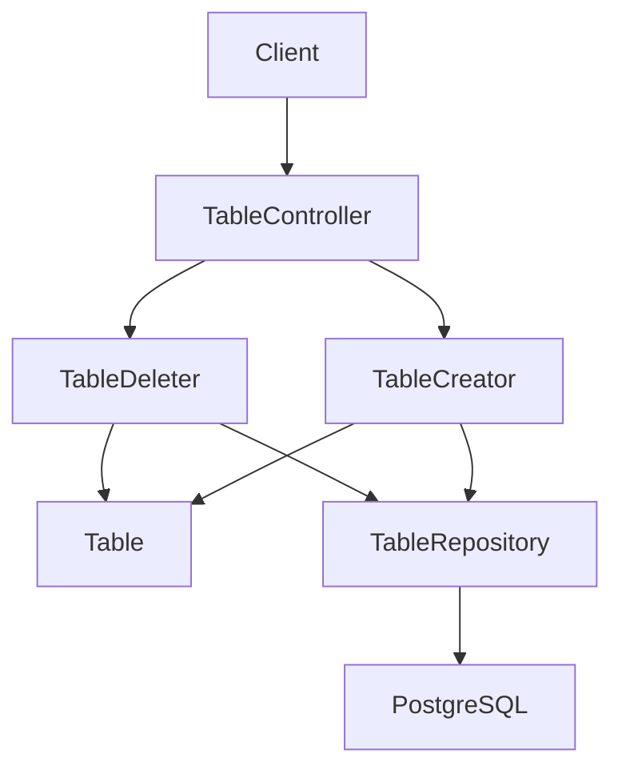
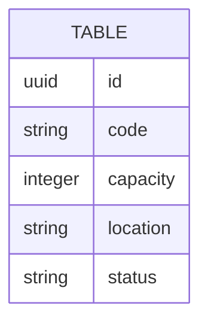

# Baja de mesa

## Introduction
- Esta funcionalidad permite eliminar mesas del contexto `tables` para reflejar su baja operativa cuando ya no deben participar en los procesos del restaurante.
- Su objetivo es completar la capacidad basica de gestion del modulo `tables` introduciendo una operacion de borrado, acompanando al alta (`table-registration`). Quedan fuera de alcance, en esta iteracion, la consulta y la actualizacion, que se abordaran en iteraciones futuras.
- Resuelve la ausencia de un flujo para retirar mesas del sistema una vez que fueron dadas de alta, manteniendo el mismo bounded context y modulo que el resto de operaciones de mesa.
- La solucion propuesta introduce el endpoint `DELETE /tables/{id}` en el bounded context `tables`. La baja de mesas es fisica: la fila de la mesa se elimina del repositorio, sin marcador logico, sin `deleted_at` ni `status = deleted`, sin posibilidad de restauracion. Adopta el modelo HTTP unificado ya en uso en `catalog/product` (post-migracion de `product-deletion`): cuerpo de error literalmente vacio como placeholder neutro para `400` y `404`, casos de uso que reciben el identificador como `String` y lo validan internamente, y adaptador HTTP que traduce los `Result` por tipo de `DomainError` en lugar de delegar en un advice global. Esta decision introduce, de forma deliberada, una **divergencia temporal con `table-registration`**, que sigue usando un cuerpo de error estructurado `{"errors":[{"field":"...","message":"..."}]}`. La unificacion del formato de cuerpo de error del modulo `tables` queda registrada como trabajo futuro.

---

## Scope

### In Scope
- Definir el endpoint HTTP `DELETE /tables/{id}` para eliminar una mesa existente del sistema.
- Aplicar una baja fisica: la fila de la mesa se elimina del repositorio de persistencia.
- Responder `204 No Content` con cuerpo literalmente vacio cuando la baja se realiza sobre una mesa que existia.
- Responder `404 Not Found` con cuerpo de error literalmente vacio cuando la mesa no existe, ya sea porque nunca fue creada o porque ya fue eliminada previamente.
- Mantener la semantica idempotente en el efecto: llamadas repetidas sobre el mismo `id` dejan a la mesa en estado no existente, y el sistema distingue `204` (primera baja) de `404` (subsiguientes o inexistente inicial) unicamente mediante el codigo de respuesta.
- Reutilizar las mismas reglas de identificacion y validacion de `id` que el resto del modulo (mismo formato y misma representacion que `table-registration`).
- El `id` de la mesa se obtiene unicamente del path; no se lee ningun `id` del body ni de query params.
- La validacion de formato del `id` la realiza el value object compartido `Id` mediante la factoría segura `Id.from(String)`, alineada con la convencion del resto de VOs del modulo (`TableCode.from`, `TableCapacity.from`, `TableStatus.from`, `TableLocation.from`). Dicha factoría devuelve `Result<Id>` y, ante un input null, blank o malformado, retorna `Result.failure(new ValidationError("id", "must be a valid UUID"))`.
- El caso de uso `TableDeleter` recibe el `id` como `String` y delega la validacion en `Id.from`. La validacion no se realiza en el adaptador HTTP, que se limita a traducir el `Result` del caso de uso a los codigos HTTP correspondientes.
- Ampliar el contrato del puerto de salida `TableRepository` con dos operaciones nuevas: `Optional<Table> findById(Id id)` y `void delete(Table table)`. La primera permite distinguir "existe" de "no existe"; la segunda recibe el agregado ya cargado por el caso de uso.
- Adoptar el modelo HTTP unificado del modulo `catalog/product` para la traduccion de `Result` a HTTP: `Result.success` -> `204 No Content` con cuerpo vacio; `Result.failure(NotFoundError)` -> `404 Not Found` con cuerpo vacio; cualquier otro `Result.failure(DomainError)` -> `400 Bad Request` con cuerpo vacio. Ningun endpoint captura `IllegalArgumentException` para validar el id.
- Mantener el estilo directo caso-de-uso-llamado-por-controlador ya usado en `TableCreator`, sin introducir un puerto de entrada adicional.

### Out of Scope
- Baja logica o soft delete: la fila se elimina fisicamente, no se marca con un campo de baja ni se archiva.
- Restauracion o "undo" de mesas eliminadas: una vez borradas, dejan de existir.
- Eliminaciones en cascada sobre otros agregados (por ejemplo, futuras referencias desde `orders`): la baja se limita a la fila de la mesa. Si en el futuro el contexto `orders` referencia mesas por `id`, esa decision vivira en su propio contexto y requerira una politica explicita de borrado que se abordara en una iteracion posterior.
- Eliminacion masiva o por lote: este flujo opera sobre un unico `id` por request.
- Auditoria o registro historico de bajas: no se conserva trazabilidad de quien o cuando elimino una mesa en esta iteracion.
- Autorizacion y autenticacion: fuera de alcance, igual que en `table-registration` y en el resto del modulo `catalog/product`.
- Cambios en las reglas de alta ya definidas en `table-registration`.
- Anadir un metodo `delete()` al agregado `Table`: la baja es decision de orquestacion del caso de uso, no un comportamiento del dominio. El agregado `Table` no conoce la operacion `delete`.
- Emitir un evento de dominio (por ejemplo, `TableDeleted`) en esta iteracion: no se introduce ningun nuevo evento. Si en el futuro otros contextos necesitan reaccionar a la baja, el caso de uso podra emitirlo sin necesidad de modificar el contrato del puerto actual.
- Introducir un puerto de entrada adicional para `TableDeleter`: se mantiene el estilo directo caso-de-uso-llamado-por-controlador ya usado en `TableCreator`, replicando la decision ya tomada para `ProductCreator` y `ProductDeleter` en el contexto `catalog`.
- Soporte multi-tenant o campo `restaurantId` en el modelo de `Table`. La adicion de multi-tenant queda registrada en "Future Improvements".
- Unificar el formato de cuerpo de error del modulo `tables`: en esta iteracion, `table-deletion` adopta el cuerpo vacio de `catalog/product` (post-migracion de `product-deletion`) y `table-registration` mantiene su cuerpo estructurado `{"errors":[{"field":"...","message":"..."}]}`. La unificacion queda registrada en `## Deferred Decisions` y `## Future Improvements`.
- Reintroducir Problem Details u otro esquema concreto de cuerpo de error en `table-deletion`. La forma concreta del cuerpo de error de `400`, `404` y `500` queda fuera del alcance de esta iteracion, igual que en `product-deletion`.
- Sincronizacion adicional o lock a nivel de base de datos para serializar bajas concurrentes sobre el mismo `id`. La complejidad no se justifica para el MVP; el efecto visible sigue siendo idempotente.

---

## Requirements

### Functional Requirements
- FR1: El sistema debe exponer `DELETE /tables/{id}` para eliminar una mesa existente del sistema y responder `204 No Content` con cuerpo literalmente vacio.
- FR2: Si la mesa identificada por `id` no existe en el momento de la baja, el sistema debe responder `404 Not Found` con cuerpo de error literalmente vacio (sin `null`, sin `{}`, sin espacios en blanco), como placeholder neutro.
- FR3: Una segunda llamada a `DELETE /tables/{id}` sobre un mismo `id` ya eliminado debe responder `404 Not Found`. La operacion es idempotente en su efecto (la mesa permanece no existente) aunque el codigo de respuesta refleje el estado actual de la llamada.
- FR4: La baja es fisica: la fila de la mesa se elimina del repositorio de persistencia, no se mantiene con un marcador de baja ni se archiva.
- FR5: El identificador de la mesa a eliminar se toma exclusivamente del path de la URL. El sistema no debe leer ningun `id` del body ni de query params. El endpoint no acepta `Content-Type` ni deserializa body.
- FR6: El cuerpo de error para `400` y `404` es literalmente vacio (sin `null`, sin `{}`, sin espacios en blanco), como placeholder neutro. Esta decision se revisara cuando se unifique el formato de cuerpo de error del modulo `tables`, momento en el que se podra reintroducir un esquema concreto de campos. En esta iteracion, `table-deletion` adopta el modelo neutro de `catalog/product` y diverge de `table-registration`, que sigue usando `{"errors":[{"field":"...","message":"..."}]}`.
- FR7: La respuesta exitosa `204 No Content` no debe incluir cuerpo ni representacion de la mesa eliminada. No se reutiliza `TableResponse` para la baja.
- FR8: Si el `id` del path no respeta el formato esperado, el caso de uso debe devolver `Result.failure(ValidationError("id", "must be a valid UUID"))` y el adaptador HTTP debe responder `400 Bad Request` con cuerpo vacio. El adaptador HTTP no debe capturar excepciones del parseo ni validar el `id` localmente.
- FR9: La validacion de formato del `id` la realiza exclusivamente el value object `Id` mediante la factoría `Id.from(String)`, que devuelve `Result<Id>`. El caso de uso propaga el `Result.failure(ValidationError)` sin lanzar excepciones.
- FR10: El caso de uso `TableDeleter` recibe el `id` como `String` y delega la validacion en `Id.from`. El adaptador HTTP no contiene logica de validacion de id y no captura `IllegalArgumentException` del parseo.
- FR11: El caso de uso `TableDeleter` nunca lanza excepciones: cualquier error de formato del `id` se traduce a `Result.failure(ValidationError)`; la no existencia se traduce a `Result.failure(NotFoundError)`; la baja efectiva devuelve `Result.success()`. El adaptador HTTP traduce las tres senales a `204`, `400` y `404` respectivamente.
- FR12: El adaptador HTTP de `TableController` realiza el mapeo de `Result` a codigo HTTP para el nuevo endpoint `DELETE` siguiendo la politica uniforme: `Result.success` -> `204 No Content` con cuerpo vacio; `Result.failure(NotFoundError)` -> `404 Not Found` con cuerpo vacio; cualquier otro `Result.failure(DomainError)` -> `400 Bad Request` con cuerpo vacio. Ningun endpoint captura `IllegalArgumentException`.
- FR13: El contrato del puerto de salida `TableRepository` se ampla con dos operaciones: `Optional<Table> findById(Id id)` (nuevo, necesario para distinguir "existe" de "no existe") y `void delete(Table table)` (nuevo, recibe el agregado ya cargado). No se elimina ninguna operacion existente (`save(Table)`, `findByCode(TableCode)`).
- FR14: El agregado `Table` no conoce la operacion `delete`. La baja es una decision de orquestacion del caso de uso, que combina `findById` con `delete` sobre el mismo puerto. Esto preserva el principio de que el dominio `tables` no se acopla a detalles del ciclo de vida del almacenamiento.

### Non-Functional Requirements
- Performance: La baja debe ser sincrona y de baja latencia para uso operativo interno, limitada por una lectura por `id` y un borrado en el repositorio.
- Scalability: El diseno debe permitir incorporar futuras operaciones de borrado mas avanzadas (baja logica, borrado por lote) sin romper el contrato base de baja individual.
- Availability: La API debe responder de forma determinista con `204`, `400` o `404` segun corresponda, sin estados ambiguos.
- Maintainability: La regla de existencia previa al borrado no debe duplicarse en multiples lugares; debe vivir en el caso de uso `TableDeleter` y apoyarse en el mismo puerto de repositorio que el resto del modulo.
- Observability: La operacion debera poder trazarse mas adelante diferenciando bajas exitosas, intentos sobre `id` inexistente y rechazos por formato de `id` invalido.

---

## Architecture Overview

### Components
- API Layer: Adaptador REST `TableController` que expone los endpoints del modulo (`POST /tables`, `DELETE /tables/{id}`) y traduce los `Result` de los casos de uso a codigos HTTP siguiendo una politica uniforme. No contiene logica de validacion de entrada ni depende de un advice global para la traduccion de errores. En esta iteracion se aniade un unico endpoint nuevo, `@DeleteMapping("/{id}")`, paralelo a `ProductController.delete(...)`.
- Application Layer: Casos de uso `TableCreator` y `TableDeleter` que reciben los parametros de entrada y propagan el resultado a traves de `Result`. `TableDeleter` recibe el `id` como `String` y delega su validacion en `Id.from`.
- Domain Layer: Aggregate `Table` y value objects existentes, consultados unicamente para validar la presencia previa al borrado. El agregado no conoce la operacion `delete`.
- Infrastructure Layer: Adaptadores de persistencia (JPA y en memoria) que implementan el contrato ampliado de `TableRepository` con `findById(Id)` y `delete(Table)`.

### Architecture Diagram (Mermaid)



### Notes
- La funcionalidad pertenece al bounded context `tables` y al mismo modulo `tables` ya introducido en `table-registration`.
- La salida no reutiliza la representacion `TableResponse` usada por el alta: una baja exitosa no devuelve cuerpo, por lo que la consistencia de representacion aplica solo a los cuerpos de error.
- El cuerpo de error de `400` y `404` no usa el formato estructurado `{"errors":[{"field":"...","message":"..."}]}` de `table-registration`, ni Problem Details: es literalmente vacio, como placeholder neutro. Esta es una **divergencia explicita y temporal** con `table-registration`, documentada en `## Module-Wide Consistency Notes`, `## Deferred Decisions` y `## Future Improvements`.
- La operacion es de tipo comando: el caso de uso modifica estado y no retorna valor de negocio al controlador, solo la senal de exito o no existencia.
- La validacion de formato del `id` se delega completamente al value object `Id` mediante `Id.from(String)`. El adaptador HTTP no valida ni captura excepciones del parseo: traduce el `Result` del caso de uso a `204`, `400` o `404` segun el tipo de `DomainError` (`success`, `ValidationError` o `NotFoundError` respectivamente).
- El caso de uso `TableDeleter` se apoya en dos metodos del mismo puerto: `findById(Id)` para distinguir "existe" de "no existe", y `delete(Table)` para emitir la baja fisica una vez cargada la fila. Pasar el agregado a `delete(Table)` (en lugar de un `deleteById(Id)`) refleja la semantica tipica de los adaptadores de persistencia y deja margen a futuras extensiones del borrado (eventos de dominio, borrado en cascada) sin cambiar la firma del puerto.
- No se introduce un puerto de entrada para `TableDeleter` en esta iteracion, replicando la decision ya tomada para `TableCreator` y para `ProductCreator` / `ProductDeleter` en el contexto `catalog`.
- La baja fisica no es un comportamiento del dominio: el agregado `Table` no conoce la operacion `delete`. Es una decision de orquestacion del caso de uso, que combina una lectura por `id` con una llamada al puerto de salida. Esto preserva el principio de que el dominio `tables` no se acopla a detalles del ciclo de vida del almacenamiento.

---

## Data Design

### Data Model (Mermaid)



### Description
- Entities: `Table` como aggregate root ya existente.
- Relationships: Ninguna nueva para esta iteracion.
- Constraints: La operacion elimina la fila de la mesa; tras una baja exitosa, el `id` deja de estar presente en `tables` y no se conserva copia logica alguna. `id` es la clave por la que se localiza la fila, y como clave primaria ya cuenta con el indice necesario para la lectura y el borrado. No se requieren migraciones, cambios de esquema, indices adicionales ni cambios en la configuracion de la conexion.

---

## Technology Stack
- Backend: Java 25
- Framework: Spring Boot 4, Spring Web MVC
- Database: PostgreSQL
- ORM: Por definir
- Messaging: No aplica en esta fase
- Testing: JUnit
- Infrastructure: Gradle

---

## Core Logic

### Workflow
1. Un cliente invoca `DELETE /tables/{id}`.
2. El adaptador HTTP toma el `id` del path como `String` y delega en el caso de uso `TableDeleter.run(id)` sin validar nada y sin capturar excepciones.
3. El caso de uso invoca `Id.from(id)`. Si devuelve `Result.failure(ValidationError)`, el caso de uso propaga ese `Result.failure` y termina.
4. Si `Id.from` devuelve `Result.success(id)`, el caso de uso consulta la mesa a traves de `TableRepository.findById(id)`.
5. Si la mesa no existe, el caso de uso devuelve `Result.failure(new NotFoundError("Table", id.asString()))` y termina.
6. Si la mesa existe, el caso de uso solicita su baja fisica a traves de `TableRepository.delete(table)` y devuelve `Result.success()`.
7. El adaptador HTTP traduce la senal del caso de uso: `success` -> `204 No Content` con cuerpo vacio; `NotFoundError` -> `404 Not Found` con cuerpo vacio; cualquier otro `DomainError` (incluido `ValidationError`) -> `400 Bad Request` con cuerpo vacio.

### Business Rules
- La baja es fisica: la fila correspondiente al `id` se elimina del repositorio, sin campo `deleted_at`, `status = deleted` ni cualquier otro marcador.
- El unico `id` valido para localizar la mesa a eliminar es el del path. Cualquier `id` presente en el body debe ignorarse; este endpoint no acepta body y no deserializa contenido.
- Una mesa inexistente en el momento de la llamada no es un error de validacion de entrada, sino un estado valido del recurso, y debe responderse `404 Not Found`.
- Llamadas repetidas sobre el mismo `id` son idempotentes en su efecto: la mesa permanece no existente. La diferencia entre `204` y `404` refleja unicamente si esa llamada concreta fue la que provoco la baja.
- La operacion no debe propagar borrados en cascada a ningun otro agregado.
- La respuesta `204` no incluye cuerpo; no se devuelve representacion de la mesa eliminada, ni `null`, ni `{}`, ni espacios en blanco. No se reutiliza `TableResponse` para la baja.
- La validacion de formato del `id` no se realiza en el adaptador HTTP. El unico responsable es la factoría `Id.from(String)`, que encapsula la posible `IllegalArgumentException` del parseo de UUID en un `Result.failure(ValidationError)`. Los adaptadores HTTP nunca capturan excepciones para validar el id.
- El caso de uso `TableDeleter` nunca lanza excepciones: cualquier fallo se traduce a un `Result.failure` y el adaptador HTTP lo refleja en el codigo HTTP correspondiente.
- El agregado `Table` no expone una operacion `delete`. La baja es una decision de orquestacion del caso de uso, que combina `findById` con `delete` sobre el mismo puerto.

### Edge Cases
- `id` inexistente en la primera llamada (mesa nunca creada): el sistema debe responder `404 Not Found` con cuerpo de error literalmente vacio, no `204`.
- `id` ya eliminado en una llamada posterior: el sistema debe responder `404 Not Found` con cuerpo de error literalmente vacio. La operacion es idempotente en el efecto, no en el codigo de respuesta.
- `id` con formato invalido en el path (por ejemplo, UUID malformado): `Id.from(id)` devuelve `Result.failure(ValidationError("id", "must be a valid UUID"))`, el caso de uso lo propaga y el adaptador HTTP responde `400 Bad Request` con cuerpo vacio. El adaptador HTTP no captura excepciones.
- `id` vacio o solo con espacios en blanco en el path: `Id.from(id)` devuelve `Result.failure(ValidationError("id", "must be a valid UUID"))`; el adaptador HTTP responde `400 Bad Request` con cuerpo vacio. El adaptador HTTP no captura excepciones.
- `id` presente en el body de la request: el adaptador HTTP ignora el body por construccion (no deserializa contenido para esta operacion). El `id` del path es el unico que se utiliza.
- Llamadas concurrentes `DELETE` sobre el mismo `id`: la validacion del `id` (`Id.from`), la verificacion de existencia (`findById`) y el borrado (`delete`) se ejecutan como operaciones separadas en el caso de uso. Bajo una carrera extrema, dos llamadas podrian pasar la validacion, observar la fila presente y emitir el borrado; una de ellas eliminara cero filas tras la otra, pero ninguna de las dos observara un estado inconsistente y el sistema no necesitara compensacion. El efecto visible para los clientes sigue siendo idempotente (mesa no existente), aunque en el caso limite ambas llamadas podrian responder `204` en lugar de una `204` y una `404`. No se introduce lock a nivel de base de datos ni sincronizacion adicional: la complejidad no se justifica para el MVP.

---

## HTTP Contract

### Request
- Metodo: `DELETE`
- Path: `/tables/{id}`
- Body: Ninguno. El endpoint no acepta `Content-Type` ni deserializa body. Un `id` eventualmente presente en el body debe ignorarse por construccion.
- Path variable:
  - `id`: identificador de la mesa en el mismo formato UUIDv7 que el resto del modulo (validado por `Id.from(String)`).

### Success Response
- Status: `204 No Content`
- Cuerpo: literalmente vacio. No se devuelve `TableResponse`, ni representacion parcial de la mesa eliminada, ni `null`, ni objeto JSON vacio, ni espacios en blanco.

### Error Responses
- `400 Bad Request` cuando el `id` del path no respeta el formato esperado (null, blank, o UUID malformado). Cuerpo: literalmente vacio, como placeholder neutro.
- `404 Not Found` cuando la mesa identificada por el `id` no existe en el momento de la llamada, ya sea porque nunca fue creada o porque ya fue eliminada en una llamada anterior. Cuerpo: literalmente vacio, como placeholder neutro.
- `500 Internal Server Error` para fallos inesperados de infraestructura. Cuerpo: formato por defecto de Spring (no especificado por esta arquitectura; ver `## Deferred Decisions`).

### Error body format divergence with `table-registration`

`table-deletion` adopta el cuerpo de error **literalmente vacio** de `catalog/product` (post-migracion de `product-deletion`). En esta iteracion, `table-registration` sigue usando el cuerpo estructurado `{"errors":[{"field":"...","message":"..."}]}` para sus errores `400` (CompositeValidationError) y `409` (ConflictError). La unificacion del formato de cuerpo de error del modulo `tables` queda registrada en `## Deferred Decisions` y `## Future Improvements`. Hasta entonces, los clientes que consuman `tables` deben esperar ambos formatos segun el endpoint.

A modo ilustrativo, los formatos que **no** se usan en `table-deletion` (y que si se usan, total o parcialmente, en `table-registration` o en iteraciones anteriores de `catalog/product`) son:

```json
{
  "errors": [
    { "field": "id", "message": "must be a valid UUID" }
  ]
}
```

```json
{
  "type": "about:blank",
  "title": "Invalid table",
  "status": 400,
  "detail": "id: must be a valid UUID"
}
```

Ninguno de los dos se emite desde `table-deletion`. La unica respuesta de error de este endpoint es cuerpo vacio.

---

## Module-Wide Consistency Notes

Esta seccion recoge los detalles de la coherencia del modulo `tables` con el modelo HTTP unificado, sin reintroducir Problem Details en el nuevo endpoint. Los puntos contractuales y de comportamiento ya estan cubiertos en `## Requirements` (FR1-FR14); esta seccion sirve de guia de implementacion y de contrato de los pasos a aplicar al codigo existente.

### Endpoint affected

El nuevo endpoint del modulo `tables` es:

| Endpoint | Use case | Success mapping | Failure mapping |
| -------- | -------- | --------------- | --------------- |
| `DELETE /tables/{id}` | `TableDeleter` | `204 No Content` with empty body | `400` for `ValidationError` (id format), `404` for `NotFoundError` (id not found) |

El `POST /tables` existente, gobernado por `TableCreator`, mantiene su contrato actual, incluido el cuerpo de error estructurado `{"errors":[{"field":"...","message":"..."}]}` para `CompositeValidationError` y `ConflictError`. En esta iteracion no se migra el alta.

### Failure-to-HTTP mapping rule

La regla uniforme aplicada al nuevo endpoint es:

```
switch (result) {
  case success -> 204 No Content with empty body
  case failure(NotFoundError) -> 404 Not Found with empty body
  case failure(DomainError) -> 400 Bad Request with empty body
}
```

Esta regla se implementa en el nuevo metodo de `TableController` sin `try/catch` y sin lanzar ninguna excepcion. El adaptador HTTP no captura `IllegalArgumentException` del parseo del id ni valida el `id` localmente.

### Divergence with `table-registration` and future unification

En esta iteracion, el modulo `tables` queda con dos politicas de cuerpo de error conviviendo:

- `POST /tables` (`TableCreator`): cuerpo estructurado `{"errors":[{"field":"...","message":"..."}]}` para `400` (CompositeValidationError) y `409` (ConflictError). No se modifica.
- `DELETE /tables/{id}` (`TableDeleter`): cuerpo literalmente vacio para `400` y `404`. Adopta el modelo neutro de `catalog/product` (post-migracion de `product-deletion`).

Esta coexistencia es temporal. La unificacion del formato de cuerpo de error del modulo `tables` queda registrada en `## Future Improvements` y los detalles concretos de la decision se aplazan a `## Deferred Decisions`. La decision de no migrar `POST /tables` en esta iteracion es deliberada: mantiene el alcance de `table-deletion` paralelo a `product-deletion` y evita acoplar la decision de unificacion a la entrega de la baja.

### No new domain event, no new entry port

No se introduce un evento de dominio (`TableDeleted`) ni un puerto de entrada para `TableDeleter` en esta iteracion. Se mantiene el estilo directo caso-de-uso-llamado-por-controlador ya usado en `TableCreator`, replicando la decision ya tomada para `ProductCreator` y `ProductDeleter` en el contexto `catalog`.

---

## Performance Considerations
- Bottlenecks: La operacion depende de una lectura previa por `id` y un borrado posterior, por lo que la latencia de base de datos sera el factor dominante.
- Caching: No necesario para esta primera version de baja.
- Database optimization: El borrado se realiza por clave primaria, que ya cuenta con el indice adecuado; no se requieren indices adicionales ni cambios de esquema.
- Scaling strategy: Mantener el caso de uso aislado para poder incorporar baja logica, auditoria o borrado por lote en el futuro sin acoplar al resto del modulo.
- Async processing: No aplica para esta baja sincrona.

---

## Security Considerations
- Authentication: Fuera de alcance por ahora, pero el endpoint debera poder protegerse mas adelante, igual que el resto de operaciones del modulo `tables`.
- Authorization: Fuera de alcance por ahora; previsiblemente restringido a usuarios operativos o administrativos con capacidad de retirar mesas.
- Input validation: Obligatoria para el `id` del path, reutilizando las mismas reglas de formato ya presentes en `Id.from(String)`.
- Rate limiting: No prioritario en esta fase inicial interna.
- Encryption: No aplica a datos sensibles en esta iteracion; la baja no expone informacion de la mesa eliminada.
- Vulnerabilities: Evitar que un `id` en el body altere el objetivo real de la baja y evitar diferencias en el formato de error entre este endpoint y el resto del modulo. Evitar validacion de id o captura de excepciones en el adaptador HTTP: la validacion debe vivir en el value object `Id` y propagarse por `Result`. Un `try/catch` local en el controlador reintroduce acoplamiento a la implementacion de `Id.from` y rompe la consistencia con el resto del modulo `tables`. El cuerpo de error vacio como placeholder neutro reduce la exposicion de informacion sensible en las respuestas de error, en linea con la decision adoptada en `product-deletion`.

---

## Trade-offs
- Decision: Baja fisica (fila eliminada del repositorio) frente a baja logica (`deleted_at` o `status = deleted`).
  - Alternatives: Implementar baja logica con un campo `deleted_at` o `status = deleted` que conserve la fila y permita restaurar o auditar.
  - Reason: El usuario ha decidido baja fisica, alineada con la simplicidad del MVP y con la expectativa operativa de que una mesa retirada no vuelva a aparecer en consultas.
  - Downsides: La operacion es irreversible: no hay restauracion posible, no queda huella de la mesa eliminada y no hay trazabilidad de quien o cuando la dio de baja. Cualquier necesidad futura de auditoria, restauracion o analisis historico requerira reescribir este flujo.
- Decision: Responder `204` en la primera baja y `404` en cualquier llamada posterior o sobre un `id` que nunca existio.
  - Alternatives: Responder `204` siempre (idempotencia estricta de codigo de respuesta) o introducir baja logica para poder distinguir "primera baja" de "subsiguiente" sin perder la fila.
  - Reason: Permite distinguir claramente la llamada que provoco la baja de las llamadas posteriores y mantiene un contrato HTTP explicito y consistente con `product-deletion`. El cliente puede distinguir "lo acabo de borrar yo" de "ya no estaba".
  - Downsides: La operacion no es idempotente en el codigo de respuesta, lo que obliga a los clientes idempotencia-aware a no asumir `204` en reintentos ciegos. La idempotencia se mantiene unicamente en el efecto (mesa no existente).
- Decision: Cuerpo de error literalmente vacio para `400` y `404` en `table-deletion`, divergiendo del cuerpo estructurado `{"errors":[{"field":"...","message":"..."}]}` que `table-registration` sigue usando.
  - Alternatives: Adoptar el formato estructurado de `table-registration` en `table-deletion`, o migrar tambien `table-registration` al cuerpo vacio en esta iteracion.
  - Reason: Replicar el modelo HTTP unificado de `catalog/product` (post-migracion de `product-deletion`) y mantener el alcance de `table-deletion` paralelo a `product-deletion`, evitando acoplar la decision de unificacion del modulo `tables` a la entrega de la baja.
  - Downsides: El modulo `tables` queda con dos politicas de cuerpo de error conviviendo hasta que se aborde la unificacion. Los clientes que consuman `tables` deben esperar ambos formatos segun el endpoint. La decision concreta del esquema unificado se aplaza a una iteracion futura.
- Decision: No introducir lock a nivel de base de datos ni sincronizacion adicional para serializar bajas concurrentes sobre el mismo `id`.
  - Alternatives: Introducir un lock pesimista, un `SELECT ... FOR UPDATE` o una condicion adicional de borrado (`@Modifying @Query` con check de filas afectadas) para garantizar que exactamente una de las dos llamadas concurrentes responda `204` y la otra `404`.
  - Reason: El efecto visible para los clientes sigue siendo idempotente (mesa no existente) y la complejidad adicional no se justifica para el MVP.
  - Downsides: En una carrera extrema, dos `DELETE` concurrentes podrian pasar la validacion, observar la fila y emitir el borrado; ambas podrian responder `204` en el caso limite. Si la operativa futura requiere distinguir inequivocamente la primera baja de las siguientes, sera necesario introducir una estrategia explicita de concurrencia.

---

## Future Improvements
- Anadir baja logica y un endpoint de restauracion para escenarios donde la irreversibilidad deje de ser aceptable.
- Incorporar un registro de auditoria que registre `id` eliminado, momento y, eventualmente, actor responsable.
- Definir una politica explicita de borrado en cascada cuando el contexto `orders` (u otro) referencie mesas por `id` desde su propio contexto.
- Incorporar borrado por lote o borrado masivo filtrado por estado, si la operativa lo requiere.
- Anadir recuperacion puntual `GET /tables/{id}` para complementar el flujo de baja con consulta directa.
- Definir estrategia explicita de concurrencia si el volumen de bajas simultaneas crece y la semantica `204` vs `404` bajo carrera deja de ser aceptable (por ejemplo, condicion adicional de borrado o `SELECT ... FOR UPDATE`).
- Unificar el formato de cuerpo de error del modulo `tables`: `table-deletion` adopta el cuerpo vacio de `catalog/product` y `table-registration` mantiene el cuerpo estructurado `{"errors":[{"field":"...","message":"..."}]}`. Cuando se unifique, se debera reintroducir un esquema concreto (estructurado o neutro) y migrar ambos endpoints de forma consistente.
- Reintroducir un esquema de cuerpo de error concreto (no vacio) para `400`, `404` y `500` del modulo `tables` si la operativa lo requiere, manteniendo el contrato unificado de mapeo de `Result` a HTTP.
- Eliminar el sufijo `OrThrow` en `Id.fromStringOrThrow` una vez que todos los call sites del proyecto hayan migrado a `Id.from` o al constructor directo, dejando una sola API canonica para construir un `Id` a partir de un `String`.
- Anadir `restaurantId` al modelo de `Table` para soportar multi-tenant cuando el contexto operativo lo justifique.

---

## Deferred Decisions
- **Formato del cuerpo de error del modulo `tables`**: el shape concreto del JSON que devolveran los endpoints del modulo `tables` en `400`, `404`, `409` y `500` queda deliberadamente fuera del alcance de esta iteracion. `table-deletion` adopta cuerpo vacio como placeholder neutro (alineado con `catalog/product` post-migracion de `product-deletion`); `table-registration` mantiene el cuerpo estructurado `{"errors":[{"field":"...","message":"..."}]}`. La decision de unificacion se abordara en una iteracion futura y debera cubrir ambos endpoints de forma consistente. Hasta entonces, los clientes deben esperar ambos formatos segun el endpoint que consuman.
- **Mensaje concreto del `ValidationError` para id malformado**: el wording exacto del `message` del `ValidationError("id", ...)` lo define el value object `Id.from(String)`. Debe seguir el mismo estilo declarativo, en minusculas y sin puntuacion final que usan los demas VOs del modulo (`TableCode.from`, `TableCapacity.from`, `TableStatus.from`, `TableLocation.from`). Una sugerencia razonable es `"must be a valid UUID"`, pero la decision final la toma el arquitecto y debe quedar alineada con el resto de mensajes del modulo. El `field` del `ValidationError` es siempre `"id"`.
- **Politica de error 500 para errores tecnicos inesperados**: dado que el adaptador HTTP no captura excepciones, cualquier excepcion no anticipada (por ejemplo, un fallo de conexion a la base de datos) se propagara al contenedor de Spring, que por defecto devuelve un cuerpo de error con su propio formato. La decision de si ese formato debe alinearse con el modelo HTTP unificado del modulo (cuerpo vacio) o si debe mantener el formato por defecto de Spring queda fuera del alcance de esta iteracion y se abordara en una iteracion posterior si surge la necesidad.
- **Sincronizacion bajo carrera extrema**: la decision de no introducir lock a nivel de base de datos ni sincronizacion adicional para serializar bajas concurrentes se mantiene en el MVP. Si en el futuro la operativa requiere distinguir inequivocamente la primera baja de las siguientes, se definira una estrategia explicita de concurrencia (por ejemplo, condicion adicional de borrado, `SELECT ... FOR UPDATE` o un patron de `compare-and-swap` sobre el `id`).
