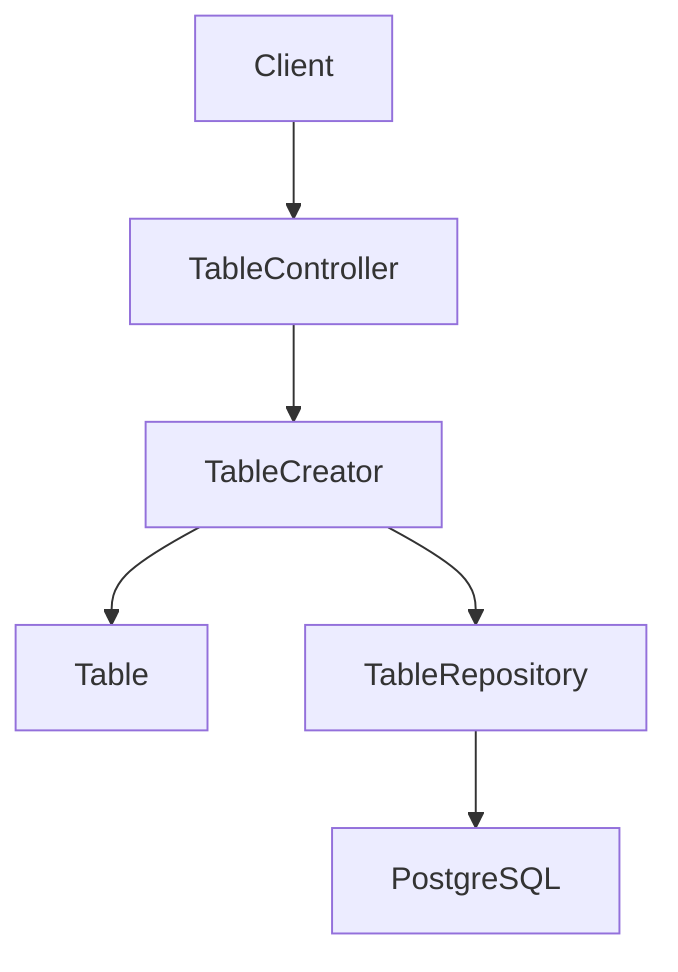
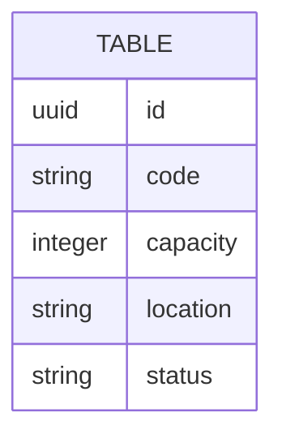

# Alta de mesa

## Introduction
- Esta funcionalidad permite dar de alta mesas que podran ser usadas por la operativa del restaurante.
- Su objetivo es introducir un primer flujo de gestion de mesas dentro del MVP.
- Resuelve la ausencia de una capacidad basica para registrar mesas antes de que puedan participar en pedidos, reservas u otros procesos operativos.
- La solucion propuesta introduce un endpoint de creacion de mesas ubicado dentro de un nuevo contexto acotado `tables`, modelado con DDD y arquitectura hexagonal, independiente del contexto `catalog`.

---

## Scope

### In Scope
- Definir un nuevo contexto de negocio `tables` responsable del alta de mesas.
- Definir el endpoint de entrada para crear una mesa.
- Definir el modelo de dominio minimo necesario para registrar una mesa.
- Definir puertos y adaptadores necesarios para una implementacion hexagonal del contexto `tables`.
- Definir la unicidad del `code` de mesa a nivel de sistema y su traduccion a `409 Conflict` cuando se incumple.

### Out of Scope
- Edicion o actualizacion de mesas existentes.
- Baja logica o eliminacion fisica de mesas.
- Listado o consulta de mesas por identificador u otros criterios.
- Transiciones de estado de la mesa durante su ciclo de vida.
- Reservas de mesa.
- Asociacion de mesas con pedidos.
- Codigos QR, ocupacion o rotacion de mesas.
- Soporte multi-tenant o campo `restaurantId`.

---

## Requirements

### Functional Requirements
- FR1: El sistema debe permitir registrar una mesa nueva mediante un endpoint HTTP.
- FR2: El sistema debe validar los datos minimos requeridos para crear una mesa antes de persistirla.
- FR3: El sistema debe devolver una representacion de la mesa creada con su identificador.
- FR4: El sistema debe impedir el alta de mesas invalidas segun las reglas del dominio.
- FR5: El alta de mesas debe quedar ubicada en un nuevo bounded context `tables`, con responsabilidad clara y desacoplada de los contextos `catalog` y de pedidos.
- FR6: El sistema debe rechazar sincronamente con `409 Conflict` cualquier alta cuyo `code` ya exista en el sistema.
- FR7: Cuando `status` no venga informado en la request, el sistema debe asignar `available` por defecto.

### Non-Functional Requirements
- Performance: La operacion de alta debe ser sincrona y de baja latencia para uso operativo interno.
- Scalability: El diseno debe permitir evolucionar a mas operaciones de mesas (listado, actualizacion, baja) sin acoplarse al contexto `catalog` ni al de pedidos.
- Availability: El endpoint debe responder con errores deterministas cuando la validacion, la unicidad o la persistencia fallen.
- Maintainability: La logica de negocio debe vivir en dominio y aplicacion, no en el controlador HTTP.
- Observability: La operacion debera poder trazarse mas adelante con logs y metricas de creacion de mesas.

---

## Architecture Overview

### Components
- API Layer: Adaptador REST para recibir la solicitud de alta de mesa.
- Application Layer: Caso de uso `TableCreator` que orquesta validaciones de aplicacion y persistencia.
- Domain Layer: Aggregate `Table` y value objects de la mesa, incluyendo el enum de estado.
- Infrastructure Layer: Adaptador de persistencia para guardar mesas en PostgreSQL.

### Architecture Diagram (Mermaid)

### Notes
- Se define un nuevo bounded context `tables`, independiente del contexto `catalog`.
- Dentro del contexto, el modulo de mesa se organizara como `com.forkcore.api.tables.*`, siguiendo el mismo patron de empaquetado que `catalog/product/...`.
- Las mesas NO son productos de catalogo; representan un agregado propio con identidad, `code` y `capacity`.
- Pedidos podran referenciar una mesa por `id` en el futuro, pero esa integracion vivira en un contexto distinto y queda fuera de alcance en esta iteracion.
- Esta iteracion asume un unico tenant: el modelo de `Table` no incluye `restaurantId`. La adicion de multi-tenant queda registrada en "Future Improvements".

---

## Data Design

### Data Model (Mermaid)

### Description
- Entities: `Table` como aggregate root del contexto `tables`.
- Relationships: Ninguna obligatoria en esta primera iteracion.
- Constraints:
  - `id` obligatorio, generado por el dominio mediante `Id.create()` siguiendo el patron time-ordered ya usado por `Product`.
  - `code` obligatorio, unico a nivel de sistema, con longitud maxima 16 y charset permitido `[A-Za-z0-9_-]`.
  - `capacity` obligatorio, entero mayor o igual a 1, con un soft cap operativo de 50 registrable fuera del dominio.
  - `location` opcional; si esta presente, su contenido no puede ser solo espacios en blanco.
  - `status` obligatorio en el modelo, con valores cerrados `available`, `occupied`, `out_of_service`. `reserved` queda intencionalmente excluido en esta iteracion.

---

## Technology Stack
- Backend: Java 25
- Framework: Spring Boot 4, Spring Web MVC
- Database: PostgreSQL
- ORM: Por definir
- Messaging: No aplica en esta fase
- Testing: JUnit
- Infrastructure: Gradle

---

## Core Logic

### Workflow
1. Un cliente invoca el endpoint de alta de mesa.
2. El adaptador HTTP transforma la request en los valores requeridos por aplicacion.
3. El caso de uso `TableCreator` crea y valida el agregado `Table`.
4. El repositorio comprueba la unicidad del `code` y persiste la mesa.
5. Si la unicidad se incumple, el caso de uso traduce el resultado a `409 Conflict`.
6. El adaptador HTTP responde con la representacion de la mesa creada y la cabecera `Location`.

### Business Rules
- Una mesa no debe crearse sin `code`.
- Una mesa no debe crearse sin `capacity`.
- El `code` debe ser unico a nivel de sistema; un duplicado se rechaza con `409 Conflict`.
- El `capacity` debe ser un entero mayor o igual a 1.
- El `location` es opcional; si llega con contenido solo de espacios en blanco, se tratara como ausente.
- El `status` es opcional en la request; si se omite, el sistema debe asignar `available` por defecto.
- Cuando `status` viene informado, debe normalizarse case-insensitive a minusculas y pertenecer al enum cerrado `available`, `occupied`, `out_of_service`.
- El estado `reserved` no forma parte del enum en esta iteracion y debe rechazarse como valor invalido.
- No se define por ahora una regla de unicidad por `location` ni por `capacity`.

### Edge Cases
- `code` ausente, vacio o solo con espacios en blanco.
- `code` con longitud superior a 16 o con caracteres fuera de `[A-Za-z0-9_-]`.
- `code` duplicado contra una mesa ya persistida, que debe traducirse a `409 Conflict`.
- `capacity` ausente, `null`, `0` o negativo.
- `capacity` con tipo no entero en la request, que debe rechazarse como error de validacion.
- `location` presente pero con contenido solo de espacios en blanco, tratado como ausente.
- `status` ausente, que debe resolverse con el valor por defecto `available`.
- `status` con valor fuera del enum cerrado tras la normalizacion, incluido `reserved`.
- Multiples errores de validacion en la misma request, que deben agregarse de forma similar al patron `CompositeValidationError` de `catalog/product`.

---

## HTTP Contract

### Request
- Metodo: `POST`
- Path: `/tables`
- Body: `CreateTableRequest { code, capacity, location, status }`
- `status` es opcional en la request.

### Responses
- Exito: `201 Created` con cabecera `Location: /tables/{id}` y cuerpo `TableResponse { id, code, capacity, location, status }`.
- Error de validacion: `400 Bad Request`, agregando todos los errores detectados en una sola respuesta.
- `code` duplicado: `409 Conflict`, con un cuerpo que comunique de forma inequivoca que el `code` ya esta en uso.

---

## Performance Considerations
- Bottlenecks: Persistencia sin indices adecuados cuando crezca el numero de mesas.
- Caching: No necesario para el alta en esta primera version.
- Database optimization: Indexar el campo `code` para soportar la comprobacion de unicidad y consultas futuras.
- Scaling strategy: Mantener el caso de uso aislado para permitir nuevos adaptadores o procesos asincronos en el futuro.
- Async processing: No necesario para el alta inicial.

---

## Security Considerations
- Authentication: Fuera de alcance por ahora, pero el endpoint debera quedar preparado para integrarse luego.
- Authorization: Fuera de alcance por ahora; previsiblemente restringido a roles operativos o administrativos.
- Input validation: Obligatoria en borde y en dominio, replicando la agregacion de errores del contexto `catalog`.
- Rate limiting: No prioritario en fase inicial interna.
- Encryption: No aplica a datos sensibles en esta iteracion.
- Vulnerabilities: Evitar validaciones solo en controlador y errores ambiguos de entrada, especialmente en la respuesta de `409 Conflict` por `code` duplicado.

---

## Trade-offs
- Decision: Tratar el `code` duplicado como `409 Conflict` en lugar de `400 Bad Request`.
  - Alternatives: Devolver `400 Bad Request` cuando el `code` ya exista.
  - Reason: La duplicidad de `code` es un conflicto de estado del sistema, no una request malformada, y `409 Conflict` es la opcion mas RESTful y consistente con el significado semantico del codigo HTTP.
  - Downsides: El cliente debe distinguir entre `400` y `409` para diferenciar "request invalida" de "recurso en conflicto".
- Decision: Modelar mesas en un contexto `tables` separado de `catalog`.
  - Alternatives: Modelar mesas como un tipo mas de producto de catalogo.
  - Reason: Las mesas tienen identidad, ciclo de vida y reglas de unicidad propias; mezclarlas con productos acoplaria dos dominios con preocupaciones distintas.
  - Downsides: Introduce una nueva frontera de contexto antes de que existan aun todos los flujos consumidores.
- Decision: Asumir single-tenant en el MVP y diferir `restaurantId` a iteraciones futuras.
  - Alternatives: Incluir `restaurantId` desde el inicio.
  - Reason: Acelerar la entrega del primer flujo operativo de mesas sin condicionar el modelo a un multi-tenant que aun no esta definido.
  - Downsides: Cualquier evolucion a multi-tenant exigira una migracion del modelo y de la persistencia de `Table`.

---

## Future Improvements
- Anadir actualizacion, baja logica y consulta de mesas.
- Introducir transiciones de estado controladas y, eventualmente, el estado `reserved`.
- Soportar reservas de mesa como un agregado o servicio aparte.
- Asociar pedidos a mesas por `id` desde el contexto correspondiente.
- Introducir codigos QR, ocupacion y rotacion de mesas.
- Anadir `restaurantId` al modelo de `Table` para soportar multi-tenant.
- Indexar y consultar por `location` cuando el modelo de sala lo justifique.
